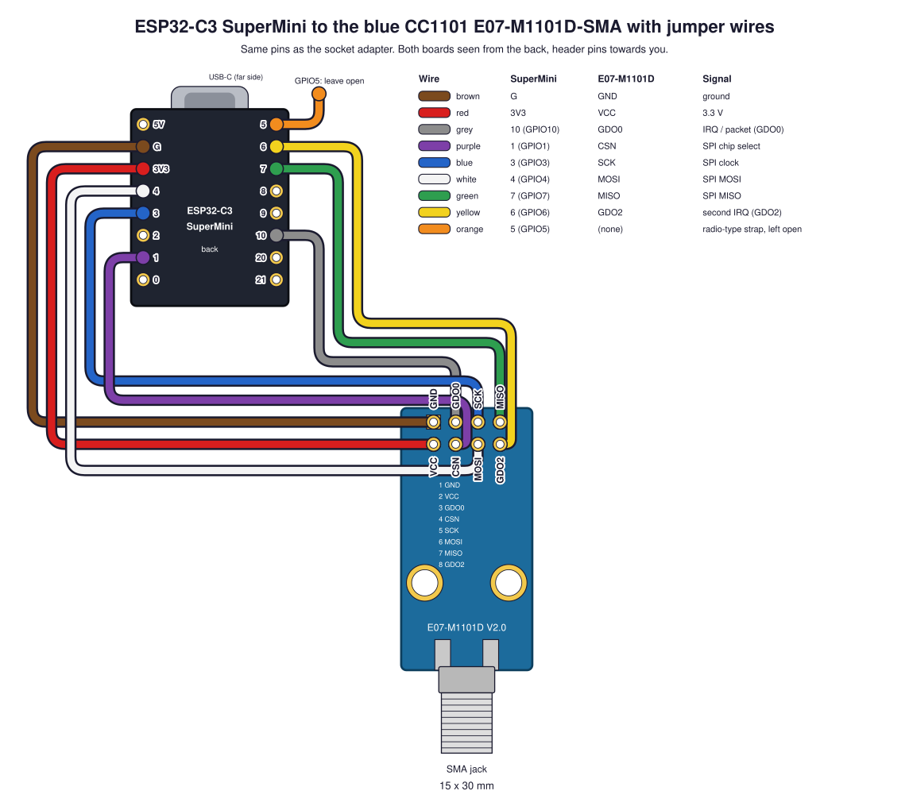
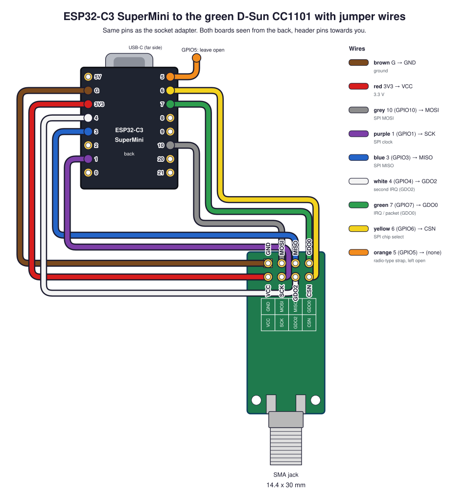
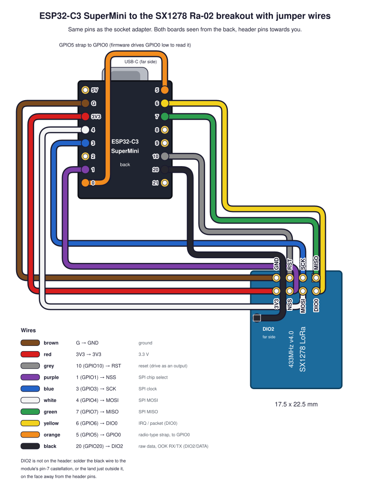
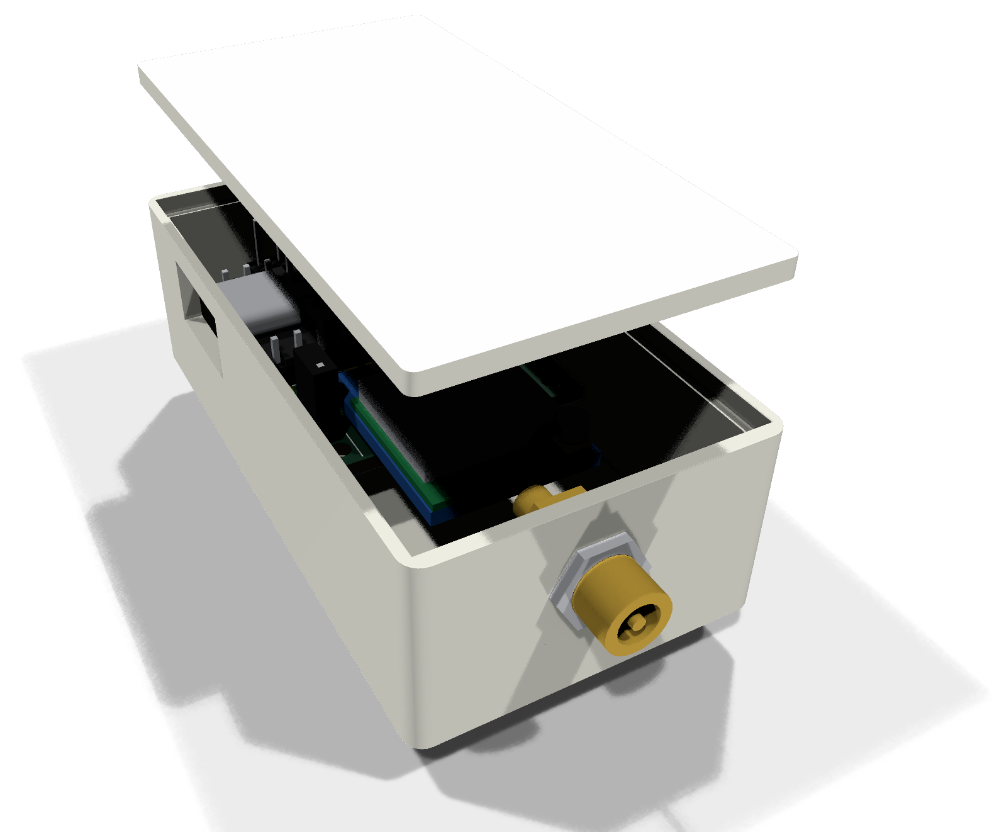

# esp32-to-433mhz

A small carrier board that turns an **ESP32-C3 SuperMini** and a cheap
**433 MHz radio board** into one 29&nbsp;x&nbsp;38 mm unit. It takes any of three
common 2x4-header radios in the same socket:

* the blue **Ebyte E07-M1101D** (CC1101, SMA jack),
* the green **D-Sun CC1101** board (same signals, different header order),
* the blue **SX1278 LoRa 433MHz v4.0** breakout (Ai-Thinker Ra-02, IPEX
  antenna).

Same ESP32 pins for every radio, one firmware pin map per board, and every
track on one copper layer so it can even be etched at home.

| With the E07-M1101D (CC1101) | With the Ra-02 breakout (SX1278) |
| --- | --- |
|  |  |

The KiCad 9 project is `hardware/esp32c3-radio-adapter`. Ready-to-upload
Gerber packages are attached to the
[latest release](https://github.com/mithro/esp32-to-433mhz/releases/latest).

Contents:

* [What you need](#what-you-need)
* [Getting the board made](#getting-the-board-made)
* [Assembling it](#assembling-it)
* [Pin map for firmware](#pin-map-for-firmware)
* [Jumper-wire version (no adapter needed)](#jumper-wire-version-no-adapter-needed)
* [Further reading](#further-reading)

## What you need

Everything is a stock AliExpress / eBay / Amazon part costing a few
dollars. The "Buy" links are AliExpress searches for the listing names;
the "Details" links go to the reference drawings in this repository.

### Boards

| Board | Buy | How to recognise it | Details |
| --- | --- | --- | --- |
| **ESP32-C3 SuperMini** | [ESP32-C3 SuperMini](https://www.aliexpress.com/w/wholesale-esp32-c3-supermini.html) | 18&nbsp;x&nbsp;22.5 mm, USB-C, 8 castellated pins per side, ceramic antenna at the far end from the USB-C. Usually ships with two 1x8 pin headers. | [dimensions and pinout](docs/component-boards.md#esp32-c3-supermini) |
| **One radio board**, any of: | | | |
| Ebyte E07-M1101D-SMA (CC1101) | [E07-M1101D](https://www.aliexpress.com/w/wholesale-e07-m1101d.html), also sold as "TENSTAR CC1101 433MHz wireless module" | Blue, 15&nbsp;x&nbsp;30 mm, 2x4 header at one end, SMA jack at the other, PCB marked "E07-M1101D V2.0". Needs a 433 MHz SMA antenna (often included). | [Ebyte product page](https://www.cdebyte.com/products/E07-M1101D-SMA), [drawing](docs/component-boards.md#cc1101-e07-m1101d-sma) |
| D-Sun CC1101 (green) | [CC1101 433MHz module](https://www.aliexpress.com/w/wholesale-cc1101-433mhz-module.html), pick the green one | Green, 14.4&nbsp;x&nbsp;30 mm, silk "433MHz D-Sun CC1101", 2x4 header, SMA jack. Needs a 433 MHz SMA antenna. | [drawing](docs/component-boards.md#cc1101-d-sun-green-board) |
| SX1278 Ra-02 breakout | [SX1278 LoRa 433MHz Ra-02](https://www.aliexpress.com/w/wholesale-sx1278-lora-433mhz-ra-02.html) | Blue 17.5&nbsp;x&nbsp;22.5 mm carrier with the Ai-Thinker Ra-02 can on top, 2x4 header underneath, silk "SX1278 LoRa 433MHz v4.0". Needs a [U.FL (IPEX) to SMA pigtail](https://www.aliexpress.com/w/wholesale-ipex-to-sma-pigtail.html) plus a 433 MHz SMA antenna. | [Ai-Thinker Ra-02 page](https://docs.ai-thinker.com/en/Ra-02/index.html), [drawing](docs/component-boards.md#sx1278-ra-02-breakout) |

Get a [433 MHz SMA antenna](https://www.aliexpress.com/w/wholesale-433mhz-sma-antenna.html),
not the 868/915 MHz one many listings bundle with the same radio.

### Headers and small parts

| Ref | Part | Qty | Notes |
| --- | --- | --- | --- |
| J1, J2 | 1x8 male pin header, 2.54 mm | 2 | For the SuperMini; usually in the bag with it. Or solder the SuperMini flat by its castellations and skip these. |
| J3 | 2x4 male pin header, 2.54 mm | 1 | The radio board's own header solders straight into the adapter. Fit a 2x4 female header instead if you want the radio removable. |
| [J4](docs/design-notes.md#expansion-header-j4) | 1x7 male pin header, 2.54 mm | 1 | Expansion header: 3V3 and the spare GPIOs. Optional. |
| [J5](docs/design-notes.md#the-dio2-fly-wire-header) | 1x2 male pin header, 2.54 mm | 1 | DIO2 fly-wire header. Only needed for raw OOK on the SX1278. |
| [JP1](docs/design-notes.md#radio-type-strap-jp1-r1) | 1x2 male pin header + jumper cap, 2.54 mm | 1 | Radio-type strap. Jumper fitted for the Ra-02, open for a CC1101. |
| R1 | 0805 0 ohm resistor | 0 or 1 | Permanent alternative to the JP1 jumper (Ra-02 only). |
| R2, R3, R4 | 0805 4.7 kOhm resistors | 0 | Do-not-populate pull-ups on the boot straps: GPIO8 and GPIO2 (on J4) and GPIO9 (unused). Only if something you add holds one of them low at boot. |
| | M2 screws or standoffs | 4 | The corner holes are 2.2 mm. |
| | Thin insulated wire, 30 to 50 mm | 1 | The DIO2 fly wire (Ra-02 only): a strand of wire-wrap or enamelled wire. |

A strip of 40-pin "breakaway" male header covers J1, J2, J4, J5 and JP1.

## Getting the board made

1. Download `esp32c3-radio-adapter-<version>-jlcpcb.zip` or
   `...-nextpcb.zip` from the
   [latest release](https://github.com/mithro/esp32-to-433mhz/releases/latest).
   Each zip is a complete Gerber + drill package for that fab, with a
   `README.txt` of the ordering options.
2. Upload the zip to [JLCPCB](https://jlcpcb.com) or
   [NextPCB](https://www.nextpcb.com) as a new PCB order.
3. Order with these options (all fab defaults, no special processes):

| Option | Value |
| --- | --- |
| Size | 29.0&nbsp;x&nbsp;38.0 mm |
| Layers | 2 |
| Thickness | 1.6 mm FR-4 |
| Copper | 1 oz |
| Finish | ENIG preferred, HASL fine |
| Solder mask / silk | any colour, silkscreen both sides |
| Castellated holes | not needed |

The packages are rebuilt by CI on every push to `main` and carry the
`git describe` version in their name; the same string is printed in the
board's title block.

**Etching it yourself.** Every track is on the bottom copper; the top has
only pads and a ground pour. So the bottom layer alone works as a
single-sided board, with two limits: the SuperMini must go on with pin
headers (laid flat it would sit on the copper side, where its pin rows
come out mirrored), and R1 sits on the copper side. Use the `.GBL`,
`.GBO` and `.DRL` files from the package.

## Assembling it

1. **Radio-type strap first.** For the Ra-02 breakout, fit JP1 and put a
   jumper on it (or solder a 0 ohm resistor in R1 on the bottom). For
   either CC1101 board, leave JP1 empty or open.
2. **SuperMini.** It lies on its side along the left edge, USB-C hanging
   off the board; the silk shows the outline and pin names. Either solder
   its two 1x8 headers through the 1.0 mm holes (long pins down through
   the adapter, the plastic body between the two boards), or lay it flat
   on the top side and solder the castellations to the extended pads.
3. **J4, J5.** Optional; solder them from the top so the pins stand up.
   The silk under J4 names the pins the way the SuperMini does; J5's pins
   are "21" and "20 DIO2".
4. **Radio board.** It plugs in component side up, hanging off the bottom
   edge with its antenna connector pointing away from the adapter. Pin 1
   (GND) is the square pad at the right of the outer row. Solder its
   header pins into the 2x4 holes, or into a female socket fitted there.
5. **DIO2 fly wire (Ra-02, raw OOK only).** Run a wire from the
   breakout's DIO2 land to J5 pin 2 (GPIO20). DIO2 is not on the 2x4
   header: it is the Ra-02 module's pin 7, whose land sticks 0.8 mm out
   past the module's edge on the right-hand side, about 9 mm down from the
   header edge. The pinout diagram below marks it, and
   [Adding the DIO2 wire](https://github.com/mithro/433mhz/blob/worktree-ra02-dio2-wire-diagram/hardware/devices/sx1278-ra02-dio2-wire.md)
   shows the radio end and how to check it landed.
6. **Antenna.** Screw it on the E07 or D-Sun's SMA jack; for the Ra-02,
   clip the pigtail's U.FL plug onto the module and screw the antenna on
   the pigtail. The DIO2 wire and the pigtail both want strain relief:
   a dab of hot glue over the wire's solder joint is enough.

| Top | Bottom (all the tracks) |
| --- | --- |
|  |  |

The silkscreen outlines the two mechanical keep-outs, the footprints of the
SuperMini and of the plugged-in radio board. J5 sits in the band between
them and is the only thing that fits there.

## Pin map for firmware

The socket's eight positions go to fixed GPIOs. Which signal each carries
depends on the radio, so firmware needs one pin map per board:

| Socket position | ESP32-C3 GPIO | E07-M1101D (blue CC1101) | D-Sun (green CC1101) | Ra-02 breakout (SX1278) |
| --- | --- | --- | --- | --- |
| 1 | GND | GND | GND | GND |
| 2 | 3V3 | VCC | VCC | 3V3 |
| 3 | GPIO10 | GDO0 (radio out) | MOSI | RST (radio in) |
| 4 | GPIO1 | CSN | SCK | NSS |
| 5 | GPIO3 | SCK | MISO (radio out) | SCK |
| 6 | GPIO4 | MOSI | GDO2 (radio out) | MOSI |
| 7 | GPIO7 | MISO (radio out) | GDO0 (radio out) | MISO (radio out) |
| 8 | GPIO6 | GDO2 (radio out) | CSN | DIO0 (radio out) |
| J5 pin 2 | GPIO20 | | | DIO2/DATA (fly wire) |
| JP1 / R1 | GPIO5 | open | open | strapped to GND |

The same maps, signal first:

| Signal | E07-M1101D | D-Sun | Ra-02 |
| --- | --- | --- | --- |
| MOSI | GPIO4 | GPIO10 | GPIO4 |
| MISO | GPIO7 | GPIO3 | GPIO7 |
| SCK | GPIO3 | GPIO1 | GPIO3 |
| CSN / NSS | GPIO1 | GPIO6 | GPIO1 |
| GDO0 / DIO0 | GPIO10 | GPIO7 | GPIO6 |
| GDO2 | GPIO6 | GPIO4 | |
| RST | | | GPIO10 |
| DIO2/DATA | | | GPIO20 |

**Telling the boards apart.** GPIO5 is the radio-type strap. Read it with
the internal pull-up enabled: low means the Ra-02 (jumper fitted), high
means a CC1101 board. The three-state read that also covers the SX1278
module adapter is in the
[design notes](docs/design-notes.md#radio-type-strap-jp1-r1). The two
CC1101 boards are told apart without driving anything: an unconfigured CC1101 clocks about 135 kHz out of GDO0, so
whichever of GPIO10 (blue board) and GPIO7 (green board) is toggling at
power-up names the board. In the jumper-wire build the strap goes to GPIO0
instead of GND, so drive GPIO0 low as an output before reading GPIO5.

**Why DIO2 matters on the SX1278.** In its continuous mode the raw
demodulated bitstream is available only on the DIO2/DATA pin. Packet mode
carries only what the packet handler can frame, which suits Fineoffset
weather stations but not the OOK remotes this node exists to hear and key.
The Ra-02 breakout leaves DIO2 unconnected, hence the fly wire to GPIO20.

**Never put a radio pin on GPIO2, GPIO8 or GPIO9.** They are ESP32-C3 boot
straps; a radio pin's capacitance makes the strap rise too slowly at reset
and the chip drops into USB download mode instead of running. This was
measured on the bench and is not fixable in software, which is why the
socket uses GPIO1 rather than GPIO9.

## Jumper-wire version (no adapter needed)

The same hook-up with Dupont jumper wires, so the firmware pin map is
identical and you can test everything before ordering boards. Plug the
female-to-female wires onto the SuperMini's headers and the radio board's
2x4 header. Both boards are drawn from the back, pins towards you.

| Wire | SuperMini pin | E07-M1101D | D-Sun | Ra-02 |
| --- | --- | --- | --- | --- |
| brown | G | GND | GND | GND |
| red | 3V3 | VCC | VCC | 3V3 |
| grey | GPIO10 | GDO0 | MOSI | RST |
| purple | GPIO1 | CSN | SCK | NSS |
| blue | GPIO3 | SCK | MISO | SCK |
| white | GPIO4 | MOSI | GDO2 | MOSI |
| green | GPIO7 | MISO | GDO0 | MISO |
| yellow | GPIO6 | GDO2 | CSN | DIO0 |
| orange | GPIO5 | not fitted | not fitted | to the SuperMini's GPIO0 (radio-type strap) |
| black | GPIO20 | | | DIO2, soldered to the module's pin-7 land |

The Ra-02's orange strap wire goes to GPIO0 rather than GND because the
SuperMini's only GND pin is taken by the brown wire; the firmware drives
GPIO0 low while it reads the strap. The black DIO2 wire has no header pin
at the radio end: solder it to the module's pin-7 castellation or the land
just outside it, on the face away from the header pins. The header
pinouts, with the DIO2 land marked on both faces:

## Printing a case

A two-part case that fits the adapter with either radio is in
`hardware/case/` as STL files. Every
[release](https://github.com/mithro/esp32-to-433mhz/releases/latest)
carries it as `esp32c3-radio-adapter-case-<version>.zip`, plus the two
`.stl` files loose for dropping straight into a slicer. The zip holds the
STL files in print orientation, the case's STEP models, and a README.txt
with the parts' sizes, home FDM print settings and how to order them from
JLCPCB's 3D-printing service:

| E07-M1101D in the case | Ra-02 breakout in the case |
| --- | --- |
|  |  |

* Two halves that snap together: `esp32c3-radio-adapter-case-bottom.stl`
  and `esp32c3-radio-adapter-case-top.stl`, each printed open side up. No
  supports, no screws; 2.2 mm walls; 36.2&nbsp;x&nbsp;66.7&nbsp;x&nbsp;20.6 mm
  outside.
* The board presses onto four 2.15 mm pegs in the bottom half (they fit
  the 2.2 mm M2 corner holes), and bosses in the top half hold it there
  once the case is shut. The USB-C plug goes through the window in the
  left wall.
* One 6.6 mm hole in the far wall serves both radios: the E07-M1101D's SMA
  jack pokes through it, and the Ra-02's U.FL-to-SMA pigtail bulkhead is
  clamped in it by its nut, with the spare cable stowed beside the breakout.
* Four snap tabs on the bottom half click into grooves in the top half's
  skirt; a notch at the seam on the USB end takes a fingernail to open it.
* The package's README.txt has the print settings, what to inspect (the
  0.8 mm snap tabs, the peg fit, which depends on the printer's
  calibration) and the material to pick at a service.

The case is generated from the same dimensions as the boards by
`scripts/build_case.py`; see [3D models and case design](docs/3d-models.md#the-printed-case).

## Further reading

* [Design notes](docs/design-notes.md): why the GPIOs are what they are,
  how everything routes on one layer, the expansion header J4, the DIO2
  header J5, the mechanical keep-outs and the radio-type strap.
* [Component boards](docs/component-boards.md): KiCad reproductions of
  the SuperMini and the radio boards (outline, header, castellations,
  mounting holes), with dimensions and sources, under `hardware/parts/`.
* [3D models and case design](docs/3d-models.md): STEP/GLB assemblies on
  every release, the dimensions a case needs, and the printed case.
* [SX1278 castellated module adapter](docs/sx1278-module-adapter.md): a
  second, two-layer carrier for the solder-down 16-pin SX1278 module,
  `hardware/esp32c3-sx1278-adapter`.
* [Development](docs/development.md): regenerating the KiCad projects
  from the scripts, running ERC/DRC, and how CI builds the release
  packages.

## Licence

Apache License 2.0, see `LICENSE`.
