# esp32-to-433mhz

KiCad 9 form-factor boards for an ESP32-C3 SuperMini and two 433 MHz radio
modules. Each project under `hardware/` reproduces the outline, pin headers,
castellations, mounting holes and connector positions of a commercial module so
it can be used as the starting point for a drop-in replacement or a board that
plugs into the same socket.

| Board | Original module | Size (mm) |
| --- | --- | --- |
| [`hardware/esp32-c3-supermini`](#esp32-c3-supermini) | ESP32-C3 SuperMini | 18.00 x 22.52 |
| [`hardware/sx1278-lora-module`](#sx1278-lora-module) | SX1278 LoRa 433 MHz module (PXL1276-D01, HKFYD) | 17.0 x 16.5 |
| [`hardware/cc1101-e07-m1101d`](#cc1101-e07-m1101d-sma) | Ebyte E07-M1101D-SMA (TENSTAR CC1101 433 MHz module) | 15.0 x 30.0 |
| [`hardware/esp32c3-sx1278-adapter`](#adapter-esp32-c3-supermini-to-sx1278-module) | carrier: SuperMini + SX1278 module | 24.0 x 55.0 |
| [`hardware/esp32c3-cc1101-adapter`](#adapter-esp32-c3-supermini-to-cc1101-board) | carrier: SuperMini + E07-M1101D socket, single-sided | 27.0 x 36.5 |

All projects are generated by scripts (see [Regenerating](#regenerating)), so
edit the generator rather than the KiCad files.

## ESP32-C3 SuperMini

| 3D render, top | 3D render, bottom | Layout (copper, silk, fab, outline) |
| --- | --- | --- |
| 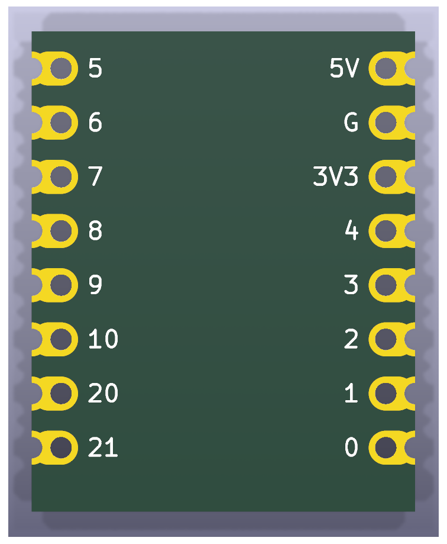 | 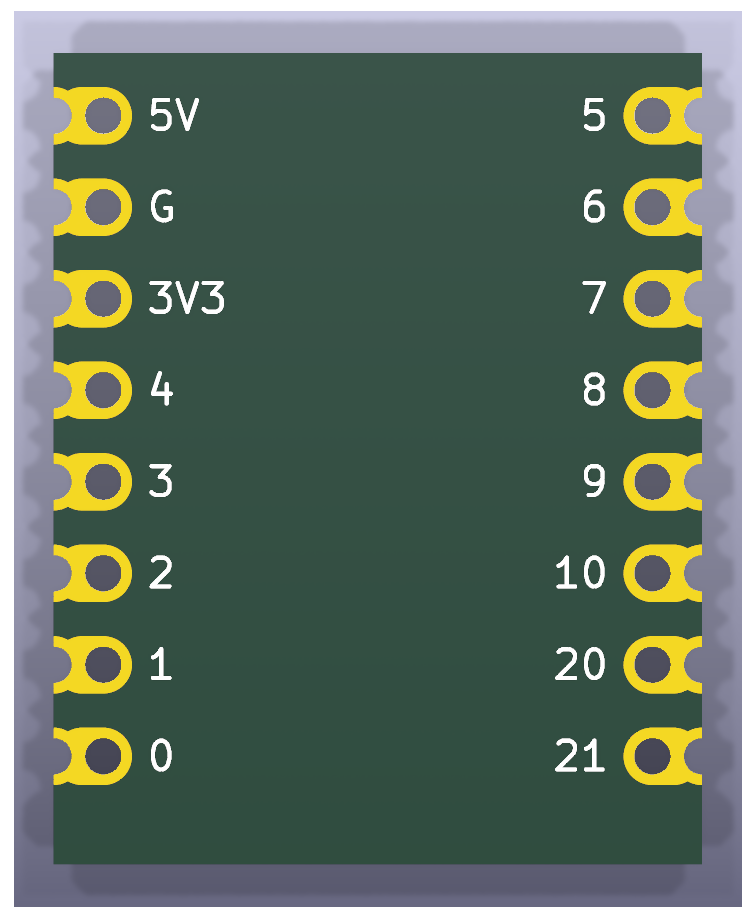 | 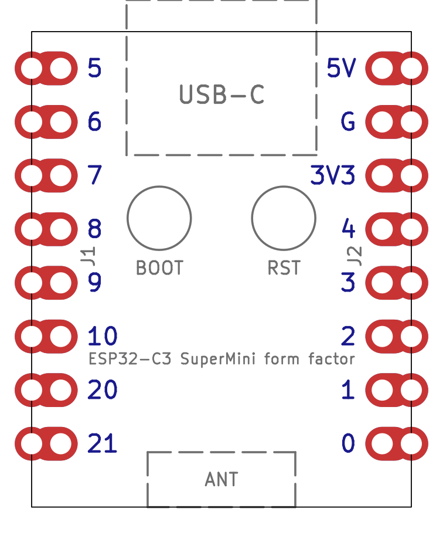 |

The grey half-circles outside the outline in the 3D renders are the outer
halves of the castellation pads; the PCB fab routes them away, leaving plated
half-holes on the edge.

All values in millimetres, viewed from the component side with the USB-C end
at the top.

| Feature | Value |
| --- | --- |
| Board outline | 18.00 x 22.52, square corners |
| Pin pitch | 2.54 |
| Pins per side | 8 (16 total) |
| Distance between the two pin rows | 15.24 |
| Pin centre to long board edge | 1.38 |
| First pin centre to USB-C edge | 1.74 |
| Last pin centre to antenna edge | 3.00 |
| Through-hole drill | 1.00 |
| Castellation half-hole on the edge | 1.00 diameter, centred on the edge |
| Pad copper | 1.60 wide oval from the pin to the board edge |
| Board thickness | 1.0 (from the STEP model, not a datasheet) |

Pin names, top to bottom:

| Left (J1) | Right (J2) |
| --- | --- |
| GPIO5 | 5V |
| GPIO6 | GND |
| GPIO7 | 3V3 |
| GPIO8 | GPIO4 |
| GPIO9 | GPIO3 |
| GPIO10 | GPIO2 |
| GPIO20 | GPIO1 |
| GPIO21 | GPIO0 |

The USB-C connector, BOOT and RST buttons and the ceramic antenna of the
original board are drawn on the `F.Fab` layer as placement references only.

Sources:

* [GrabCAD "ESP32C3 SuperMini" STEP model by Ulf Hille](https://grabcad.com/library/esp32c3-supermini-1),
  redistributed in [mrtnvgr/KiCad_ESP32-C3-SuperMini](https://github.com/mrtnvgr/KiCad_ESP32-C3-SuperMini):
  board body 18.00 x 22.52, pin rows at +/-7.62, first pin 1.74 from the USB-C edge, 1.6 mm pad copper.
* [mischianti.org ESP32-C3 Super Mini dimension drawing](https://mischianti.org/esp32-c3-super-mini-high-resolution-pinout-datasheet-and-specs/):
  18.00 mm width, 15.24 mm row spacing, 22.50 mm length, pin order.
* [components101 ESP32-C3 Super Mini](https://components101.com/development-boards/esp32c3-mini-development-board-datasheet-pinout): 22.52 x 18.0 mm.
* Photographs of production boards for the keyhole castellated pad shape.

The hole diameter (1.0 mm) is the standard drill for 2.54 mm headers and
matches the hole size measured from the dimension drawing; it was not taken
from a manufacturer datasheet. Note that the community KiCad footprint linked
above has its GPIO column reversed (GPIO21 opposite 5V instead of GPIO5); the
footprints here were generated from scratch and follow the physical board.

## SX1278 LoRa module

| 3D render, top | 3D render, bottom | Layout (copper, silk, fab, outline) |
| --- | --- | --- |
| 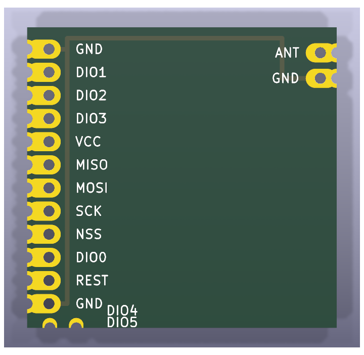 | 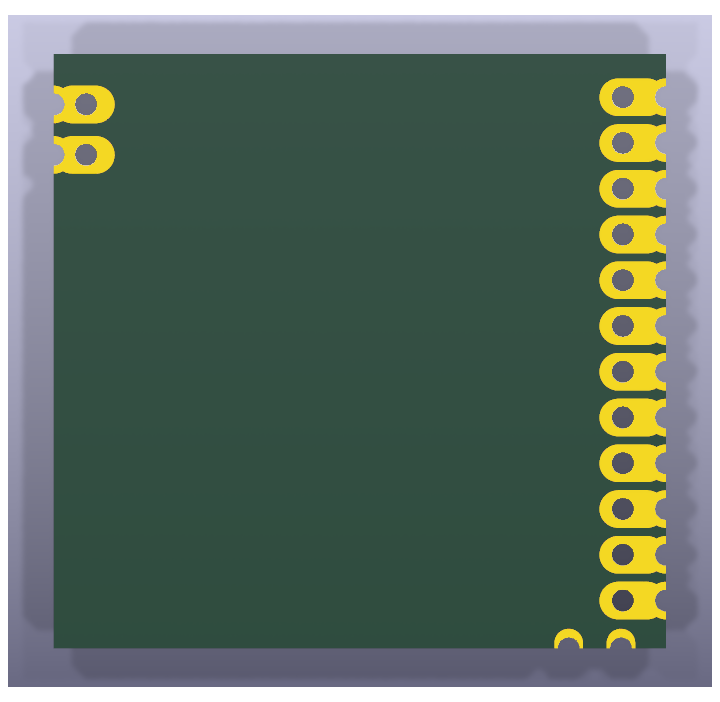 | 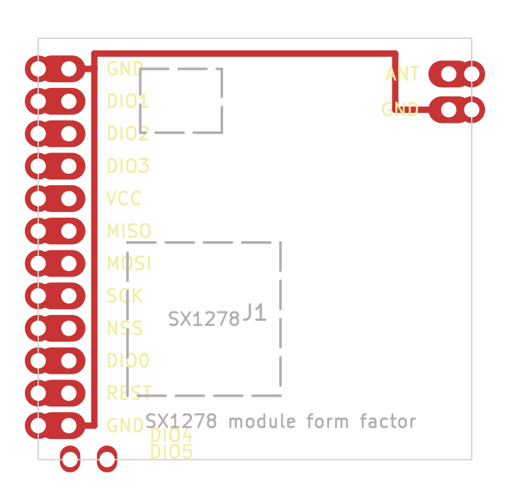 |

The 16-pin castellated 433 MHz SX1278 module sold as "SX1278 LoRa 433MHz
Wireless Module (PXL1276-D01)" with a spring antenna. It is a derivative of
the NiceRF LoRa1276/LoRa1278 layout.

All values in millimetres, viewed from the component side with the 12-pad
row on the left edge and pin 1 at the top.

| Feature | Value |
| --- | --- |
| Board outline | 17.0 (top/bottom edges) x 16.5 (left/right edges) |
| Left edge | 12 keyhole pads (pins 1-12) at 1.27 pitch, first hole 1.2 from the top corner |
| Bottom edge | 2 castellation-only notches: DIO4 (pin 13) 1.25 and DIO5 (pin 14) 2.7 from the left corner |
| Right edge | 2 keyhole pads: ANT (pin 16) 1.4 and GND (pin 15) 2.8 from the top corner |
| Keyhole pads, left row | 0.60 through-hole 1.2 in from the edge, 0.60 half-hole on the edge, 1.05 wide copper reaching 1.85 in |
| Keyhole pads, right edge | as above but hole 0.9 in from the edge, copper reaching 1.7 in |
| Notches | 0.60 half-hole on the edge, 0.8 wide copper reaching 0.55 in, no inboard hole |
| Board thickness | 1.0 (assumed) |

Pin names (J1), numbered counter-clockwise from the top-left:

| Pin | Name | Pin | Name |
| --- | --- | --- | --- |
| 1 | GND | 9 | NSS |
| 2 | DIO1 | 10 | DIO0 |
| 3 | DIO2 | 11 | REST (reset) |
| 4 | DIO3 | 12 | GND |
| 5 | VCC (3.3 V) | 13 | DIO4 |
| 6 | MISO | 14 | DIO5 |
| 7 | MOSI | 15 | GND |
| 8 | SCK | 16 | ANT |

The three GND pins are joined by tracks (the original uses a ground plane).
Approximate positions of the SX1278 and its crystal are drawn on `F.Fab`.

Sources and accuracy:

* Seller PDF for the "SX1278 LoRa 433MHz Wireless Module (PXL1276-D01)":
  module size 17 mm x 16.5 mm.
* Seller pinout photo (top-down with dimension lines) for the pin names in
  physical order: GND DIO1 DIO2 DIO3 VCC MISO MOSI SCK NSS DIO0 REST GND
  along the row, DIO4 and DIO5 at the adjacent corner, ANT and GND at the
  opposite corner. The seller's pin table lists REST twice, which shifts its
  last four entries by one; the photo was followed.
* No manufacturer drawing was found for this variant. Pad positions were
  measured in pixels from the top-down pinout photo and a perspective-
  rectified product photo; both give the 12-pad row a 1.27 mm pitch on the
  16.5 mm edge (the pinout photo's dimension labels appear to have the two
  sides swapped). Positions are accurate to roughly +/-0.15 mm; the pitch,
  pin count and outline are solid.
* Close-up photos show the 12 row pads and the two ANT/GND pads are keyholes
  like the SuperMini's (a plated through-hole plus a half-hole castellation on
  the edge, joined by an oval), while DIO4 and DIO5 are plain castellations
  without an inboard hole. The
  [NiceRF LoRa127X datasheet](https://makerhero.com/img/files/download/LoRa127X-Module-Datasheet.pdf)
  mechanical drawing shows the same construction for this family and
  supplied the 0.6 mm hole size.

## CC1101 E07-M1101D-SMA

| 3D render, top | 3D render, bottom | Layout (copper, silk, fab, outline) |
| --- | --- | --- |
| 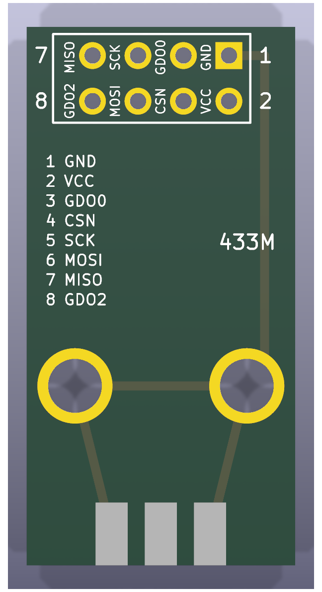 | 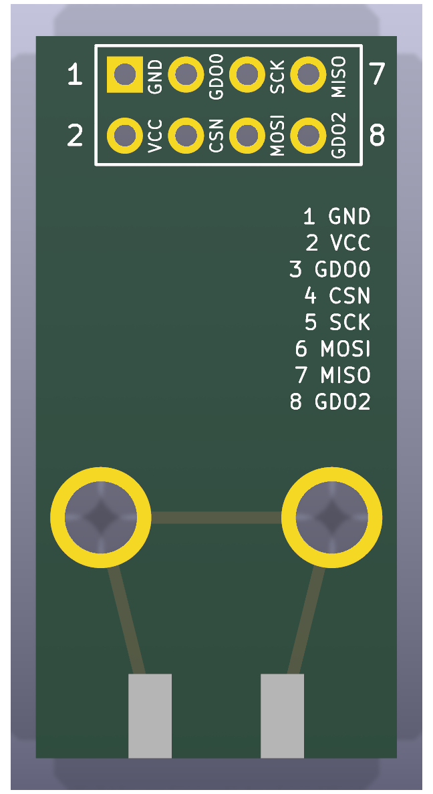 | 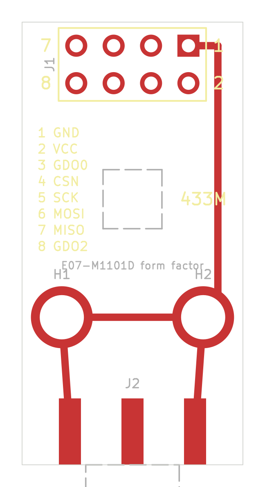 |

The Ebyte E07-M1101D-SMA (PCB marked "E07-M1101D V2.0"), sold as the "TENSTAR
CC1101 433MHz Wireless Module" with an SMA antenna.

All values in millimetres, viewed from the component side with the header at
the top and the SMA jack at the bottom.

| Feature | Value |
| --- | --- |
| Board outline | 15.0 x 30.0 |
| Header | 2 x 4, 2.54 pitch, 1.50 pads (pin 1 square), 0.90 holes |
| Header position | outer row 1.60 from the header edge, columns 3.70 from the long edges |
| Header numbering | outer row 7 5 3 1 left to right, inner row 8 6 4 2 |
| Mounting holes | 3.00 plated, 4.20 pad, 2.70 from each long edge, 10.0 from the SMA edge |
| SMA jack | edge mount, centred on the bottom edge; 1.5 mm pads, ground legs 4.25 either side |
| Board thickness | 1.6 (edge-mount SMA) |

Pin names (J1):

| Pin | Name | Pin | Name |
| --- | --- | --- | --- |
| 1 | GND | 5 | SCK |
| 2 | VCC (1.8 - 3.6 V) | 6 | MOSI |
| 3 | GDO0 | 7 | MISO / GDO1 |
| 4 | CSN | 8 | GDO2 |

Header pin 1, both mounting holes and the SMA ground legs are joined by GND
tracks on both copper layers; the original uses a ground pour instead.

Sources:

* [Ebyte E07 series user manual v1.00](https://ia802806.us.archive.org/26/items/ebytecdebytedl0719/557_E07_Usermanual_EN_v1.00.pdf),
  section 2.2 "E07 (M1101D-TH) / E07 (M1101D-SMA)": mechanical drawing
  (15.0 x 30.0, header 1.60 / 3.70 / 2.54, holes 2.70 / 10.0) and pin table.
* [Ebyte E07-M1101D-TH user manual v1.20](https://www.rcscomponents.kiev.ua/datasheets/e07-m1101d-th_usermanual_en_v1_20.pdf),
  section 3 "Size and pin definition": pad sizes (1.50 pad / 0.90 hole,
  4.20 ring / 3.00 hole).
* Seller listing (15 x 28 mm, pin table). The 28 mm figure is Ebyte's value
  for the spring-antenna variant; the SMA variant and the drawing say 30 mm.
* The SMA pad geometry follows the common 1.6 mm PCB edge-mount SMA jack
  (KiCad `SMA_Amphenol_132289_EdgeMount`), not an Ebyte drawing.

## Adapters

Two small carrier boards wire an ESP32-C3 SuperMini to each radio. Both use
the same GPIO assignment so one firmware SPI setup serves either radio:

| Signal | ESP32-C3 GPIO | SX1278 module pin | E07-M1101D pin |
| --- | --- | --- | --- |
| MOSI | GPIO5 | 7 MOSI | 6 MOSI |
| SCK | GPIO6 | 8 SCK | 5 SCK |
| Chip select | GPIO7 | 9 NSS | 4 CSN |
| MISO | GPIO4 | 6 MISO | 7 MISO |
| IRQ / packet | GPIO10 | 10 DIO0 | 3 GDO0 |
| Second IRQ | GPIO3 | 2 DIO1 | 8 GDO2 |
| Reset | GPIO8 | 11 RESET | - |
| 3.3 V | 3V3 | 5 VCC | 2 VCC |
| GND | GND | 1, 12, 15 GND | 1 GND |

GPIO2, GPIO8 and GPIO9 are ESP32-C3 strapping pins, so the radio's interrupt
outputs (which idle low at power-up) avoid them; GPIO8 is only used as an
output to drive the SX1278 reset. GPIO20/21 (UART) and GPIO0/1/9 stay free.
The SuperMini's pins go into 1.0 mm through-holes so it can be fitted with
headers (on the CC1101 adapter the pads are also extended past the SuperMini's
edge so it can be soldered flat by its castellations); its USB-C connector
hangs off a board edge and no copper runs under its ceramic antenna. The
silkscreen carries the SuperMini's own pin names on the outer side of each
header row and the radio signal names on the inner side.

Routing is generated by `scripts/generate_adapters.py`. The SX1278 adapter
is two-layer: signals run on the top copper in horizontal lanes below the
SuperMini, power and reset on the bottom copper, with vias to the SMD module
pads. The CC1101 adapter is single-sided (see below).

### Adapter: ESP32-C3 SuperMini to SX1278 module

| 3D render, top | 3D render, bottom | Layout (copper, silk, fab, outline) |
| --- | --- | --- |
| 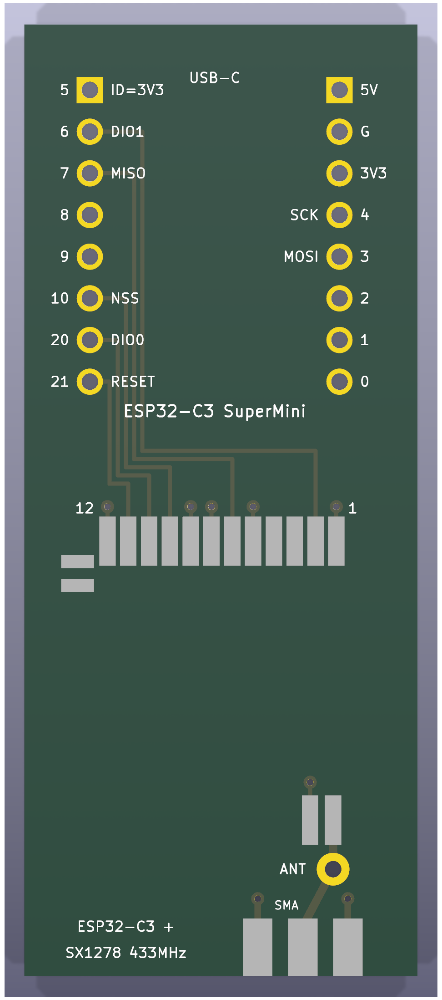 | 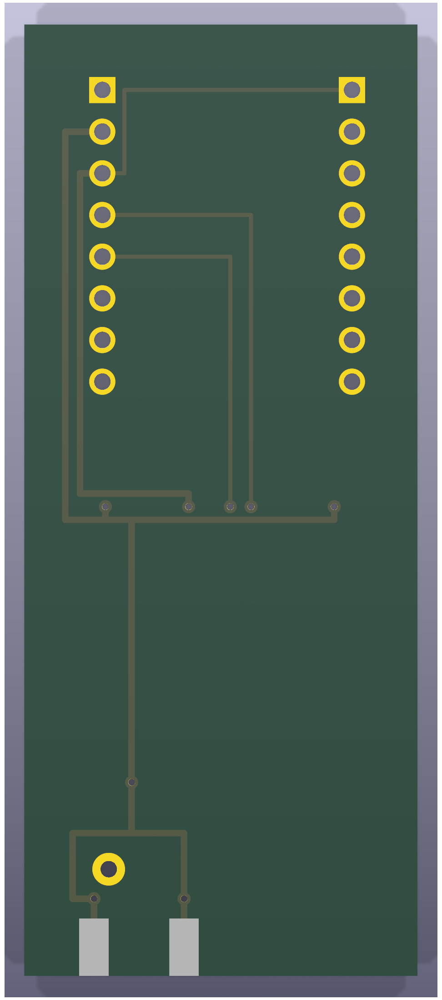 | 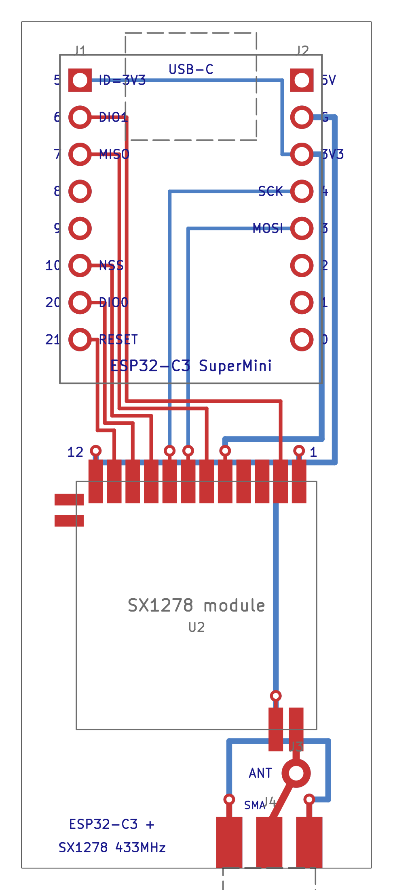 |

24 x 55 mm. The SX1278 module is soldered onto SMD land pads that reproduce
its castellations (1.0 x 3.0 mm pads extending 1.5 mm outside the module
edge), rotated so its 12-pad row faces the SuperMini and its ANT pad faces
the bottom edge, where a 1.0 mm hole takes the spring antenna wire. DIO2-5
are landed but not connected.

### Adapter: ESP32-C3 SuperMini to CC1101 board

| 3D render, top | 3D render, bottom | Layout (copper, silk, fab, outline) |
| --- | --- | --- |
| 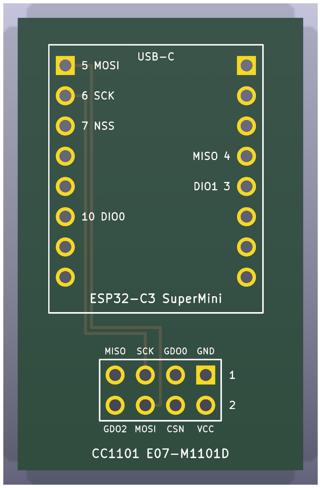 | 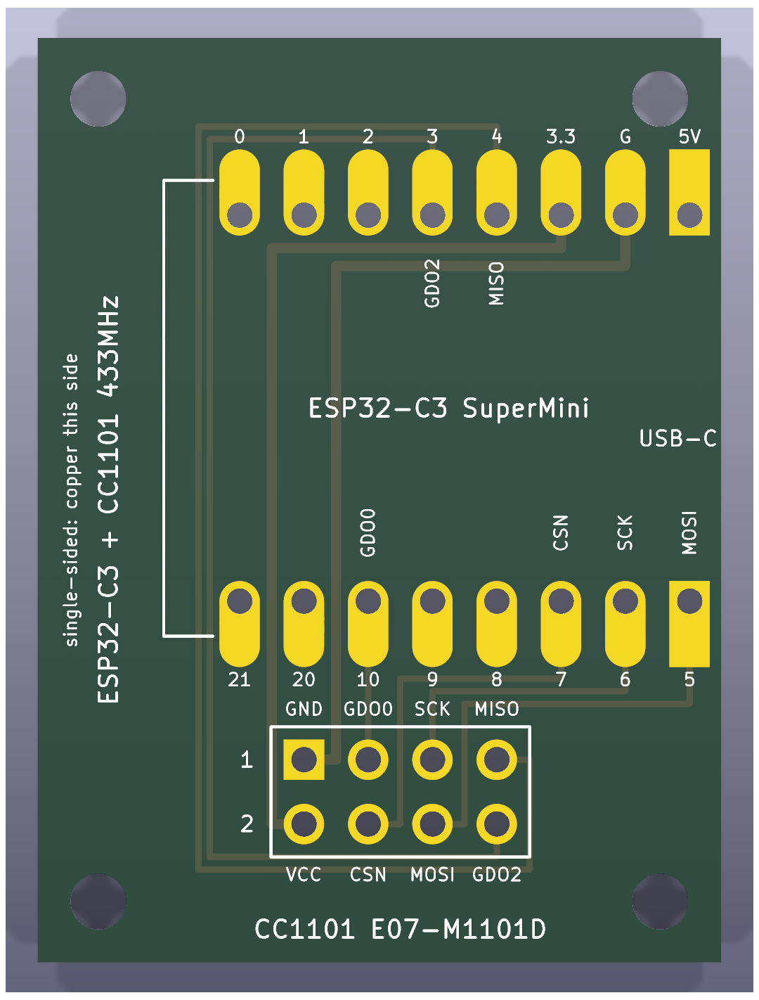 | 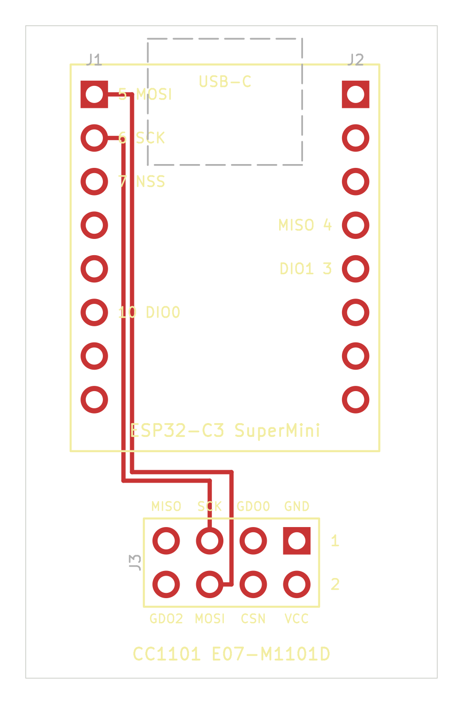 |

27 x 36.5 mm, single-sided: every track is on the back copper and the front
carries only pad copper, so it can be etched at home or ordered as a
one-layer board from the back-layer artwork alone. Silkscreen is printed on
both sides (the back copy mirrored), and there is an M2 mounting hole 2.4 mm
in from each corner.

The SuperMini lies on its side with its body overhanging the left edge by
0.5 mm, so its USB-C connector hangs clear of the board. Each of its 16 pins
lands on a keyhole pad: a 1.0 mm hole for header pins with 1.6 x 3.4 mm oval
copper extended outward to 1.2 mm past the SuperMini's edge, so the module
can instead be soldered flat by its castellations. Note that the flat option
needs the pad copper on the front, i.e. a normal two-layer (or plated) build
of the same files; on a home-etched single-sided board only the header-pin
option is available, because a castellated module on the copper side would
present its pins mirrored.

Lying sideways puts the SuperMini's GPIO row directly above the socket and
its power row behind it, which is what lets all eight nets route on one
layer without jumpers: MOSI, SCK and CSN drop into three lanes and enter the
socket from above, GDO0 goes straight down, GND and 3V3 run between the
SuperMini rows and enter the socket from the right, and the two radio
outputs (MISO, GDO2) pass over the top of the power row, down the right of
the SuperMini and under the socket to its left column. A 2x4 socket (1.0 mm
holes, same numbering as the E07-M1101D header: pin 1 square at the right of
the outer row) takes the CC1101 board, which plugs in component side up and
extends past the bottom edge with its SMA jack away from the carrier; the
socket sits far enough right that the board clears the bottom-left screw.
The layout plot shows back-copper tracks in blue.

## Castellations in KiCad

KiCad has no native castellated pad. Each castellation is a through-hole pad
whose drill is centred on the board edge; the fab cuts the plated hole in
half. On the SuperMini and the SX1278 module each pin is two pads sharing a
number: the through-hole inboard and the half-hole on the edge, joined by oval
copper.

KiCad flags copper and holes touching the board edge, so each project's
`.kicad_dru` ignores edge clearance and relaxes the hole-to-hole distance for
the edge-pad footprints only. Order the boards with the "castellated holes"
option at your PCB fab.

## Regenerating

The projects are produced by the scripts in `scripts/`, which need only the
Python standard library plus the stock KiCad symbol libraries (for the
connector symbols embedded in the schematics):

```sh
uv run scripts/generate_supermini.py
uv run scripts/generate_sx1278.py
uv run scripts/generate_cc1101.py
uv run scripts/generate_adapters.py
```

`scripts/kicadgen.py` is the shared library (footprints, board, schematic,
project settings, DRC rules). Verification and rendering with KiCad 9.0
(`kicad-cli`) and inkscape:

```sh
uv run scripts/verify_boards.py   # ERC + DRC with schematic parity, all boards
uv run scripts/render_boards.py   # docs/images/*.png
```

ERC reports only "global label not connected anywhere else" warnings (each
pin carries a single global label); DRC reports no violations on any board.

## Licence

Apache License 2.0, see `LICENSE`.
