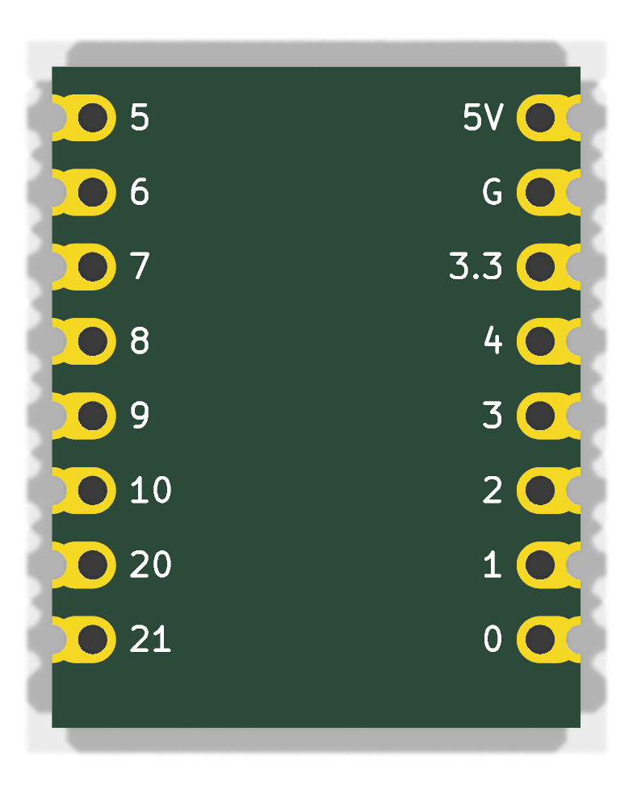
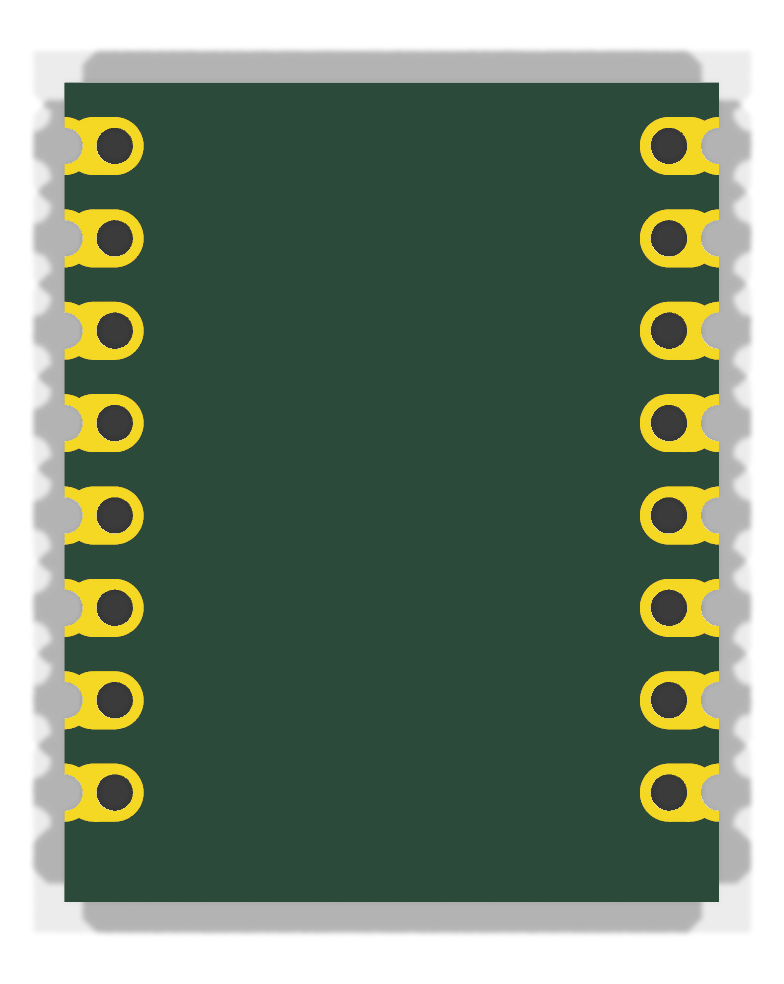
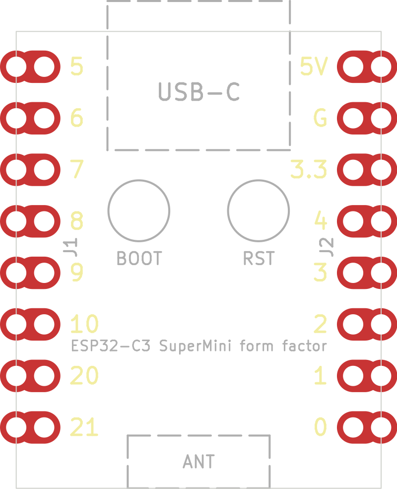

# esp32-to-433mhz

KiCad 9 hardware for an ESP32-C3 SuperMini form-factor board.

`hardware/esp32-c3-supermini/` is a KiCad project whose outline, pin header
positions and castellated edge pads are identical to the ESP32-C3 SuperMini
development board, ready to be used as the starting point for a drop-in
replacement or a board that plugs into the same socket.

| 3D render, top | 3D render, bottom | Layout (copper, silk, fab, outline) |
| --- | --- | --- |
|  |  |  |

The grey half-circles outside the outline in the 3D renders are the outer
halves of the castellation pads; the PCB fab routes them away, leaving plated
half-holes on the edge. Regenerate the images with
`uv run scripts/render_supermini.py` (needs `kicad-cli` and `inkscape`).

## Dimensions

All values in millimetres, viewed from the component side with the USB-C end
at the top.

| Feature | Value |
| --- | --- |
| Board outline | 18.00 x 22.52, square corners |
| Pin pitch | 2.54 |
| Pins per side | 8 (16 total) |
| Distance between the two pin rows | 15.24 |
| Pin centre to long board edge | 1.38 |
| First pin centre to USB-C edge | 1.74 |
| Last pin centre to antenna edge | 3.00 |
| Through-hole drill | 1.00 |
| Castellation half-hole on the edge | 1.00 diameter, centred on the edge |
| Pad copper | 1.60 wide oval from the pin to the board edge |
| Board thickness | 1.0 (from the STEP model, not a datasheet) |

Pin names, top to bottom:

| Left (J1) | Right (J2) |
| --- | --- |
| GPIO5 | 5V |
| GPIO6 | GND |
| GPIO7 | 3V3 |
| GPIO8 | GPIO4 |
| GPIO9 | GPIO3 |
| GPIO10 | GPIO2 |
| GPIO20 | GPIO1 |
| GPIO21 | GPIO0 |

The USB-C connector, BOOT and RST buttons and the ceramic antenna of the
original board are drawn on the `F.Fab` layer as placement references only.

## Sources

* [GrabCAD "ESP32C3 SuperMini" STEP model by Ulf Hille](https://grabcad.com/library/esp32c3-supermini-1),
  redistributed in [mrtnvgr/KiCad_ESP32-C3-SuperMini](https://github.com/mrtnvgr/KiCad_ESP32-C3-SuperMini):
  board body 18.00 x 22.52, pin rows at +/-7.62, first pin 1.74 from the USB-C edge, 1.6 mm pad copper.
* [mischianti.org ESP32-C3 Super Mini dimension drawing](https://mischianti.org/esp32-c3-super-mini-high-resolution-pinout-datasheet-and-specs/):
  18.00 mm width, 15.24 mm row spacing, 22.50 mm length, pin order.
* [components101 ESP32-C3 Super Mini](https://components101.com/development-boards/esp32c3-mini-development-board-datasheet-pinout): 22.52 x 18.0 mm.
* Photographs of production boards for the keyhole castellated pad shape.

The hole diameter (1.0 mm) is the standard drill for 2.54 mm headers and
matches the hole size measured from the dimension drawing; it was not taken
from a manufacturer datasheet.

Note that the community KiCad footprint linked above has its GPIO column
reversed (GPIO21 opposite 5V instead of GPIO5); the footprints here were
generated from scratch and follow the physical board.

## Castellations in KiCad

Each header pin is made of two pads sharing the same pad number:

1. A through-hole pad at the pin centre with a 1.0 mm drill and 1.6 x 2.18 mm
   oval copper offset toward the board edge, so the copper reaches the edge.
2. A 1.6 mm round through-hole pad with its 1.0 mm drill centred on the board
   edge, which the fab cuts in half to form the castellation.

KiCad flags copper and holes touching the board edge, so
`esp32-c3-supermini.kicad_dru` ignores edge clearance and relaxes the
hole-to-hole distance for the J1/J2 pads only. Order the boards with the
"castellated holes" option at your PCB fab.

## Regenerating

The project is produced by `scripts/generate_supermini.py`; it needs only the
Python standard library plus the stock KiCad symbol library (for the 1x08
connector symbol embedded in the schematic):

```sh
uv run scripts/generate_supermini.py
```

Verification with KiCad 9.0 (`kicad-cli`):

```sh
kicad-cli sch erc --severity-all hardware/esp32-c3-supermini/esp32-c3-supermini.kicad_sch
kicad-cli pcb drc --severity-all --schematic-parity hardware/esp32-c3-supermini/esp32-c3-supermini.kicad_pcb
```

ERC reports only "global label not connected anywhere else" warnings (each
header pin has a single global label); DRC reports no violations.

## Licence

Apache License 2.0, see `LICENSE`.
