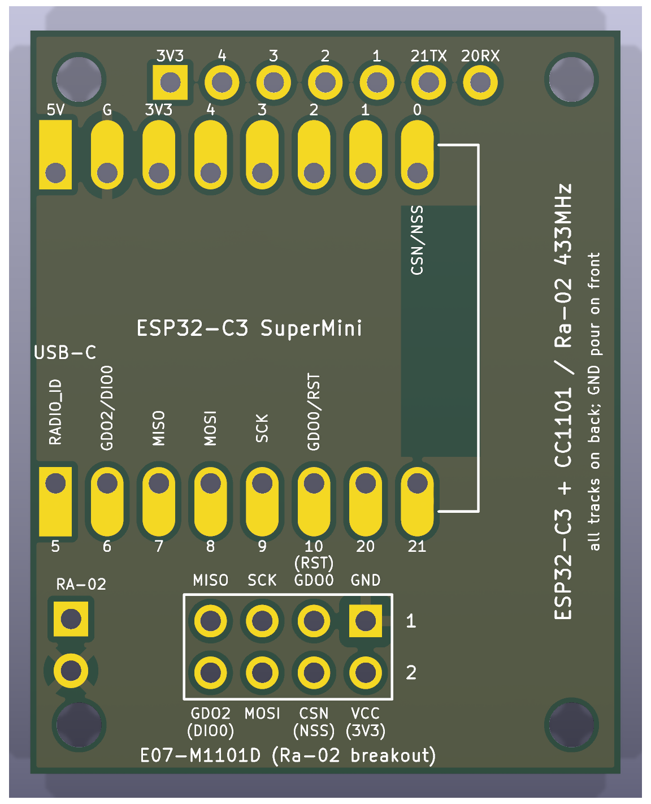
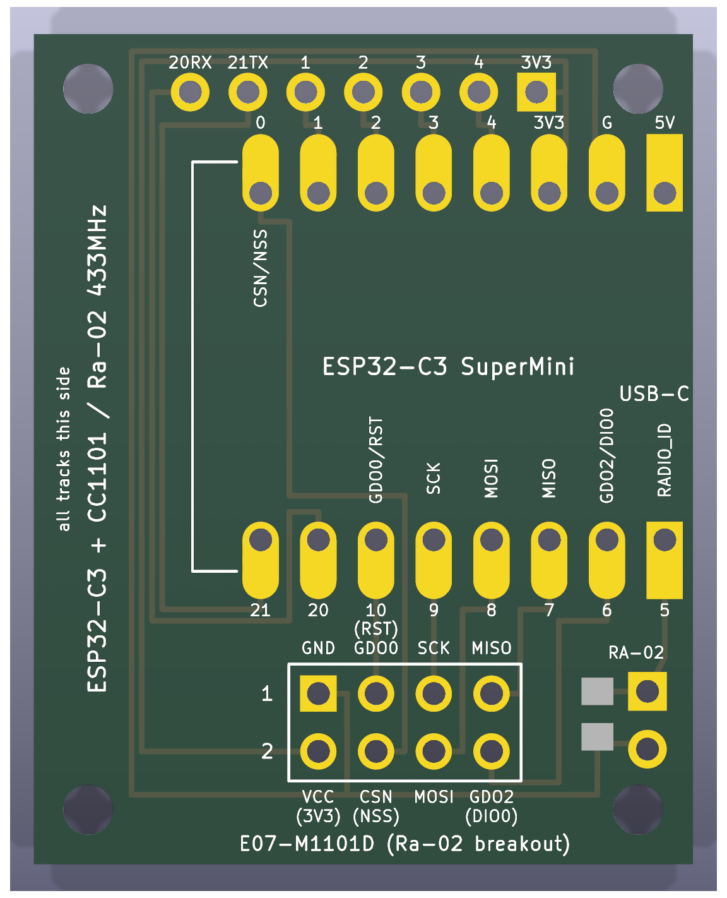
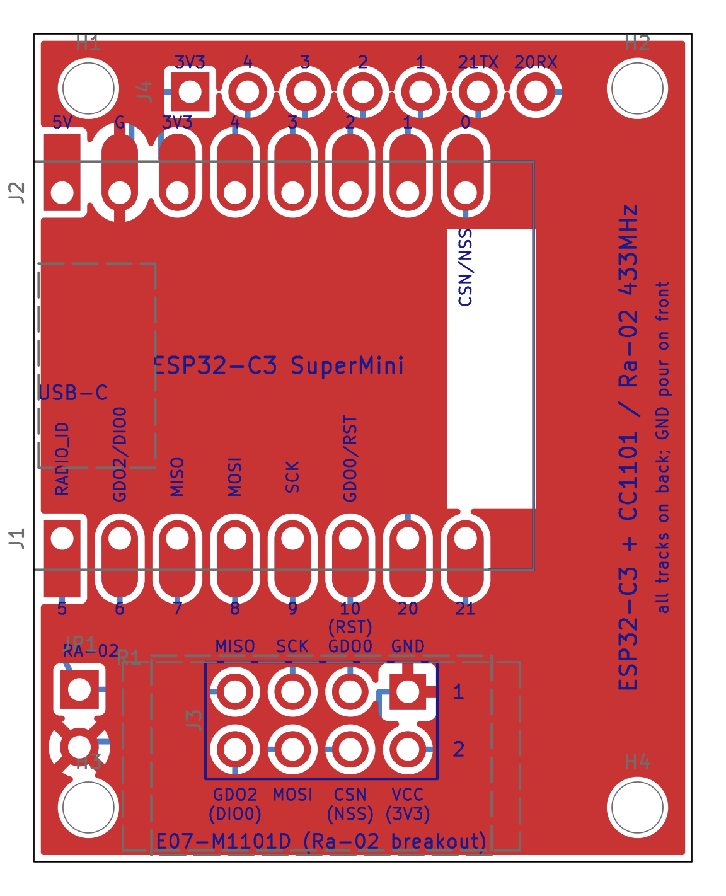
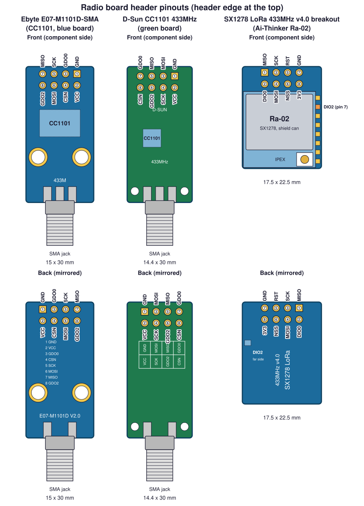
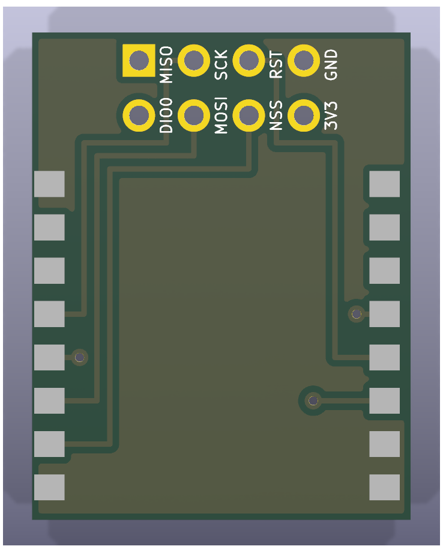
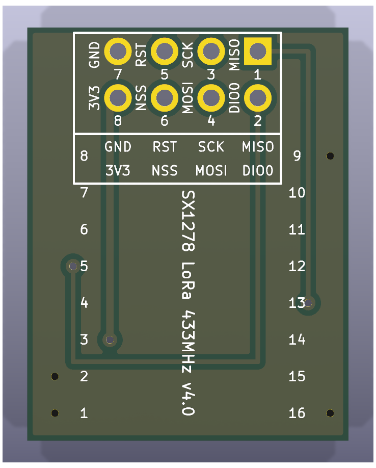
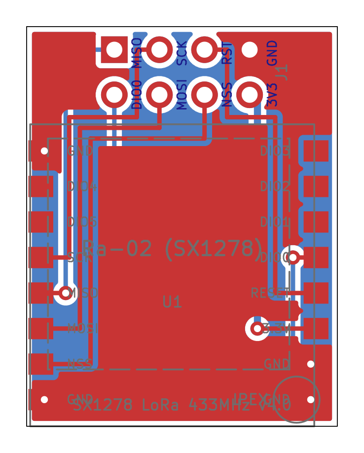

# esp32-to-433mhz

A small KiCad 9 carrier board that wires an ESP32-C3 SuperMini to a 433 MHz
radio board with a 2x4 pin header: either an Ebyte E07-M1101D (CC1101) or
an Ai-Thinker Ra-02 breakout (SX1278). One socket takes both, and the same
ESP32 pins serve either radio.

| Adapter | Radio | Size (mm) |
| --- | --- | --- |
| [`hardware/esp32c3-radio-adapter`](#the-adapter) | CC1101 E07-M1101D board **or** SX1278 Ra-02 breakout, in one socket | 27.0 x 36.5 |

Manufacturing packages (Gerbers and drill files for JLCPCB and NextPCB) are
attached to the
[latest release](https://github.com/mithro/esp32-to-433mhz/releases/latest);
see [CI and manufacturing packages](#ci-and-manufacturing-packages).

To design the adapter, the three commercial boards involved were first
reproduced as KiCad projects (outline, pin headers, castellations, mounting
holes, connector positions), so their footprints and pinouts could be checked
against photos and datasheets. They are kept under `hardware/parts/` as
[component boards](#component-boards) for reference:

| Component board | Original | Size (mm) |
| --- | --- | --- |
| [`hardware/parts/esp32-c3-supermini`](#esp32-c3-supermini) | ESP32-C3 SuperMini | 18.00 x 22.52 |
| [`hardware/parts/cc1101-e07-m1101d`](#cc1101-e07-m1101d-sma) | Ebyte E07-M1101D-SMA (TENSTAR CC1101 433 MHz module) | 15.0 x 30.0 |
| [`hardware/parts/sx1278-ra02-breakout`](#sx1278-ra-02-breakout) | SX1278 LoRa 433MHz v4.0 breakout (Ai-Thinker Ra-02 + 2x4 header) | 17.5 x 22.5 |

A second adapter for a castellated 16-pin SX1278 module, and that module's
reference board, are described [at the end](#sx1278-castellated-module-and-its-adapter).

All projects are generated by scripts (see [Regenerating](#regenerating)), so
edit the generator rather than the KiCad files.

## The adapter

| Signal | ESP32-C3 GPIO | E07-M1101D pin (CC1101) | Ra-02 breakout |
| --- | --- | --- | --- |
| MOSI | GPIO8 | 6 MOSI | MOSI |
| SCK | GPIO9 | 5 SCK | SCK |
| Chip select | GPIO0 | 4 CSN | NSS |
| MISO | GPIO7 | 7 MISO | MISO |
| IRQ / packet | GPIO10 | 3 GDO0 | RST (input to the radio; drive it as an output) |
| Second IRQ | GPIO6 | 8 GDO2 | DIO0 (the Ra-02's packet IRQ) |
| 3.3 V | 3V3 | 2 VCC | 3V3 |
| GND | GND | 1 GND | GND |
| Radio-type strap | GPIO5 | JP1 open, R1 not fitted | jumper on JP1 or 0R in R1 (to GND) |

The assignment is chosen so that the whole board routes on one copper
layer (see below): the radio signals sit on the SuperMini's GPIO column in
the order the socket wants them. GPIO8 and GPIO9 are ESP32-C3 boot
strapping pins, but they carry only ESP32 outputs (MOSI, SCK), which float
while the chip boots, so the radio never disturbs the boot mode; the
radio's own outputs (MISO, GDO0, GDO2) are on plain GPIOs. GPIO5 is the
radio-type strap (below); 3V3 and the unused GPIOs (GPIO1..4 and the UART
pair GPIO20/21) are brought out to a 1x7 header on the top edge. The
SuperMini's pins go into 1.0 mm through-holes so it
can be fitted with headers, and the pads are also extended past the
SuperMini's edge so it can be soldered flat by its castellations; its USB-C
connector hangs off the board edge and no copper runs under its ceramic
antenna. The silkscreen carries the SuperMini's own pin names on the outer
side of each header row and the radio signal names on the inner side.
Routing is generated by `scripts/generate_adapters.py`.


| 3D render, top | 3D render, bottom | Layout (copper, silk, fab, outline) |
| --- | --- | --- |
|  |  |  |

`hardware/esp32c3-radio-adapter`, 29 x 36.5 mm. Every track is on the back
copper, the expansion header and strap included; the front carries only the
pad copper and a GND pour (thermal-relieved to the SuperMini's G pin, the
socket's GND pin and the strap), so the back-layer artwork alone works as a
single-sided board for the header-pin option, with R1 on the copper side. A
keepout on both layers keeps the pour and all tracks away from the
SuperMini's ceramic antenna (the 3.8 mm of the module furthest from the
USB-C). Silkscreen is printed on both sides (the back copy mirrored), and
there is an M2 mounting hole 2.4 mm in from each corner.

The SuperMini lies on its side with its body overhanging the left edge by
0.5 mm, so its USB-C connector hangs clear of the board. Each of its 16 pins
lands on a keyhole pad: a 1.0 mm hole for header pins with 1.6 x 3.4 mm oval
copper extended outward to 1.2 mm past the SuperMini's edge, so the module
can instead be soldered flat by its castellations. Note that the flat option
needs the pad copper on the front, i.e. a normal two-layer (or plated) build
of the same files; on a home-etched single-sided board only the header-pin
option is available, because a castellated module on the copper side would
present its pins mirrored.

One 2x4 socket (1.0 mm holes, numbered like the E07-M1101D header: pin 1
square at the right of the outer row) takes either radio board, plugged in
component side up and extending past the bottom edge with its antenna
connector away from the carrier; the socket sits far enough right that
either board clears the bottom-left screw. The silk shows the E07-M1101D's
pin names next to the socket and, where the Ra-02 breakout's differ, the
breakout's names in parentheses one line further out; beside the SuperMini
the two board-dependent signals read "GDO0/RST" (GPIO10) and "GDO2/DIO0"
(GPIO3).

Lying sideways puts the SuperMini's GPIO row directly above the socket and
its power row behind it, which together with the GPIO assignment lets
every net, header and strap included, route on the back copper without
jumpers. GDO0/RST (GPIO10) and SCK (GPIO9) drop straight into the socket;
MOSI (GPIO8) and MISO (GPIO7) take one short lane each and enter their
pads from the side; GDO2/DIO0 (GPIO6) goes down the left of the socket and
into its pad from below. CSN/NSS is the one signal from the power row
(GPIO0, its last pin): it passes under that pad, crosses between the rows,
which nothing else uses, and drops through a gap in the GPIO row. GND and
3V3 leave the power row upward, run along the top edge above the expansion
header and down the strip right of the SuperMini into the socket's right
column, GND continuing under the socket to the strap. The layout plot
shows the back-copper tracks in blue.

### Expansion header and radio-type strap

J4 is a 1x7 2.54 mm header on the top edge, centred between the mounting
holes, carrying 3V3 and every GPIO the radio does not use in the order 3V3,
GPIO4, GPIO3, GPIO2, GPIO1, GPIO21, GPIO20 (pin 1, square, at the left; the
silk names them the way the SuperMini does, with the spare UART marked
"21TX" and "20RX"). GPIO4..1 rise straight from the power row; GPIO21 and GPIO20 leave
the GPIO row's right end and come up the strip right of the SuperMini, the
same strip GND and 3V3 come down. 5V is not on the header: its pad sits
under the top-left mounting hole and cannot be reached on one layer.

JP1 and R1, in the bottom-left corner beside the plugged-in radio board,
strap GPIO5 (net `RADIO_ID`) to GND so firmware can tell which radio it is
driving: JP1 is a 1x2 2.54 mm header for an ordinary jumper, R1 an 0805 pad
pair on the back copper in parallel with it for a 0R resistor as the
permanent alternative. The SX1278 module adapter ties the same pin to 3V3,
giving three distinct states:

| GPIO5 reads | Board |
| --- | --- |
| floating | this adapter with the E07-M1101D (CC1101): no jumper, R1 empty |
| low | this adapter with the Ra-02 breakout: jumper on JP1 or 0R in R1 |
| high | the SX1278 module adapter (GPIO5 hard-wired to 3V3) |

To read it, enable GPIO5's internal pull-down and sample (high means the
SX1278 module adapter), then enable the pull-up and sample again (low means
the Ra-02; high means the pin is floating, i.e. the CC1101). GPIO5 is not an
ESP32-C3 boot strapping pin, so tying it either way is harmless.

### Why one socket fits both boards

Seen from the carrier (radio board plugged in component side up, its header
edge at the top) the two boards' 2x4 headers are laid out almost
identically. Pin numbers are the E07-M1101D's own and the odd/even numbering
used for the Ra-02 breakout in this repository:

| Socket position | E07-M1101D (CC1101) | Ra-02 breakout | ESP32-C3 GPIO |
| --- | --- | --- | --- |
| Outer row, column 1 (left) | 7 MISO | 1 MISO | GPIO7 |
| Outer row, column 2 | 5 SCK | 3 SCK | GPIO9 |
| Outer row, column 3 | 3 GDO0 (output) | 5 RST (input) | GPIO10 |
| Outer row, column 4 (right) | 1 GND | 7 GND | GND |
| Inner row, column 1 (left) | 8 GDO2 (output) | 2 DIO0 (output) | GPIO6 |
| Inner row, column 2 | 6 MOSI | 4 MOSI | GPIO8 |
| Inner row, column 3 | 4 CSN | 6 NSS | GPIO0 |
| Inner row, column 4 (right) | 2 VCC | 8 3V3 | 3V3 |

Only column 3's outer pin and column 1's inner pin differ: the CC1101 board
puts its two interrupt outputs there (GDO0, GDO2) while the Ra-02 breakout
has its reset input and its single interrupt (RST, DIO0). Both positions are
wired to plain GPIOs (neither is a strapping pin), so firmware treats GPIO10
as an interrupt input for the CC1101 and as the reset output for the Ra-02,
and reads the Ra-02's DIO0 on GPIO6.



(Diagram drawn by `scripts/draw_pinouts.py` from the generators' geometry.)

## Component boards

Reference reproductions, under `hardware/parts/`, of the commercial boards
the adapter is built around. Each project reproduces the outline, pin
headers, castellations, mounting holes and connector positions of the
original so the adapter's footprints could be checked against photos and
datasheets; they are not built by CI (pass their names to
`scripts/export_manufacturing.py` to export them).

### ESP32-C3 SuperMini

| 3D render, top | 3D render, bottom | Layout (copper, silk, fab, outline) |
| --- | --- | --- |
|  |  |  |

`hardware/parts/esp32-c3-supermini`. The grey half-circles outside the outline in
the 3D renders are the outer halves of the castellation pads; the PCB fab
routes them away, leaving plated half-holes on the edge.

All values in millimetres, viewed from the component side with the USB-C end
at the top.

| Feature | Value |
| --- | --- |
| Board outline | 18.00 x 22.52, square corners |
| Pin pitch | 2.54 |
| Pins per side | 8 (16 total) |
| Distance between the two pin rows | 15.24 |
| Pin centre to long board edge | 1.38 |
| First pin centre to USB-C edge | 1.74 |
| Last pin centre to antenna edge | 3.00 |
| Through-hole drill | 1.00 |
| Castellation half-hole on the edge | 1.00 diameter, centred on the edge |
| Pad copper | 1.60 wide oval from the pin to the board edge |
| Board thickness | 1.0 (from the STEP model, not a datasheet) |

Pin names, top to bottom:

| Left (J1) | Right (J2) |
| --- | --- |
| GPIO5 | 5V |
| GPIO6 | GND |
| GPIO7 | 3V3 |
| GPIO8 | GPIO4 |
| GPIO9 | GPIO3 |
| GPIO10 | GPIO2 |
| GPIO20 | GPIO1 |
| GPIO21 | GPIO0 |

The USB-C connector, BOOT and RST buttons and the ceramic antenna of the
original board are drawn on the `F.Fab` layer as placement references only.

Sources:

* [GrabCAD "ESP32C3 SuperMini" STEP model by Ulf Hille](https://grabcad.com/library/esp32c3-supermini-1),
  redistributed in [mrtnvgr/KiCad_ESP32-C3-SuperMini](https://github.com/mrtnvgr/KiCad_ESP32-C3-SuperMini):
  board body 18.00 x 22.52, pin rows at +/-7.62, first pin 1.74 from the USB-C edge, 1.6 mm pad copper.
* [mischianti.org ESP32-C3 Super Mini dimension drawing](https://mischianti.org/esp32-c3-super-mini-high-resolution-pinout-datasheet-and-specs/):
  18.00 mm width, 15.24 mm row spacing, 22.50 mm length, pin order.
* [components101 ESP32-C3 Super Mini](https://components101.com/development-boards/esp32c3-mini-development-board-datasheet-pinout): 22.52 x 18.0 mm.
* Photographs of production boards for the keyhole castellated pad shape.

The hole diameter (1.0 mm) is the standard drill for 2.54 mm headers and
matches the hole size measured from the dimension drawing; it was not taken
from a manufacturer datasheet. Note that the community KiCad footprint linked
above has its GPIO column reversed (GPIO21 opposite 5V instead of GPIO5); the
footprints here were generated from scratch and follow the physical board.

### CC1101 E07-M1101D-SMA

| 3D render, top | 3D render, bottom | Layout (copper, silk, fab, outline) |
| --- | --- | --- |
|  |  |  |

`hardware/parts/cc1101-e07-m1101d`: the Ebyte E07-M1101D-SMA (PCB marked
"E07-M1101D V2.0"), sold as the "TENSTAR CC1101 433MHz Wireless Module" with
an SMA antenna.

All values in millimetres, viewed from the component side with the header at
the top and the SMA jack at the bottom.

| Feature | Value |
| --- | --- |
| Board outline | 15.0 x 30.0 |
| Header | 2 x 4, 2.54 pitch, 1.50 pads (pin 1 square), 0.90 holes |
| Header position | outer row 1.60 from the header edge, columns 3.70 from the long edges |
| Header numbering | outer row 7 5 3 1 left to right, inner row 8 6 4 2 |
| Mounting holes | 3.00 plated, 4.20 pad, 2.70 from each long edge, 10.0 from the SMA edge |
| SMA jack | edge mount, centred on the bottom edge; 1.5 mm pads, ground legs 4.25 either side |
| Board thickness | 1.6 (edge-mount SMA) |

Pin names (J1):

| Pin | Name | Pin | Name |
| --- | --- | --- | --- |
| 1 | GND | 5 | SCK |
| 2 | VCC (1.8 - 3.6 V) | 6 | MOSI |
| 3 | GDO0 | 7 | MISO / GDO1 |
| 4 | CSN | 8 | GDO2 |

Header pin 1, both mounting holes and the SMA ground legs are joined by GND
tracks on both copper layers; the original uses a ground pour instead. The
pin names are printed beside each header column on both sides.

Sources:

* [Ebyte E07 series user manual v1.00](https://ia802806.us.archive.org/26/items/ebytecdebytedl0719/557_E07_Usermanual_EN_v1.00.pdf),
  section 2.2 "E07 (M1101D-TH) / E07 (M1101D-SMA)": mechanical drawing
  (15.0 x 30.0, header 1.60 / 3.70 / 2.54, holes 2.70 / 10.0) and pin table.
* [Ebyte E07-M1101D-TH user manual v1.20](https://www.rcscomponents.kiev.ua/datasheets/e07-m1101d-th_usermanual_en_v1_20.pdf),
  section 3 "Size and pin definition": pad sizes (1.50 pad / 0.90 hole,
  4.20 ring / 3.00 hole).
* Seller listing (15 x 28 mm, pin table). The 28 mm figure is Ebyte's value
  for the spring-antenna variant; the SMA variant and the drawing say 30 mm.
* The SMA pad geometry follows the common 1.6 mm PCB edge-mount SMA jack
  (KiCad `SMA_Amphenol_132289_EdgeMount`), not an Ebyte drawing.

### SX1278 Ra-02 breakout

| 3D render, top | 3D render, bottom | Layout (copper, silk, fab, outline) |
| --- | --- | --- |
|  |  |  |

`hardware/parts/sx1278-ra02-breakout`: the blue "SX1278 LoRa 433MHz v4.0"
breakout, an Ai-Thinker Ra-02 LoRa module (IPEX antenna) on a 17.5 x 22.5 mm
carrier with a 2x4 2.54 mm male header on its back. Drawn as seen from the
Ra-02 side with the header edge at the top, the way it sits on the
adapter.

| Feature | Value | Source |
| --- | --- | --- |
| Outline | 17.5 x 22.5 mm | photos, scaled by the header pitch (+/- 0.3 mm) |
| Header | 2x4, outer row 1.3 mm from the header edge, columns centred | photos |
| Header pinout | outer row MISO, SCK, RST, GND; inner row DIO0, MOSI, NSS, 3V3 (left to right) | back-side silk in the photos |
| Ra-02 module | 17 x 16 x 3.2 mm, 16 castellations at 2.0 mm on the 17 mm edges, first 1.5 mm from the end | Ai-Thinker Ra-02 Specifications V1.0, section 3 |
| Ra-02 pins | 1-8 GND, GND, 3.3V, RESET, DIO0, DIO1, DIO2, DIO3 up the right edge from the IPEX corner; 9-16 GND, DIO4, DIO5, SCK, MISO, MOSI, NSS, GND down the left edge | Ra-02 Specifications V1.0, section 4 |
| IPEX | 1.5 / 1.0 mm from the pin-1 corner (bottom-right here) | Ra-02 Specifications V1.0, section 3 |

The header is numbered here like the `Conn_02x04_Odd_Even` symbol (odd pins
in the outer row, pin 1 at the left). Copper reproduces the connections:
four header nets run on the front and three (MISO, DIO0, 3V3) cross on the
back through vias, as the real board does (its back-side trace from the 3V3
header pin ends at a via exactly where module pin 3 sits, which is what
fixed the module's orientation). Both sides carry a GND pour. The back silk
carries the header's pin numbers and name grid and the Ra-02's pin numbers
beside each land; the header names also appear on both sides beside each
column. The breakout's two decoupling capacitors are not modelled, and the
module lands are drawn 1.4 x 1.2 mm.

## Castellations in KiCad

KiCad has no native castellated pad. Each castellation is a through-hole pad
whose drill is centred on the board edge; the fab cuts the plated hole in
half. On the SuperMini and the SX1278 module each pin is two pads sharing a
number: the through-hole inboard and the half-hole on the edge, joined by oval
copper.

KiCad flags copper and holes touching the board edge, so each project's
`.kicad_dru` ignores edge clearance and relaxes the hole-to-hole distance for
the edge-pad footprints only. Order the boards with the "castellated holes"
option at your PCB fab.

## Regenerating

The projects are produced by the scripts in `scripts/`, which need only the
Python standard library plus the stock KiCad symbol libraries (for the
connector symbols embedded in the schematics):

```sh
uv run scripts/generate_supermini.py
uv run scripts/generate_sx1278.py
uv run scripts/generate_cc1101.py
uv run scripts/generate_ra02_breakout.py
uv run scripts/generate_adapters.py
uv run scripts/fill_zones.py         # fills copper zones with KiCad's own filler
```

`fill_zones.py` needs the `pcbnew` Python module (present in KiCad's Docker
images and Linux packages); with the KiCad snap it re-runs itself inside the
snap's environment. It copies only the fill polygons into the generated
files, which stay byte-identical otherwise.

`scripts/kicadgen.py` is the shared library (footprints, board, schematic,
project settings, DRC rules). Verification and rendering with KiCad 9.0
(`kicad-cli`) and inkscape:

```sh
uv run scripts/verify_boards.py   # ERC + DRC with schematic parity, all boards
uv run scripts/render_boards.py   # docs/images/*.png
uv run scripts/draw_pinouts.py    # docs/images/pinout-radio-boards.svg
```

ERC reports only "global label not connected anywhere else" warnings (each
pin carries a single global label); DRC reports no violations on any board.

## CI and manufacturing packages

GitHub Actions (`.github/workflows/ci.yml`, KiCad 9.0.7 container) runs on
every push and pull request: it regenerates all boards (including zone fills)
and fails if the result differs from the commit, runs ERC/DRC with schematic
parity, and builds manufacturing packages with
`scripts/export_manufacturing.py`. Every push to `main` then publishes them:
the release attached to the most recent version tag is renamed to the build's
`git describe` (for example `v0.1-4-g93616a6`) and its assets replaced, so the
latest release always holds packages for the tip of `main`. CI creates no
tags; pushing a `vN.M` tag starts a new release the next time `main` is
built.

The packages cover the two adapter boards (the component boards are
reference models; pass their names to the script to export them too): one
zip per board for JLCPCB and one for NextPCB
(`<board>-<git describe>-<fab>.zip`: Gerber RS-274X with Protel extensions,
Excellon drill files and a README.txt of the size, stack-up and ordering
notes), plus `SHA256SUMS`. The boards' title blocks take their revision from
the same `git describe` string through the `GIT_DESCRIBE` text variable, which
the export defines at plot time.

```sh
uv run scripts/export_manufacturing.py --out dist   # same packages locally
```

## SX1278 castellated module and its adapter

A second carrier, `hardware/esp32c3-sx1278-adapter`, takes the 16-pin
castellated SX1278 module (PXL1276-D01) instead of a socketed board. It uses
the same GPIO assignment as the pin-header adapter plus GPIO4 for the
module's reset, so one firmware SPI setup serves all three radios:

| Signal | ESP32-C3 GPIO | SX1278 module pin |
| --- | --- | --- |
| MOSI | GPIO8 | 7 MOSI |
| SCK | GPIO9 | 8 SCK |
| Chip select | GPIO0 | 9 NSS |
| MISO | GPIO7 | 6 MISO |
| IRQ / packet | GPIO10 | 10 DIO0 |
| Second IRQ | GPIO6 | 2 DIO1 |
| Reset | GPIO4 | 11 RESET |
| 3.3 V | 3V3 | 5 VCC |
| GND | GND | 1, 12, 15 GND |
| Radio-type strap | GPIO5 | tied to 3V3 (reads high) |

This adapter is two-layer: the GPIO-column signals run on the top copper in
nested horizontal lanes below the SuperMini (the GPIO order matches the
module's pad order, so no lane crosses another), while power, reset and
NSS from the other column run on the bottom copper, with vias to the SMD
module pads. GPIO5 is hard-wired to 3V3 (silk "ID=3V3") so the
[radio-type strap](#expansion-header-and-radio-type-strap) reads high here.
Its manufacturing packages are built alongside the pin-header adapter's.

### Adapter: ESP32-C3 SuperMini to SX1278 module

| 3D render, top | 3D render, bottom | Layout (copper, silk, fab, outline) |
| --- | --- | --- |
|  |  |  |

`hardware/esp32c3-sx1278-adapter`, 24 x 58 mm. The SuperMini sits at the top
with its USB-C pointing off the top edge. The
[SX1278 module](#component-board-sx1278-lora-module) is soldered onto SMD land pads that
reproduce its castellations (1.0 x 3.0 mm pads extending 1.5 mm outside the
module edge), rotated so its 12-pad row faces the SuperMini and its ANT pad
faces the bottom edge. The antenna trace runs to a 1.0 mm hole for a spring
antenna wire (J3) and on to pads for an optional edge-mount SMA jack on the
bottom edge (J4, same footprint as the E07-M1101D's jack); fit one or the
other. DIO2-5 are landed but not connected.

### Component board: SX1278 LoRa module

| 3D render, top | 3D render, bottom | Layout (copper, silk, fab, outline) |
| --- | --- | --- |
|  |  |  |

`hardware/parts/sx1278-lora-module`: the 16-pin castellated 433 MHz SX1278 module
sold as "SX1278 LoRa 433MHz Wireless Module (PXL1276-D01)" with a spring
antenna. It is a derivative of the NiceRF LoRa1276/LoRa1278 layout.

All values in millimetres, viewed from the component side with the 12-pad
row on the left edge and pin 1 at the top.

| Feature | Value |
| --- | --- |
| Board outline | 17.0 (top/bottom edges) x 16.5 (left/right edges) |
| Left edge | 12 keyhole pads (pins 1-12) at 1.27 pitch, first hole 1.2 from the top corner |
| Bottom edge | 2 castellation-only notches: DIO4 (pin 13) 1.25 and DIO5 (pin 14) 2.7 from the left corner |
| Right edge | 2 keyhole pads: ANT (pin 16) 1.4 and GND (pin 15) 2.8 from the top corner |
| Keyhole pads, left row | 0.60 through-hole 1.2 in from the edge, 0.60 half-hole on the edge, 1.05 wide copper reaching 1.85 in |
| Keyhole pads, right edge | as above but hole 0.9 in from the edge, copper reaching 1.7 in |
| Notches | 0.60 half-hole on the edge, 0.8 wide copper reaching 0.55 in, no inboard hole |
| Board thickness | 1.0 (assumed) |

Pin names (J1), numbered counter-clockwise from the top-left:

| Pin | Name | Pin | Name |
| --- | --- | --- | --- |
| 1 | GND | 9 | NSS |
| 2 | DIO1 | 10 | DIO0 |
| 3 | DIO2 | 11 | REST (reset) |
| 4 | DIO3 | 12 | GND |
| 5 | VCC (3.3 V) | 13 | DIO4 |
| 6 | MISO | 14 | DIO5 |
| 7 | MOSI | 15 | GND |
| 8 | SCK | 16 | ANT |

The three GND pins are joined by tracks (the original uses a ground plane).
Approximate positions of the SX1278 and its crystal are drawn on `F.Fab`.

Sources and accuracy:

* Seller PDF for the "SX1278 LoRa 433MHz Wireless Module (PXL1276-D01)":
  module size 17 mm x 16.5 mm.
* Seller pinout photo (top-down with dimension lines) for the pin names in
  physical order: GND DIO1 DIO2 DIO3 VCC MISO MOSI SCK NSS DIO0 REST GND
  along the row, DIO4 and DIO5 at the adjacent corner, ANT and GND at the
  opposite corner. The seller's pin table lists REST twice, which shifts its
  last four entries by one; the photo was followed.
* No manufacturer drawing was found for this variant. Pad positions were
  measured in pixels from the top-down pinout photo and a perspective-
  rectified product photo; both give the 12-pad row a 1.27 mm pitch on the
  16.5 mm edge (the pinout photo's dimension labels appear to have the two
  sides swapped). Positions are accurate to roughly +/-0.15 mm; the pitch,
  pin count and outline are solid.
* Close-up photos show the 12 row pads and the two ANT/GND pads are keyholes
  like the SuperMini's (a plated through-hole plus a half-hole castellation on
  the edge, joined by an oval), while DIO4 and DIO5 are plain castellations
  without an inboard hole. The
  [NiceRF LoRa127X datasheet](https://makerhero.com/img/files/download/LoRa127X-Module-Datasheet.pdf)
  mechanical drawing shows the same construction for this family and
  supplied the 0.6 mm hole size.

## Licence

Apache License 2.0, see `LICENSE`.
