# 3D models and case design

`hardware/3d/` holds STEP models, built by `scripts/build_3d.py` with
[CadQuery](https://cadquery.readthedocs.io/), of every board in the repo
and of the parts that go with them. The KiCad boards reference them, so
KiCad's 3D viewer and `kicad-cli pcb export step` show the adapters
populated, and the CI release includes the resulting assemblies
(`<adapter>-assembly-<variant>.step` / `.glb`) ready to import into a CAD
tool for a case. The geometry that matters for a case (outlines, hole
positions, connector positions, stack heights) follows the footprints and
datasheets; chips, crystals and shield cans are boxes of the right size.

| Model | Origin | Contents |
| --- | --- | --- |
| `esp32-c3-supermini.step` | left column pin 1 (GPIO5) | PCB with castellations, USB-C (1.5 mm past the edge), buttons, chip, antenna, two 1x8 headers underneath |
| `cc1101-e07-m1101d.step` | header pin 1 (GND) | PCB with its two 3 mm holes, CC1101 and passives, edge-mount SMA jack, 2x4 header underneath |
| `cc1101-dsun.step` | header pin 1 (GND) | the green D-Sun board: PCB with its two 1.8 mm holes, CC1101, crystal and passives, SMA jack, 2x4 header underneath |
| `sx1278-ra02-breakout.step` | header pin 1 (MISO) | PCB, Ra-02 module with shield can and IPEX socket, 2x4 header underneath |
| `sx1278-ra02-pigtail.step` | as the breakout | U.FL plug, cable and SMA bulkhead jack with nut, on the same axis as the E07's SMA jack |
| `sx1278-lora-module.step` | module top-left corner | castellated module PCB and shield can |
| `*-components.step` | as above | the same without the PCB, for the reference boards under `hardware/parts/` |
| `pin-header-1x07/1x02.step`, `jumper-cap.step`, `r0805.step`, `sma-edge-jack.step` | footprint origin | the adapters' own parts |

Every module is joined to its adapter by a 2.54 mm male pin header soldered
at both ends: the header's 2.5 mm body sits between the boards (against the
module's back, on the adapter's front) and its long pins point down through
the adapter, so 4.4 mm of pin stands out under the 1.6 mm adapter. The
adapter's own headers face up, with 6 mm pins.

| Socket adapter with E07-M1101D | Socket adapter with Ra-02 breakout and pigtail |
| --- | --- |
| 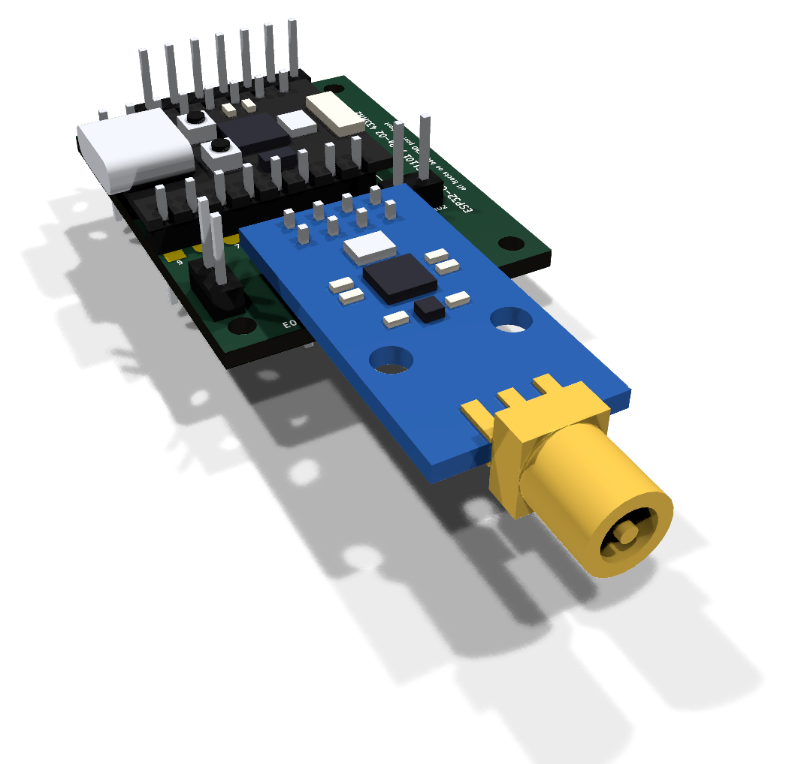 | 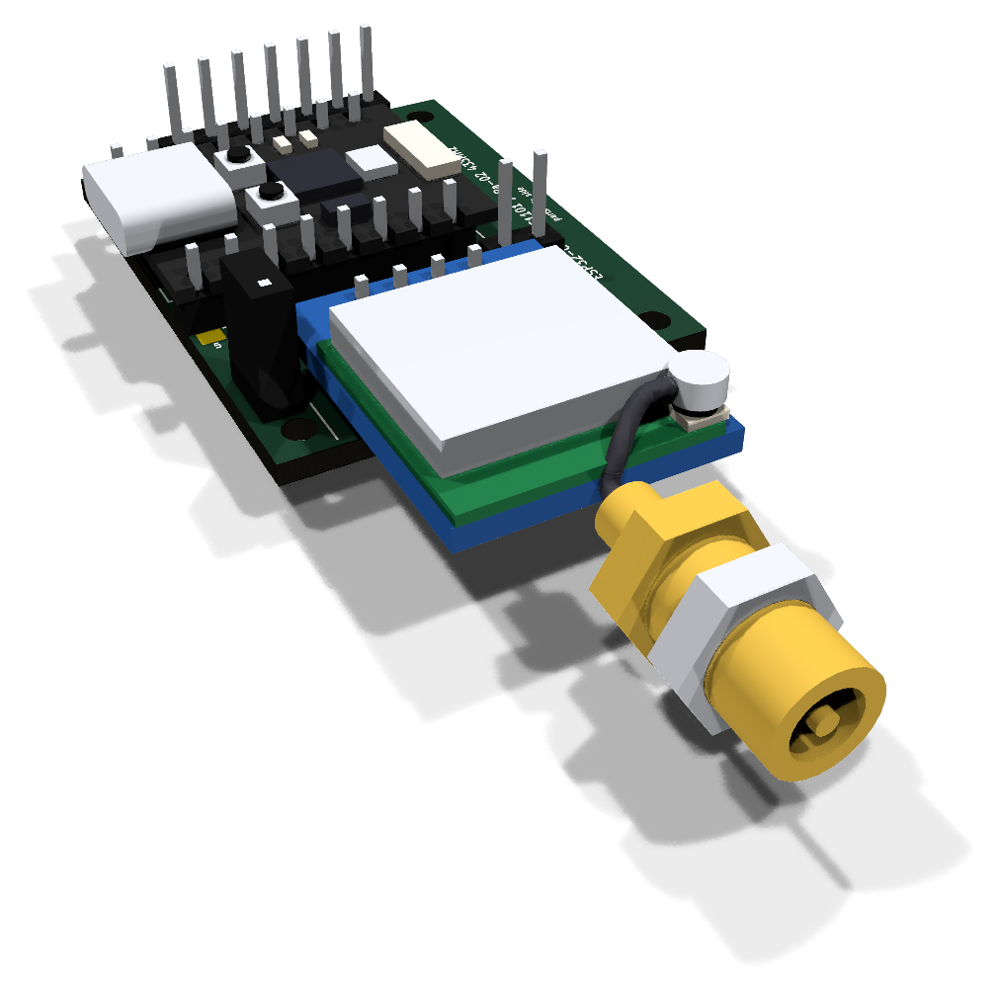 |
| 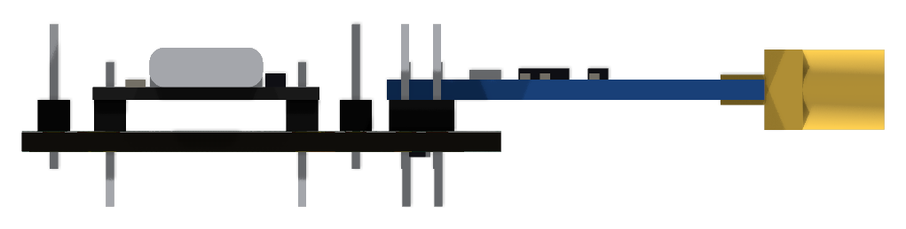 | 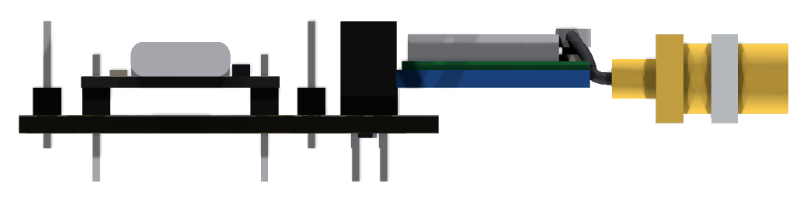 |

Key dimensions of the socket adapter assembly, in mm from the adapter's
top-left corner (x right, y down) and its top surface (z up); the STEP files
carry the rest:

| Item | x | y | z |
| --- | --- | --- | --- |
| Adapter board | 0 to 29 | 0 to 38.0 | -1.6 to 0 |
| M2 holes (2.2 mm) | 2.4 and 26.6 | 2.4 and 35.6 | |
| Pin tips under the board | | | -6.0 (module headers), -3.0 (J4, JP1, J5) |
| SuperMini PCB (1.0 thick) | -0.5 to 22.0 | 5.6 to 23.6 | 2.5 to 3.5 |
| USB-C receptacle | -2.0 to 5.4 | 10.1 to 19.1 | 3.5 to 6.7 |
| Highest point (J4/J5 pins, jumper on JP1) | | | 8.5 |
| J5 header body (2.54 cube per pin) | 19.54 to 24.62 | 25.23 to 27.77 | 0 to 2.5 |
| E07-M1101D PCB (1.6 thick) | 5.2 to 20.2 | 28.9 to 58.9 | 2.5 to 4.1 |
| E07 SMA jack: body, then barrel (6.35 dia) | axis 12.7 | 58.9 to 61.9, then to 68.4 | axis 3.3 |
| Ra-02 breakout PCB (1.6 thick) | 3.9 to 21.4 | 29.2 to 51.7 | 2.5 to 4.1 |
| Ra-02 shield can top / U.FL plug top | | | 7.3 / 7.9 |
| Pigtail SMA bulkhead: crimp, hex flange (8 AF), barrel, nut | axis 12.7 | 55.0 to 59.0, to 61.5, to 71.0; nut 64.0 to 66.4 | axis 3.3 |

J5's body clears the SuperMini by 1.61 mm and an Ra-02 breakout by
1.43 mm; an E07-M1101D's top edge is 0.3 mm further up the board, leaving
1.13 mm.

The bulkhead jack is placed so that its barrel sits where the E07's does
(same axis, starting 2.6 mm further out), so one antenna hole in a wall at
y = 61.5 to 64 suits both radios: the E07's jack passes through it, the
bulkhead is clamped in it by its nut. A real pigtail's cable is longer than
the drawn one, so leave room to stow the excess beside the breakout.

## The printed case

`scripts/build_case.py` builds exactly that case with CadQuery, from the
generator's constants and the table above: `hardware/case/*.stl` for
printing and `hardware/3d/esp32c3-radio-adapter-case-{bottom,top}.step` as
KiCad models (origin at mounting hole H1), which the `radio-*-case-*`
variants of `scripts/render_assemblies.py` put on the board:
`-case-closed` with both halves snapped together, `-case-open` with the
bottom half only, and `-case-exploded` with the top half lifted 16 mm;
`case-bottom` and `case-top` render each half by itself.  Closed and open
come out as one sheet each of the isometric view and the six sides (front
is the antenna end, back the SuperMini end with the pry notch, left the
USB-C window); the README's [Printing a case](../README.md#printing-a-case)
has the closed case with the E07-M1101D, the open one with the Ra-02 and
the halves on their own.  The design views, with either radio:

| E07-M1101D | Ra-02 breakout and pigtail |
| --- | --- |
| 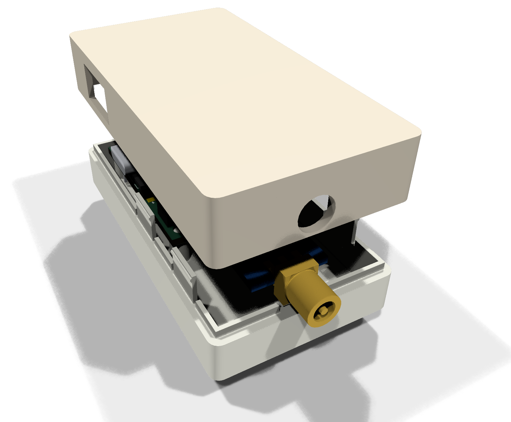 | 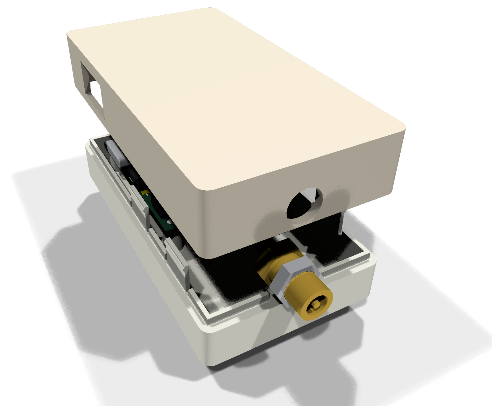 |
| 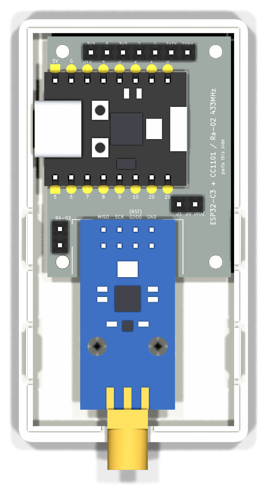 | 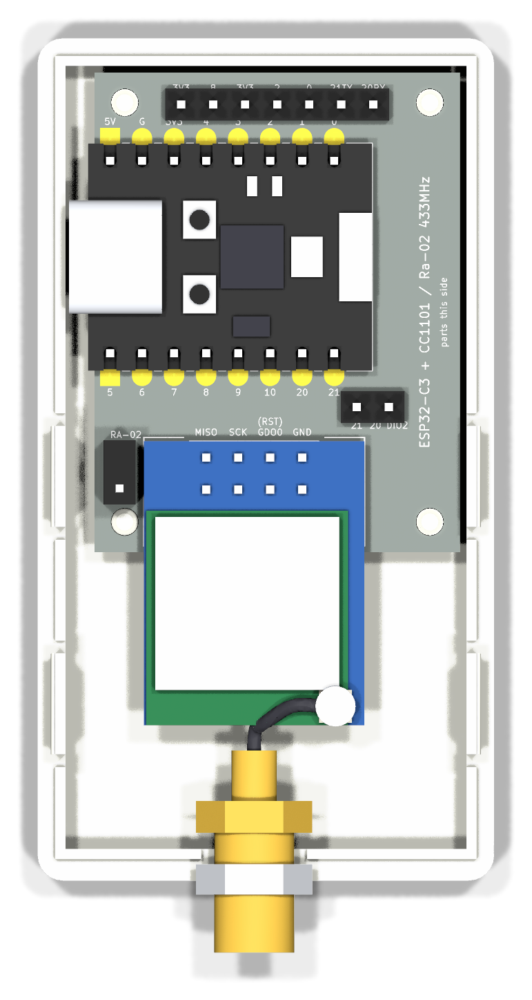 |

Closed with the Ra-02 breakout, its pigtail bulkhead and nut in the
antenna hole:

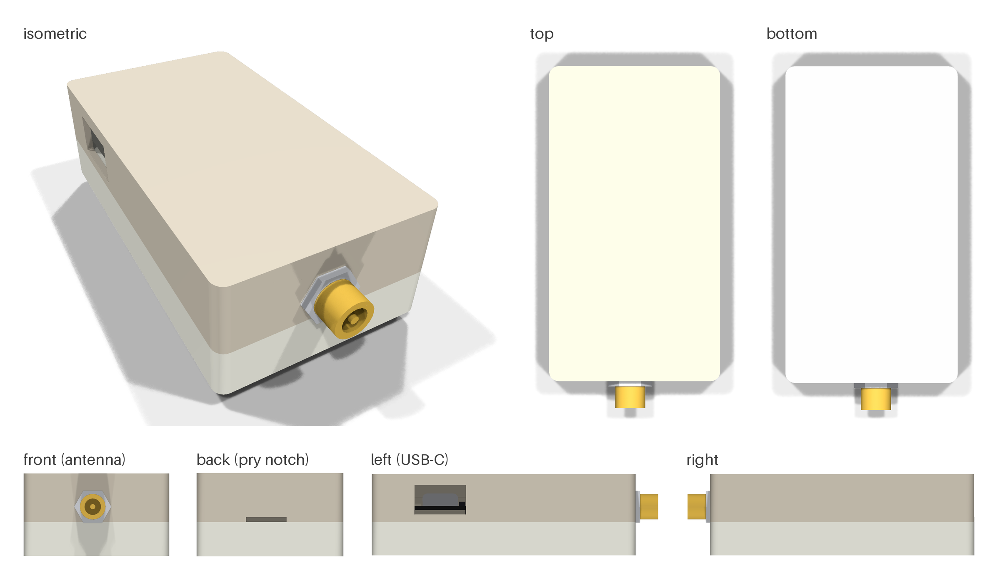

Open with the E07-M1101D:

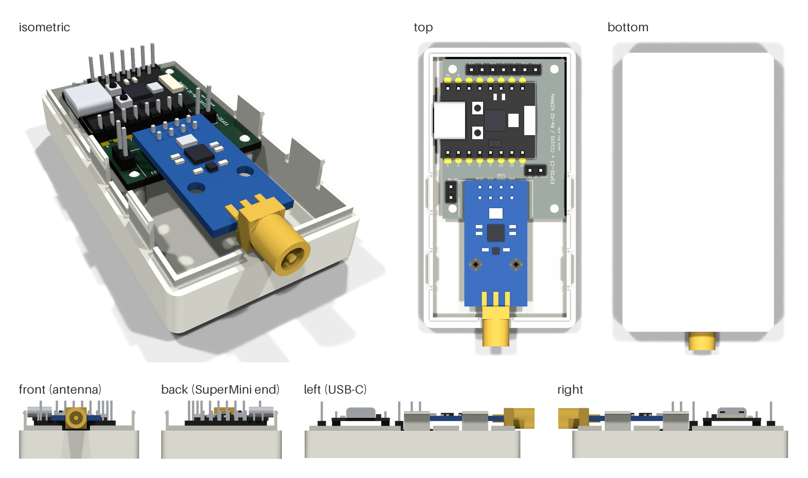

Dimensions, in the adapter's frame (x right, y down from the board's
top-left corner, z up from its top surface):

| Feature | Value |
| --- | --- |
| Cavity | x -2.3 to 29.5, y -0.5 to 61.5, z -7.0 to 9.6 (the USB-C face, the pin tips under the board and the J4/J5 pins with 0.3 to 1.1 mm to spare) |
| Walls, floor, ceiling | 2.2 / 2.0 / 2.0 mm; the antenna wall 2.5 mm, y 61.5 to 64.0 |
| Outside | 36.2&nbsp;x&nbsp;66.7&nbsp;x&nbsp;20.6 mm, vertical corners R2 |
| Parting line | z = -0.5, just under the board's top, so the USB-C window and the antenna hole are whole in the top half. Bottom half 8.5 mm tall, top half 12.1 |
| Standoffs and pegs | 4.0 mm standoffs under the four M2 holes, floor to the board's underside (5.4 mm), each with a 2.15 mm peg, chamfered, standing 0.4 mm proud of the board (flush at the bottom-left hole). FDM pegs print a touch oversize, which is the press fit into the 2.2 mm holes. 4 mm rather than 5 so the bottom-left one clears JP1's pin 2. |
| Hold-down bosses | from the ceiling to 0.2 mm above the board: 4.4 mm bosses bored 2.6 mm over three pegs, and a 3.0 mm solid one at (2.2, 36.6) in the bottom-left corner, beside its hole, because a jumper cap on JP1 and the Ra-02's overhang leave no room over it |
| Snap fit | the bottom half's lip (the inner 0.8 mm of the wall) rises 1.5 mm into a rebate in the top half's skirt, 0.15 mm clear, gapped at the antenna hole. Two tabs per long wall (at y 32 and 50), 8 mm wide, 6 mm tall, cut free of the lip by 1 mm slots, each with a 0.35 mm half-round bump at 5.3 mm that clicks into a 0.42 mm groove in the skirt. The bump stands 0.2 mm proud of the skirt face, about 1 % strain over the tab |
| USB-C window | left wall, 13&nbsp;x&nbsp;7.5 mm centred on the receptacle (y 14.6, z 5.1): room for a plug's overmoulding, so it seats fully |
| Antenna hole | 6.6 mm at x 12.67, z 3.3, with a 7.4 mm square pocket 0.6 mm deep on the inside for the E07 jack's body, which reaches 0.4 mm into the wall |
| Pry notch | 10&nbsp;x&nbsp;1.2 mm in the top half's skirt at the y = 0 end, on the seam |

The script's constants are the numbers above, and before it writes
anything it intersects both halves with a solid for every part they have
to house (the boards, the headers and a jumper cap, the pins under the
adapter, the back-side resistors, the USB-C receptacle and a plug's
overmoulding, both radios' antenna connectors and the pigtail's nut), with
the cavity above the board (which only the pegs and bosses may enter), and
with each other closed, and stops if any intersection is not empty.

The SX1278 module adapter assembly (`esp32c3-sx1278-adapter-assembly-module`)
is 24&nbsp;x&nbsp;58 mm with the SuperMini at the top, the module soldered flat
(3.2 mm tall) and the optional SMA jack on the bottom edge at x = 17:

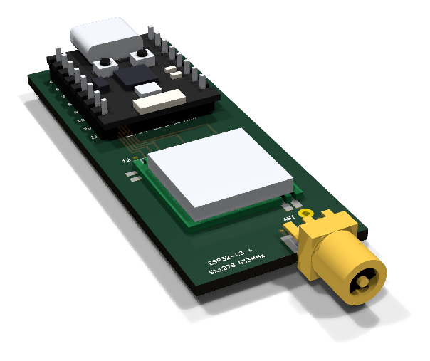

The reference boards render with the products' parts on them:

| ESP32-C3 SuperMini | CC1101 E07-M1101D-SMA | CC1101 D-Sun | SX1278 Ra-02 breakout | SX1278 module |
| --- | --- | --- | --- | --- |
| 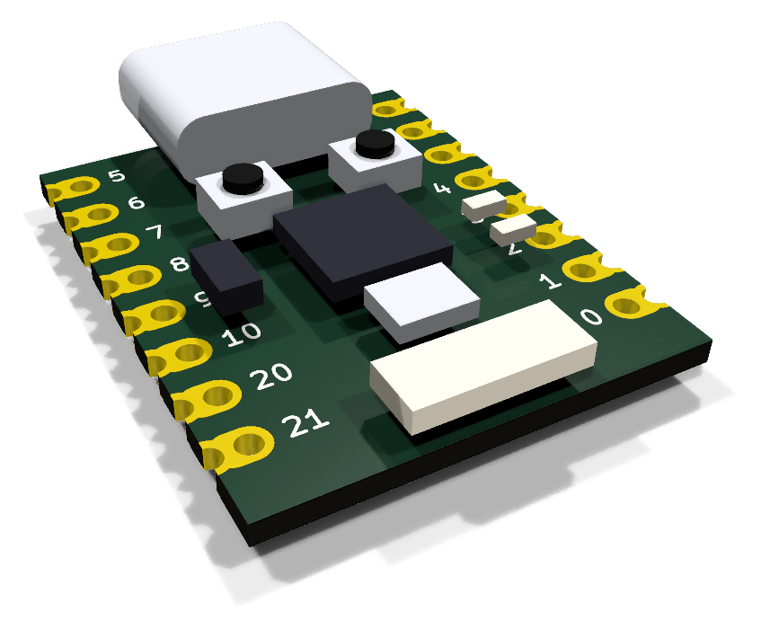 | 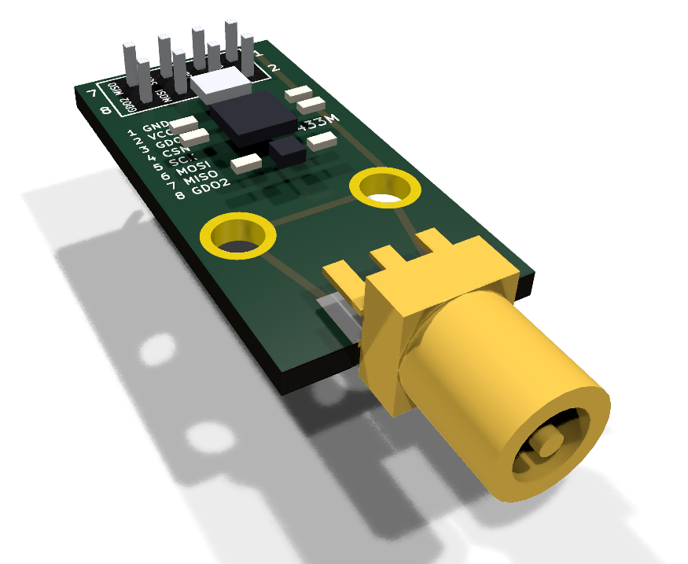 | 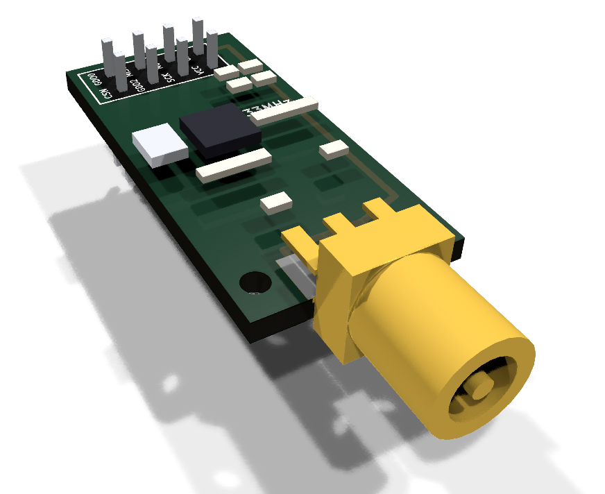 | 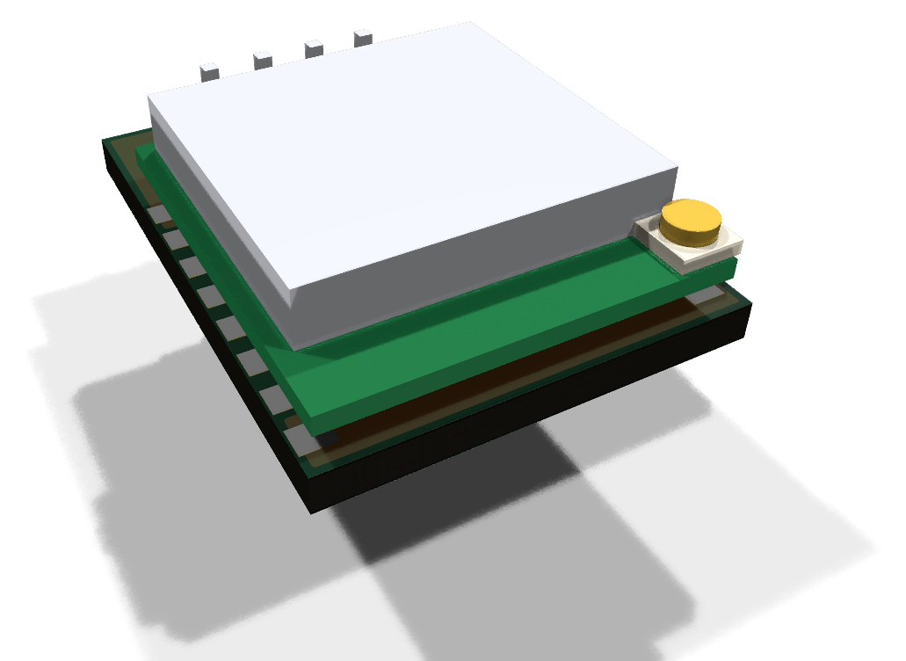 | 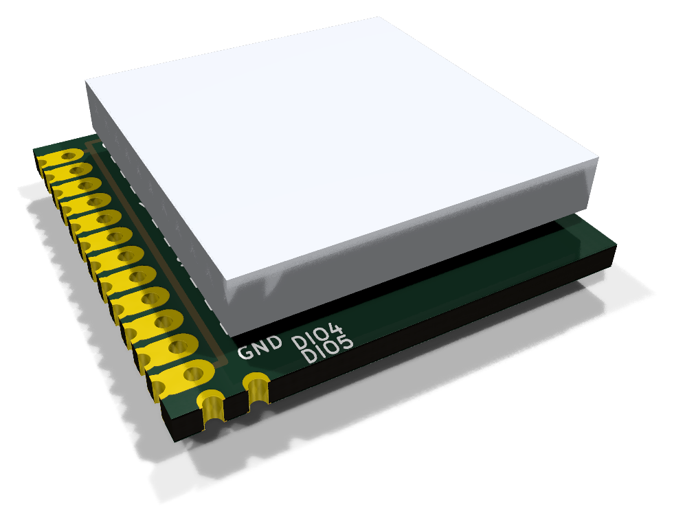 |
