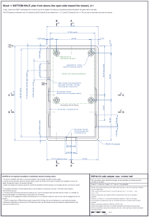
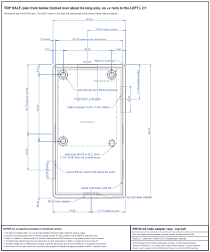
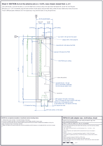
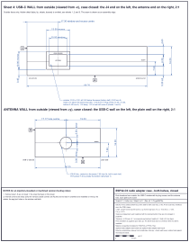
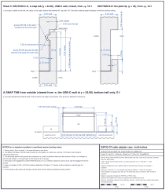
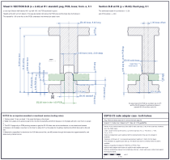
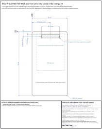

# Case drawings

Mechanical drawings of the printed case for the socket adapter
(`hardware/case/`), for checking a printed part with calipers and as the
starting point for an injection-moulded or machined version. They are
drawn by `scripts/draw_case.py` from `scripts/case_dims.py`, the same
constants `scripts/build_case.py` builds the solids from, so the numbers on
the sheets cannot drift from the model. Every number on a sheet is tagged
with the name of the measurement `build_case.py` takes of the finished
solids (`hardware/case/esp32c3-radio-adapter-case-measured.json`), and
`uv run scripts/draw_case.py --check` reads the numbers back out of the
SVG files and compares them with those measurements (see
[Development](development.md)). The caliper checklist at the end of this
page is written by the same script.

Every sheet is in the adapter's frame: x right, y down from the PCB's
top-left corner, z up from the PCB's top face; the PCB is drawn in green
for reference. The datums the sheets and the checklist measure from are
the case's outside faces: A is the outside bottom face (z = -4.6), B the
USB-C wall's outer face (x = -4.5) and C the J4-end outer face (y = -2.7).
The four walls are named by what they carry: the USB-C wall (-x, the
case's left, with the window and plug recess), the antenna wall (+y, the
front), the J4 end (y = 0, the back, with the SuperMini and the pry notch)
and the plain wall (+x). The views are independent, each captioned with
its viewing direction, and not arranged in projection. The sheets are
sized in millimetres (2:1 for the views, 5:1 and 10:1 for the details), so
printed at 100 % they lay on the part, and each carries a scale bar. No
draft angles are modelled, and the only radii are the R2 vertical outside
corners; sheet 1 carries the tooling notes for a moulding or machining
engineer, and the other sheets the ones that bear on them.

The case's parting line is on the antenna axis (z = 3.3), so the antenna
hole and the USB-C window are each half in one half: the bottom half's
cut-outs cradle the connectors and the top half closes over them. The
title block's revision is the `git describe` of the last commit that
touched `hardware/case/` (the STL files and the measurements), so the
sheets name the model they were checked against and regenerating them on
a later commit changes nothing.

## Sheet 1: bottom half, plan from above

The cavity, the walls and the lip round the rim (gapped in the antenna
wall for the E07's jack body and across the USB-C plug recess, where the
top half's wall is full thickness), the four standoffs with their
press-fit pegs (the H3 peg is flush with the PCB), the two snap tabs on
each long wall with their slots, and the cut-outs that come down to the
seam: the USB-C window with its plug recess in the left wall, the E07
pocket and the half-hole in the antenna wall. Positions are given from
the datums; the section marks A-A and B-B (viewed from -x) and C-C and
D-D (viewed from +y) locate the other sheets.

## Sheet 2: top half, plan from below

The top half turned over about its long axis, so +x runs to the left and
the USB-C wall is on the right: the skirt and its rebate (absent across
the plug recess), the grooves the bumps click into (hidden), the three
bored hold-down bosses over the pegs and the solid one beside H3, the pry
notch, the window head seen through the window, the half-hole in the
antenna wall, and where the slotted top's J4 slot would be.

## Sheet 3: section A-A on the antenna axis

Both halves closed, cut at x = 12.67 (the antenna axis), viewed from -x
and laid out like the plan with y down the sheet, so z runs to the right:
the floor, seam and ceiling, the halves' heights, the standoff / peg /
boss stack at H2 and H4 behind the cut with the plain wall's lip, tabs
and rebate ceiling, the lip and the pry notch at the J4 end, the PCB
sectioned in green, and the antenna hole split by the seam with the E07
pocket under it in the bottom half.

## Sheet 4: end elevations

The closed case's USB-C wall from outside (viewed from -x, the antenna end
on the right) with the window and the plug recess, both split by the
seam, dimensioned from datums A and C; and the antenna wall from outside
(viewed from +y, the USB-C wall on the left) with the hole centred on the
seam, dimensioned from A and B. Hidden detail is omitted; the seam is
drawn as an assembly edge.

## Sheet 5: the snap joint

Section C-C through a tab with the case closed at 10:1 (skirt, rebate,
clearance, tab, bump and groove, and how far the bump stands past the
skirt face), section D-D through the plain lip, both viewed from +y, and
a tab of the bottom half seen from outside (viewed from -x) at 5:1 with
its slots and the position of the top half's groove dashed for reference.

## Sheet 6: the peg, PCB and boss stack

Section B-B through hole H1 at 5:1, viewed from -x, with every height from
datum A (floor top, standoff top, PCB top, peg tip, boss face, ceiling,
top face), the standoff's height (the floor to the PCB's underside, which
is the room the trimmed pin stubs have) and the local sizes (standoff,
peg and chamfer, PCB hole, bore, boss), and the same section at H3 where
the peg is flush and the solid boss sits 1 mm beside the hole. The PCB is
sectioned in green.

## Sheet 7: the slotted top half

The second top half from above (the outside of the ceiling), with the slot
over J4 for jumper wires out of the closed case dimensioned from datums B
and C; otherwise it is sheet 2's top half.

## How to check a printed part

Measure in this order with 0.01 mm calipers (a depth rod for the depths),
outside first; the expected values are the model's and the tolerance is
what a well-tuned FDM printer holds. Anything outside it points at the
printer (first-layer squish, over-extrusion, shrinkage) before it points
at the model. Each depth names its reference surface: a caliper's base
rests on the highest thing under it, which on the bottom half is a tab
near the tab positions and the lip elsewhere (1.5 mm above the rim), and
on the top half the skirt's edge, which is on the seam plane. The rebate
cannot take a depth rod.

<!-- checklist:begin (written by scripts/draw_case.py) -->
Tolerances (the sheets' note): ±0.20 linear, ±0.10 on snap and peg
features, heights ±0.10 (half a 0.2 mm layer), each half printed as
supplied (open side up); the Ø2.60 boss bore is a minimum limit.
Every expected value below is one of the 73 that `--check` compares
with the measured solids.

| # | Measurement | Expected | Tolerance |
| --- | --- | --- | --- |
| 1 | Each half outside, width x length (calipers across the outside faces) | 36.20 x 66.70 | ±0.20 |
| 2 | Closed case height, outside bottom face (A) to the outside top face | 16.20 | ±0.10 |
| 3 | Bottom half: A to the wall's top (the rim, on the seam), beside a tab; tab tips above A | 7.90; 12.90 | ±0.10 |
| 4 | Top half: outside top face to the skirt's edge (on the seam); boss faces standing past the skirt's edge (straight edge across the skirt) | 8.30; 3.10 | ±0.10 |
| 5 | Vertical corner radius (radius gauge), each half | R2.00 | ±0.20 |
| 6 | Bottom half: long wall, back (J4 end) wall and antenna wall thickness at the rim, below the lip | 2.20; 2.20; 2.50 | ±0.20 |
| 7 | Bottom half: cavity, width x length, below the lip | 31.80 x 62.00 | ±0.20 |
| 8 | Bottom half: lip thickness; lip height above the rim | 0.80; 1.50 | ±0.10 |
| 9 | Bottom half: lip gaps, in the antenna wall (centred on the antenna axis) and in the USB-C wall (across the plug recess) | 8.40; 13.00 | ±0.20 |
| 10 | Bottom half: tab width; tab height above the rim; tab thickness through the bump; pitch of the two tabs | 8.00; 5.00; 1.15; 18.00 | ±0.10 |
| 11 | Bottom half: first tab's centre from the J4-end outside face (C); bump centre above the rim | 34.70; 4.30 | ±0.20 |
| 12 | Bottom half, depth rod with its base across both lips at y = 44 (section D-D, no tab there), the lips 1.50 above the rim: floor; standoff top; peg tip (H1, H2, H4); peg tip H3 | 7.40; 6.40; 4.40; 4.80 | ±0.10 |
| 13 | Bottom half: floor thickness (bottom half height less the floor depth from the rim) | 2.00 | ±0.10 |
| 14 | Bottom half: standoff diameter; standoff height, floor to the PCB's underside (the trimmed pin stubs' room); standoff pitch, across x along | 4.00; 1.00; 24.20 x 33.20 | ±0.20 |
| 15 | Bottom half: H1 standoff centre from the USB-C wall's outside face (B) and from the J4-end face (C) | 6.90; 5.10 | ±0.20 |
| 16 | Bottom half: peg diameter below the chamfer; peg above the standoff (H1, H2, H4); H3 | 2.15; 2.00; 1.60 | ±0.10 |
| 17 | Bottom half: USB-C window width; its sill below the rim; window centre from C | 10.00; 2.60; 17.30 | ±0.20 |
| 18 | Both halves: plug recess width; recess depth into the wall; wall left under it; recess bottom above A (bottom half) and top above A (top half) | 13.00; 1.00; 1.20; 3.45; 13.45 | ±0.20 |
| 19 | Bottom half: antenna half-hole width at the rim; its depth below the rim; centre from B; E07 pocket width; pocket depth into the wall; pocket floor below the rim | 6.60; 3.30; 17.17; 7.40; 0.60; 3.70 | ±0.20 |
| 20 | Top half: skirt thickness at its edge; between the skirt's inner faces | 1.25; 33.70 | ±0.10 |
| 21 | Top half: rebate height above the skirt's edge. No depth rod fits the 0.95 rebate: a strip of 0.80 card cut to this height should just enter it, or take it from the tab height plus the clearance over the tab | 5.30 (0.30 over the tab) | ±0.10 |
| 22 | Top half, depth rod with the base across the skirt's edge (on the seam plane): ceiling | 6.30 | ±0.10 |
| 23 | Top half: ceiling thickness (top half height less the ceiling depth) | 2.00 | ±0.10 |
| 24 | Top half: boss diameter; bore diameter (minimum); bore depth; solid boss diameter | 4.40; 2.60 min; 2.00; 3.00 | ±0.10 |
| 25 | Top half: groove centres from C (a pin in the groove, against a rule along the skirt); groove length | 34.70, 52.70; 9.00 | ±0.20 |
| 26 | Top half: USB-C window head above the skirt's edge; antenna half-hole depth above the skirt's edge | 3.70; 3.30 | ±0.20 |
| 27 | Top half: pry notch width; notch height above the skirt's edge; notch centre from B | 10.00; 1.20; 19.00 | ±0.20 |
| 28 | Slotted top half: J4 slot length x width; slot centre from B and from C | 18.78 x 3.54; 19.00, 5.25 | ±0.20 |
| 29 | Function: the PCB presses onto the pegs by hand and sits flat on the standoffs; the halves close with no gap at the seam and all four tabs click; the E07's jack, or the pigtail's bulkhead, passes the hole; a USB-C plug reaches the receptacle through the recess | - | - |
<!-- checklist:end -->

The snap fit (bump 0.35 into a 0.42 groove with 0.15 clearance) cannot be
measured with calipers; if the halves rattle or will not click, check the
lip, the tab thickness at the bump and the skirt first. FDM holes print
small and pegs print large, which is why the peg is drawn at 2.15 for a
2.20 hole: if the pegs will not go in, a touch with a 2.2 mm drill in the
PCB is better than shaving the peg.
