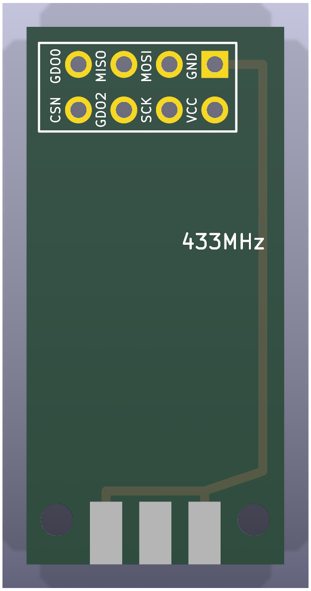
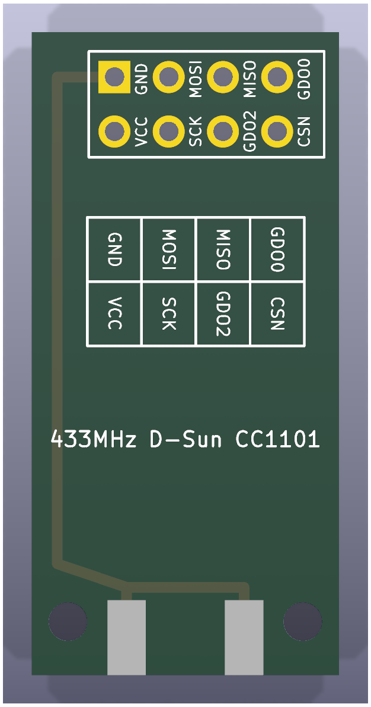
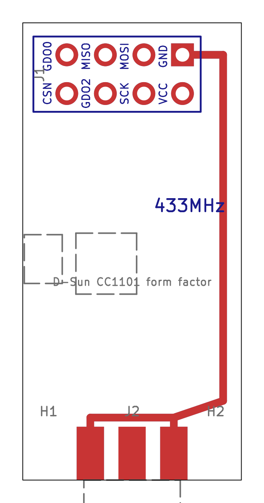

# Component boards

Reference reproductions, under `hardware/parts/`, of the commercial boards
the adapter is built around. Each project reproduces the outline, pin
headers, castellations, mounting holes and connector positions of the
original so the adapter's footprints could be checked against photos and
datasheets; they are not built by CI (pass their names to
`scripts/export_manufacturing.py` to export them).

## ESP32-C3 SuperMini

| 3D render, top | 3D render, bottom | Layout (copper, silk, fab, outline) |
| --- | --- | --- |
|  |  |  |

`hardware/parts/esp32-c3-supermini`. The grey half-circles outside the outline in
the 3D renders are the outer halves of the castellation pads; the PCB fab
routes them away, leaving plated half-holes on the edge.

All values in millimetres, viewed from the component side with the USB-C end
at the top.

| Feature | Value |
| --- | --- |
| Board outline | 18.00&nbsp;x&nbsp;22.52, square corners |
| Pin pitch | 2.54 |
| Pins per side | 8 (16 total) |
| Distance between the two pin rows | 15.24 |
| Pin centre to long board edge | 1.38 |
| First pin centre to USB-C edge | 1.74 |
| Last pin centre to antenna edge | 3.00 |
| Through-hole drill | 1.00 |
| Castellation half-hole on the edge | 1.00 diameter, centred on the edge |
| Pad copper | 1.60 wide oval from the pin to the board edge |
| Board thickness | 1.0 (from the STEP model, not a datasheet) |

Pin names, top to bottom:

| Left (J1) | Right (J2) |
| --- | --- |
| GPIO5 | 5V |
| GPIO6 | GND |
| GPIO7 | 3V3 |
| GPIO8 | GPIO4 |
| GPIO9 | GPIO3 |
| GPIO10 | GPIO2 |
| GPIO20 | GPIO1 |
| GPIO21 | GPIO0 |

The USB-C connector, BOOT and RST buttons and the ceramic antenna of the
original board are drawn on the `F.Fab` layer as placement references only.

Sources:

* [GrabCAD "ESP32C3 SuperMini" STEP model by Ulf Hille](https://grabcad.com/library/esp32c3-supermini-1),
  redistributed in [mrtnvgr/KiCad_ESP32-C3-SuperMini](https://github.com/mrtnvgr/KiCad_ESP32-C3-SuperMini):
  board body 18.00&nbsp;x&nbsp;22.52, pin rows at +/-7.62, first pin 1.74 from the USB-C edge, 1.6 mm pad copper.
* [mischianti.org ESP32-C3 Super Mini dimension drawing](https://mischianti.org/esp32-c3-super-mini-high-resolution-pinout-datasheet-and-specs/):
  18.00 mm width, 15.24 mm row spacing, 22.50 mm length, pin order.
* [components101 ESP32-C3 Super Mini](https://components101.com/development-boards/esp32c3-mini-development-board-datasheet-pinout): 22.52&nbsp;x&nbsp;18.0 mm.
* Photographs of production boards for the keyhole castellated pad shape.

The hole diameter (1.0 mm) is the standard drill for 2.54 mm headers and
matches the hole size measured from the dimension drawing; it was not taken
from a manufacturer datasheet. Note that the community KiCad footprint linked
above has its GPIO column reversed (GPIO21 opposite 5V instead of GPIO5); the
footprints here were generated from scratch and follow the physical board.

## CC1101 E07-M1101D-SMA

| 3D render, top | 3D render, bottom | Layout (copper, silk, fab, outline) |
| --- | --- | --- |
|  |  |  |

`hardware/parts/cc1101-e07-m1101d`: the Ebyte E07-M1101D-SMA (PCB marked
"E07-M1101D V2.0"), sold as the "TENSTAR CC1101 433MHz Wireless Module" with
an SMA antenna.

All values in millimetres, viewed from the component side with the header at
the top and the SMA jack at the bottom.

| Feature | Value |
| --- | --- |
| Board outline | 15.0&nbsp;x&nbsp;30.0 |
| Header | 2&nbsp;x&nbsp;4, 2.54 pitch, 1.50 pads (pin 1 square), 0.90 holes |
| Header position | outer row 1.60 from the header edge, columns 3.70 from the long edges |
| Header numbering | outer row 7 5 3 1 left to right, inner row 8 6 4 2 |
| Mounting holes | 3.00 plated, 4.20 pad, 2.70 from each long edge, 10.0 from the SMA edge |
| SMA jack | edge mount, centred on the bottom edge; ground legs 2.75 either side (5.5 apart, measured from photos) |
| Board thickness | 1.6 (edge-mount SMA) |

Pin names (J1):

| Pin | Name | Pin | Name |
| --- | --- | --- | --- |
| 1 | GND | 5 | SCK |
| 2 | VCC (1.8 - 3.6 V) | 6 | MOSI |
| 3 | GDO0 | 7 | MISO / GDO1 |
| 4 | CSN | 8 | GDO2 |

Header pin 1, both mounting holes and the SMA ground legs are joined by GND
tracks on both copper layers; the original uses a ground pour instead. The
pin names are printed beside each header column on both sides.

Sources:

* [Ebyte E07 series user manual v1.00](https://ia802806.us.archive.org/26/items/ebytecdebytedl0719/557_E07_Usermanual_EN_v1.00.pdf),
  section 2.2 "E07 (M1101D-TH) / E07 (M1101D-SMA)": mechanical drawing
  (15.0&nbsp;x&nbsp;30.0, header 1.60 / 3.70 / 2.54, holes 2.70 / 10.0) and pin table.
* [Ebyte E07-M1101D-TH user manual v1.20](https://www.rcscomponents.kiev.ua/datasheets/e07-m1101d-th_usermanual_en_v1_20.pdf),
  section 3 "Size and pin definition": pad sizes (1.50 pad / 0.90 hole,
  4.20 ring / 3.00 hole).
* Seller listing (15&nbsp;x&nbsp;28 mm, pin table). The 28 mm figure is Ebyte's value
  for the spring-antenna variant; the SMA variant and the drawing say 30 mm.
* The SMA jack's leg spacing (5.5 mm) was measured from the user's photos;
  the pad lengths are approximate.

## CC1101 D-Sun (green board)

| 3D render, top | 3D render, bottom | Layout (copper, silk, fab, outline) |
| --- | --- | --- |
|  |  |  |

`hardware/parts/cc1101-dsun`: the green CC1101 board marked "433MHz D-Sun
CC1101" (EasyEDA lists the same board as "RF1101SE V3.1"): a 2x4 header at
one end, an edge-mount SMA jack at the other and two small holes beside the
jack. Its back-side silk is a 4&nbsp;x&nbsp;2 legend of the pin names next to the
header, which is what you wire from.

All values in millimetres, viewed from the component side with the header at
the top and the SMA jack at the bottom. They were measured from photos of
the board beside the E07-M1101D (whose 15&nbsp;x&nbsp;30 gives the scale), so allow
about +/- 0.3 mm; the thickness is assumed.

| Feature | Value |
| --- | --- |
| Board outline | 14.4&nbsp;x&nbsp;30.0 |
| Header | 2&nbsp;x&nbsp;4, 2.54 pitch, 1.50 pads (pin 1 square), 0.90 holes |
| Header position | outer row 2.1 from the header edge; columns 2.9 to 10.5 from the left long edge (0.5 left of centre) |
| Header numbering | as the E07: outer row 7 5 3 1 left to right, inner row 8 6 4 2 |
| Mounting holes | 1.8, not plated, 1.7 from each long edge, 2.5 from the SMA edge |
| SMA jack | edge mount, centred on the bottom edge; ground legs 2.75 either side |
| Board thickness | 1.6 (assumed) |

Pin names (J1, numbered like the E07's header so the GND/VCC column matches):

| Pin | Name | Pin | Name |
| --- | --- | --- | --- |
| 1 | GND | 5 | MISO |
| 2 | VCC | 6 | GDO2 |
| 3 | MOSI | 7 | GDO0 |
| 4 | SCK | 8 | CSN |

The pin names are printed beside each header column on both sides, and the
back carries the original's legend grid.

## SX1278 Ra-02 breakout

| 3D render, top | 3D render, bottom | Layout (copper, silk, fab, outline) |
| --- | --- | --- |
|  |  |  |

`hardware/parts/sx1278-ra02-breakout`: the blue "SX1278 LoRa 433MHz v4.0"
breakout, an Ai-Thinker Ra-02 LoRa module (IPEX antenna) on a 17.5&nbsp;x&nbsp;22.5 mm
carrier with a 2x4 2.54 mm male header on its back. Drawn as seen from the
Ra-02 side with the header edge at the top, the way it sits on the
adapter.

| Feature | Value | Source |
| --- | --- | --- |
| Outline | 17.5&nbsp;x&nbsp;22.5 mm | photos, scaled by the header pitch (+/- 0.3 mm) |
| Header | 2x4, outer row 1.3 mm from the header edge, columns centred | photos |
| Header pinout | outer row MISO, SCK, RST, GND; inner row DIO0, MOSI, NSS, 3V3 (left to right) | back-side silk in the photos |
| Ra-02 module | 17&nbsp;x&nbsp;16&nbsp;x&nbsp;3.2 mm, 16 castellations at 2.0 mm on the 17 mm edges, first 1.5 mm from the end | Ai-Thinker Ra-02 Specifications V1.0, section 3 |
| Ra-02 pins | 1-8 GND, GND, 3.3V, RESET, DIO0, DIO1, DIO2, DIO3 up the right edge from the IPEX corner; 9-16 GND, DIO4, DIO5, SCK, MISO, MOSI, NSS, GND down the left edge | Ra-02 Specifications V1.0, section 4 |
| IPEX | 1.5 / 1.0 mm from the pin-1 corner (bottom-right here) | Ra-02 Specifications V1.0, section 3 |

The header is numbered here like the `Conn_02x04_Odd_Even` symbol (odd pins
in the outer row, pin 1 at the left). Copper reproduces the connections:
four header nets run on the front and three (MISO, DIO0, 3V3) cross on the
back through vias, as the real board does (its back-side trace from the 3V3
header pin ends at a via exactly where module pin 3 sits, which is what
fixed the module's orientation). Both sides carry a GND pour. The back silk
carries the header's pin numbers and name grid and the Ra-02's pin numbers
beside each land; the header names also appear on both sides beside each
column. The breakout's two decoupling capacitors are not modelled, and the
module lands are drawn 1.4&nbsp;x&nbsp;1.2 mm.

## SX1278 LoRa module (castellated)

| 3D render, top | 3D render, bottom | Layout (copper, silk, fab, outline) |
| --- | --- | --- |
|  |  |  |

`hardware/parts/sx1278-lora-module`: the 16-pin castellated 433 MHz SX1278 module
sold as "SX1278 LoRa 433MHz Wireless Module (PXL1276-D01)" with a spring
antenna. It is a derivative of the NiceRF LoRa1276/LoRa1278 layout.

All values in millimetres, viewed from the component side with the 12-pad
row on the left edge and pin 1 at the top.

| Feature | Value |
| --- | --- |
| Board outline | 17.0 (top/bottom edges) x 16.5 (left/right edges) |
| Left edge | 12 keyhole pads (pins 1-12) at 1.27 pitch, first hole 1.2 from the top corner |
| Bottom edge | 2 castellation-only notches: DIO4 (pin 13) 1.25 and DIO5 (pin 14) 2.7 from the left corner |
| Right edge | 2 keyhole pads: ANT (pin 16) 1.4 and GND (pin 15) 2.8 from the top corner |
| Keyhole pads, left row | 0.60 through-hole 1.2 in from the edge, 0.60 half-hole on the edge, 1.05 wide copper reaching 1.85 in |
| Keyhole pads, right edge | as above but hole 0.9 in from the edge, copper reaching 1.7 in |
| Notches | 0.60 half-hole on the edge, 0.8 wide copper reaching 0.55 in, no inboard hole |
| Board thickness | 1.0 (assumed) |

Pin names (J1), numbered counter-clockwise from the top-left:

| Pin | Name | Pin | Name |
| --- | --- | --- | --- |
| 1 | GND | 9 | NSS |
| 2 | DIO1 | 10 | DIO0 |
| 3 | DIO2 | 11 | REST (reset) |
| 4 | DIO3 | 12 | GND |
| 5 | VCC (3.3 V) | 13 | DIO4 |
| 6 | MISO | 14 | DIO5 |
| 7 | MOSI | 15 | GND |
| 8 | SCK | 16 | ANT |

The three GND pins are joined by tracks (the original uses a ground plane).
Approximate positions of the SX1278 and its crystal are drawn on `F.Fab`.

Sources and accuracy:

* Seller PDF for the "SX1278 LoRa 433MHz Wireless Module (PXL1276-D01)":
  module size 17module size 17 mm x 16.5 mm.nbsp;mmmodule size 17 mm x 16.5 mm.nbsp;xmodule size 17 mm x 16.5 mm.nbsp;16.5module size 17 mm x 16.5 mm.nbsp;mm.
* Seller pinout photo (top-down with dimension lines) for the pin names in
  physical order: GND DIO1 DIO2 DIO3 VCC MISO MOSI SCK NSS DIO0 REST GND
  along the row, DIO4 and DIO5 at the adjacent corner, ANT and GND at the
  opposite corner. The seller's pin table lists REST twice, which shifts its
  last four entries by one; the photo was followed.
* No manufacturer drawing was found for this variant. Pad positions were
  measured in pixels from the top-down pinout photo and a perspective-
  rectified product photo; both give the 12-pad row a 1.27 mm pitch on the
  16.5 mm edge (the pinout photo's dimension labels appear to have the two
  sides swapped). Positions are accurate to roughly +/-0.15 mm; the pitch,
  pin count and outline are solid.
* Close-up photos show the 12 row pads and the two ANT/GND pads are keyholes
  like the SuperMini's (a plated through-hole plus a half-hole castellation on
  the edge, joined by an oval), while DIO4 and DIO5 are plain castellations
  without an inboard hole. The
  [NiceRF LoRa127X datasheet](https://makerhero.com/img/files/download/LoRa127X-Module-Datasheet.pdf)
  mechanical drawing shows the same construction for this family and
  supplied the 0.6 mm hole size.

## Castellations in KiCad

KiCad has no native castellated pad. Each castellation is a through-hole pad
whose drill is centred on the board edge; the fab cuts the plated hole in
half. On the SuperMini and the SX1278 module each pin is two pads sharing a
number: the through-hole inboard and the half-hole on the edge, joined by oval
copper.

KiCad flags copper and holes touching the board edge, so each project's
`.kicad_dru` ignores edge clearance and relaxes the hole-to-hole distance for
the edge-pad footprints only. Order the boards with the "castellated holes"
option at your PCB fab.
