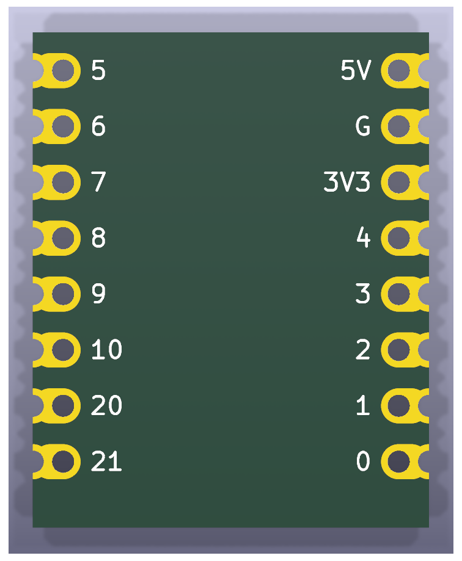
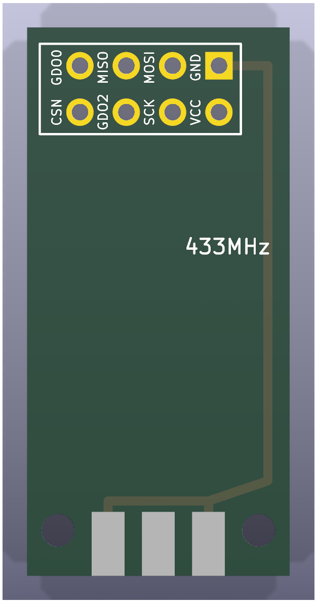
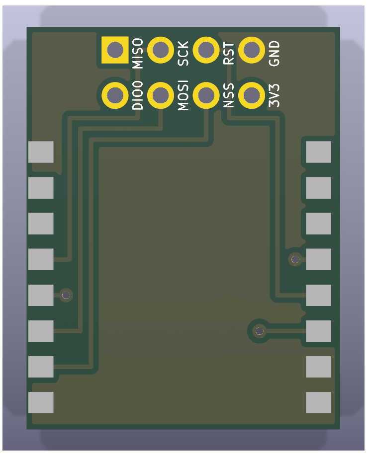
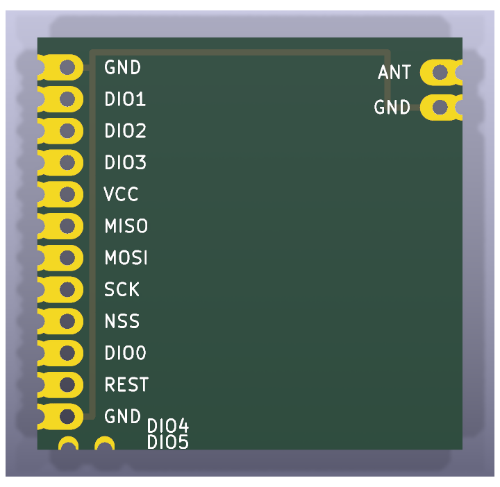

# Component boards

Reference reproductions of the commercial boards the adapters are built
around. Each project reproduces the outline, pin headers, castellations,
mounting holes and connector positions of the original, so the adapters'
footprints could be checked against photos and datasheets.

They are documentation, not boards to order. Each one has a README with the
product's dimensions, pinout, where to buy it and the sources every number
came from.

| | Board | What it is |
| --- | --- | --- |
|  | [**ESP32-C3 SuperMini**](esp32-c3-supermini/) | The ESP32-C3 board every adapter here is built around: 18&nbsp;x&nbsp;22.5 mm, USB-C, eight castellated pins per side. |
|  | [**CC1101 E07-M1101D-SMA**](cc1101-e07-m1101d/) | Blue Ebyte CC1101 radio, 15&nbsp;x&nbsp;30 mm, 2x4 header at one end and an SMA jack at the other. |
|  | [**CC1101 D-Sun**](cc1101-dsun/) | Green CC1101 radio, 14.4&nbsp;x&nbsp;30 mm: the same signals as the E07 in a different header order. |
|  | [**SX1278 Ra-02 breakout**](sx1278-ra02-breakout/) | Blue LoRa breakout, 17.5&nbsp;x&nbsp;22.5 mm: an Ai-Thinker Ra-02 with an IPEX antenna on a 2x4 header. |
|  | [**SX1278 LoRa module**](sx1278-lora-module/) | 16-pin castellated LoRa module, 17&nbsp;x&nbsp;16.5 mm, with no header: it solders flat onto the [SX1278 module adapter](../esp32c3-sx1278-adapter). |

The first four plug into, or carry, the socket on the
[main adapter](../esp32c3-radio-adapter).

CI does not build these projects; pass a name to
`scripts/export_manufacturing.py` to export one, and see
[docs/development.md](../../docs/development.md) for how they and their
images are regenerated.

## Castellations in KiCad

KiCad has no native castellated pad. Each castellation is a through-hole pad
whose drill is centred on the board edge; the fab cuts the plated hole in
half. On the SuperMini and the SX1278 module each pin is two pads sharing a
number: the through-hole inboard and the half-hole on the edge, joined by oval
copper.

KiCad flags copper and holes touching the board edge, so each project's
`.kicad_dru` ignores edge clearance and relaxes the hole-to-hole distance for
the edge-pad footprints only. Order the boards with the "castellated holes"
option at your PCB fab.
