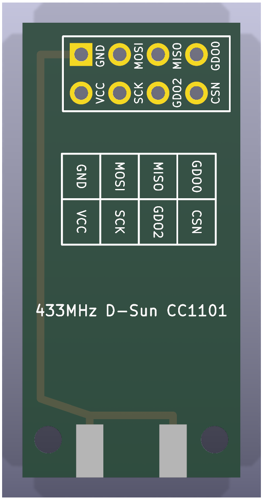
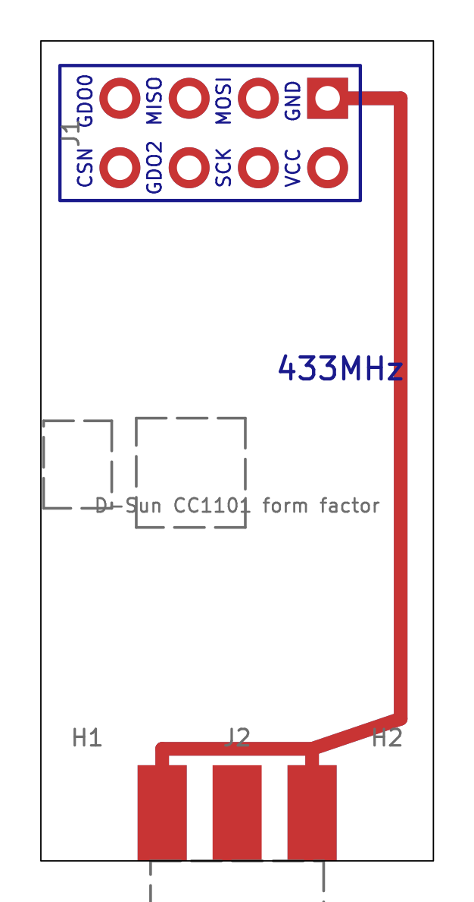
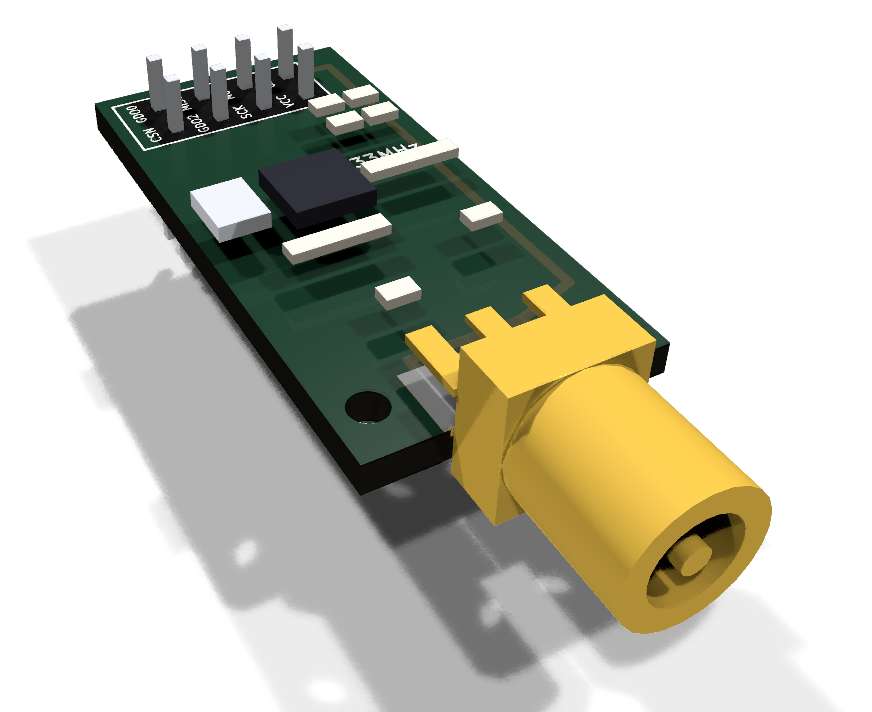

# CC1101 D-Sun (green board)

The green CC1101 board marked "433MHz D-Sun CC1101" (EasyEDA lists the same
board as "RF1101SE V3.1"): a 2x4 header at one end, an edge-mount SMA jack at
the other and two small holes beside the jack. A KiCad reproduction of it
lives in this directory; see [the parts index](../README.md) for what these
reproductions are for.

| 3D render, top | 3D render, bottom | Layout (copper, silk, fab, outline) |
| --- | --- | --- |
|  |  |  |

## Buying one

| | |
| --- | --- |
| Buy | [CC1101 433MHz module](https://www.aliexpress.com/w/wholesale-cc1101-433mhz-module.html), pick the green one |
| How to recognise it | Green, 14.4&nbsp;x&nbsp;30 mm, silk "433MHz D-Sun CC1101", 2x4 header, SMA jack |
| Also needs | A [433 MHz SMA antenna](https://www.aliexpress.com/w/wholesale-433mhz-sma-antenna.html). Not the 868/915 MHz one many listings bundle with the same radio. |

It plugs into the [radio socket](../../esp32c3-radio-adapter) on the adapter
board, sharing it with the [E07-M1101D](../cc1101-e07-m1101d) and the
[SX1278 Ra-02 breakout](../sx1278-ra02-breakout). Its header order differs
from the E07's, so it takes its own firmware pin map.

Its back-side silk is a 4&nbsp;x&nbsp;2 legend of the pin names next to the header,
which is what you wire from.

## Dimensions

All values in millimetres, viewed from the component side with the header at
the top and the SMA jack at the bottom. They were measured from photos of
the board beside the E07-M1101D (whose 15&nbsp;x&nbsp;30 gives the scale), so allow
about +/- 0.3 mm; the thickness is assumed.

| Feature | Value |
| --- | --- |
| Board outline | 14.4&nbsp;x&nbsp;30.0 |
| Header | 2&nbsp;x&nbsp;4, 2.54 pitch, 1.50 pads (pin 1 square), 0.90 holes |
| Header position | outer row 2.1 from the header edge; columns 2.9 to 10.5 from the left long edge (0.5 left of centre) |
| Header numbering | as the E07: outer row 7 5 3 1 left to right, inner row 8 6 4 2 |
| Mounting holes | 1.8, not plated, 1.7 from each long edge, 2.5 from the SMA edge |
| SMA jack | edge mount, centred on the bottom edge; ground legs 2.75 either side |
| Board thickness | 1.6 (assumed) |

## Pinout

Pin names (J1, numbered like the E07's header so the GND/VCC column matches):

| Pin | Name | Pin | Name |
| --- | --- | --- | --- |
| 1 | GND | 5 | MISO |
| 2 | VCC | 6 | GDO2 |
| 3 | MOSI | 7 | GDO0 |
| 4 | SCK | 8 | CSN |

The ESP32 GPIO each of these lands on is in the
[pin map for firmware](../../../README.md#pin-map-for-firmware); why the
socket suits both header orders is in the
[design notes](../../../docs/design-notes.md).

## The reproduction

The pin names are printed beside each header column on both sides, and the
back carries the original's legend grid.

Regenerate the project with `uv run scripts/generate_dsun.py`, and its images
with `uv run scripts/render_boards.py cc1101-dsun` and
`uv run scripts/render_assemblies.py parts`.
