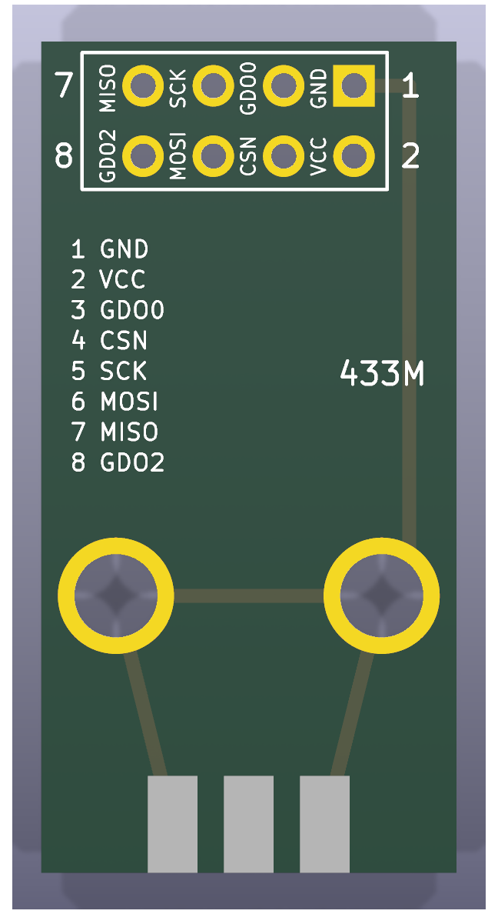
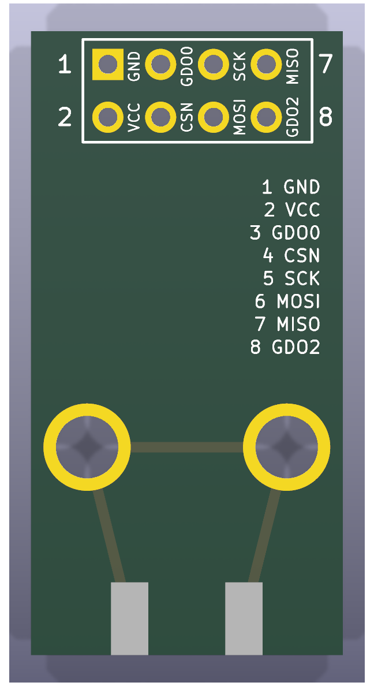
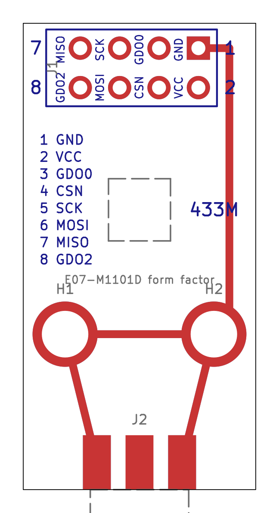
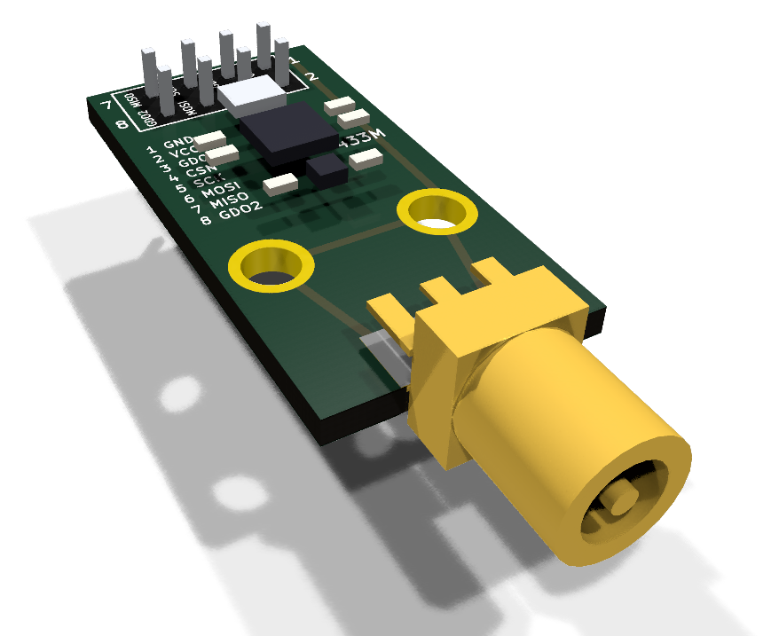

# CC1101 E07-M1101D-SMA

The Ebyte E07-M1101D-SMA (PCB marked "E07-M1101D V2.0"), sold as the "TENSTAR
CC1101 433MHz Wireless Module" with an SMA antenna. A KiCad reproduction of it
lives in this directory; see [the parts index](../README.md) for what these
reproductions are for.

| 3D render, top | 3D render, bottom | Layout (copper, silk, fab, outline) |
| --- | --- | --- |
|  |  |  |

## Buying one

| | |
| --- | --- |
| Buy | [E07-M1101D](https://www.aliexpress.com/w/wholesale-e07-m1101d.html), also sold as "TENSTAR CC1101 433MHz wireless module" |
| Product page | [Ebyte E07-M1101D-SMA](https://www.cdebyte.com/products/E07-M1101D-SMA) |
| How to recognise it | Blue, 15&nbsp;x&nbsp;30 mm, 2x4 header at one end, SMA jack at the other, PCB marked "E07-M1101D V2.0" |
| Also needs | A [433 MHz SMA antenna](https://www.aliexpress.com/w/wholesale-433mhz-sma-antenna.html) (often included). Not the 868/915 MHz one many listings bundle with the same radio. |

It plugs into the [radio socket](../../esp32c3-radio-adapter) on the adapter
board, sharing it with the [D-Sun CC1101](../cc1101-dsun) and the
[SX1278 Ra-02 breakout](../sx1278-ra02-breakout).

## Dimensions

All values in millimetres, viewed from the component side with the header at
the top and the SMA jack at the bottom.

| Feature | Value |
| --- | --- |
| Board outline | 15.0&nbsp;x&nbsp;30.0 |
| Header | 2&nbsp;x&nbsp;4, 2.54 pitch, 1.50 pads (pin 1 square), 0.90 holes |
| Header position | outer row 1.60 from the header edge, columns 3.70 from the long edges |
| Header numbering | outer row 7 5 3 1 left to right, inner row 8 6 4 2 |
| Mounting holes | 3.00 plated, 4.20 pad, 2.70 from each long edge, 10.0 from the SMA edge |
| SMA jack | edge mount, centred on the bottom edge; ground legs 2.75 either side (5.5 apart, measured from photos) |
| Board thickness | 1.6 (edge-mount SMA) |

## Pinout

Pin names (J1):

| Pin | Name | Pin | Name |
| --- | --- | --- | --- |
| 1 | GND | 5 | SCK |
| 2 | VCC (1.8 - 3.6 V) | 6 | MOSI |
| 3 | GDO0 | 7 | MISO / GDO1 |
| 4 | CSN | 8 | GDO2 |

The ESP32 GPIO each of these lands on is in the
[pin map for firmware](../../../README.md#pin-map-for-firmware).

## The reproduction

Header pin 1, both mounting holes and the SMA ground legs are joined by GND
tracks on both copper layers; the original uses a ground pour instead. The
pin names are printed beside each header column on both sides.

Regenerate the project with `uv run scripts/generate_cc1101.py`, and its
images with `uv run scripts/render_boards.py cc1101-e07-m1101d` and
`uv run scripts/render_assemblies.py parts`.

## Sources

* [Ebyte E07 series user manual v1.00](https://ia802806.us.archive.org/26/items/ebytecdebytedl0719/557_E07_Usermanual_EN_v1.00.pdf),
  section 2.2 "E07 (M1101D-TH) / E07 (M1101D-SMA)": mechanical drawing
  (15.0&nbsp;x&nbsp;30.0, header 1.60 / 3.70 / 2.54, holes 2.70 / 10.0) and pin table.
* [Ebyte E07-M1101D-TH user manual v1.20](https://www.rcscomponents.kiev.ua/datasheets/e07-m1101d-th_usermanual_en_v1_20.pdf),
  section 3 "Size and pin definition": pad sizes (1.50 pad / 0.90 hole,
  4.20 ring / 3.00 hole).
* Seller listing (15&nbsp;x&nbsp;28 mm, pin table). The 28 mm figure is Ebyte's value
  for the spring-antenna variant; the SMA variant and the drawing say 30 mm.
* The SMA jack's leg spacing (5.5 mm) was measured from the user's photos;
  the pad lengths are approximate.
