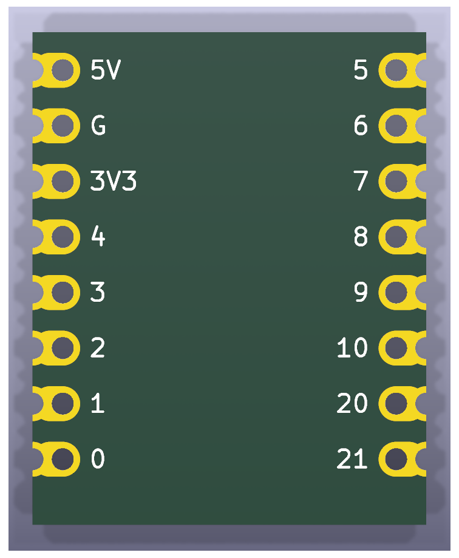
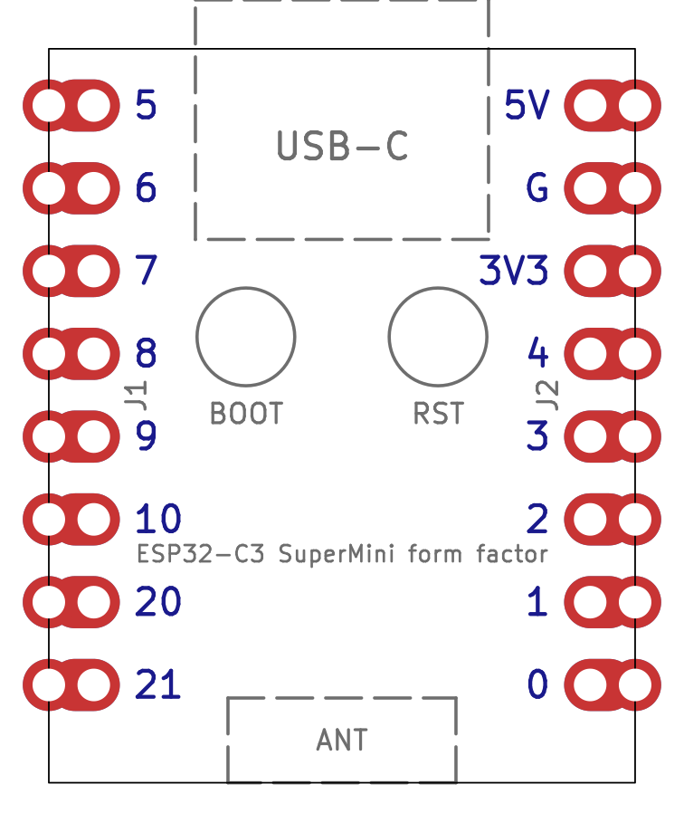
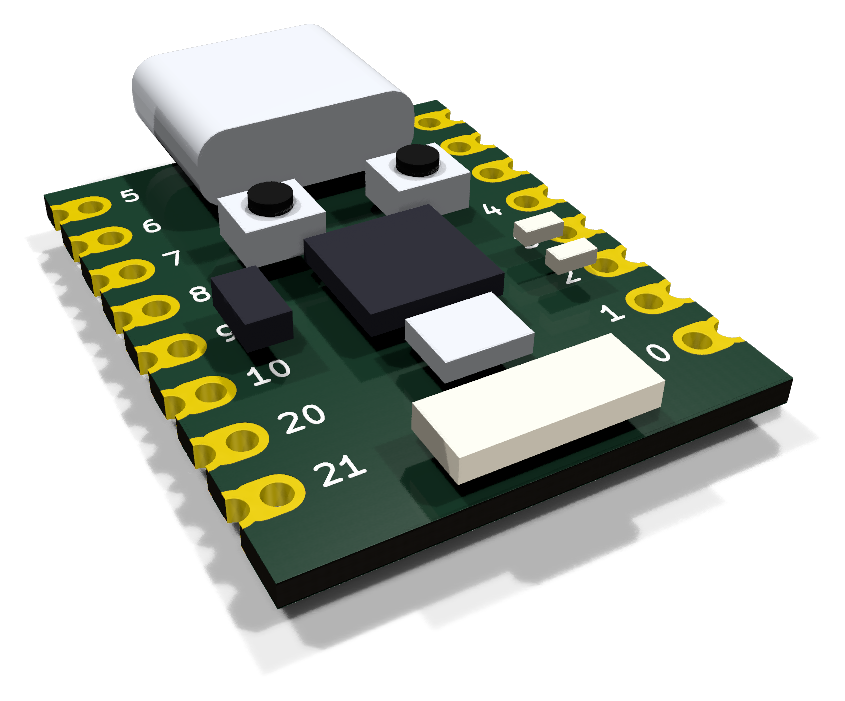

# ESP32-C3 SuperMini

The ESP32-C3 SuperMini: a 18&nbsp;x&nbsp;22.5 mm ESP32-C3 board with USB-C, eight
castellated pins per side and a ceramic antenna. It is the brain of every
board in this repository. A KiCad reproduction of it lives in this directory;
see [the parts index](../README.md) for what these reproductions are for.

| 3D render, top | 3D render, bottom | Layout (copper, silk, fab, outline) |
| --- | --- | --- |
|  |  |  |

The grey half-circles outside the outline in the 3D renders are the outer
halves of the castellation pads; the PCB fab routes them away, leaving plated
half-holes on the edge.

## Buying one

| | |
| --- | --- |
| Buy | [ESP32-C3 SuperMini](https://www.aliexpress.com/w/wholesale-esp32-c3-supermini.html) |
| How to recognise it | 18&nbsp;x&nbsp;22.5 mm, USB-C, 8 castellated pins per side, ceramic antenna at the far end from the USB-C |
| Also comes with | Usually two 1x8 pin headers in the bag. Solder those, or solder the SuperMini flat by its castellations. |

## Dimensions

All values in millimetres, viewed from the component side with the USB-C end
at the top.

| Feature | Value |
| --- | --- |
| Board outline | 18.00&nbsp;x&nbsp;22.52, square corners |
| Pin pitch | 2.54 |
| Pins per side | 8 (16 total) |
| Distance between the two pin rows | 15.24 |
| Pin centre to long board edge | 1.38 |
| First pin centre to USB-C edge | 1.74 |
| Last pin centre to antenna edge | 3.00 |
| Through-hole drill | 1.00 |
| Castellation half-hole on the edge | 1.00 diameter, centred on the edge |
| Pad copper | 1.60 wide oval from the pin to the board edge |
| Board thickness | 1.0 (from the STEP model, not a datasheet) |

## Pinout

Pin names, top to bottom:

| Left (J1) | Right (J2) |
| --- | --- |
| GPIO5 | 5V |
| GPIO6 | GND |
| GPIO7 | 3V3 |
| GPIO8 | GPIO4 |
| GPIO9 | GPIO3 |
| GPIO10 | GPIO2 |
| GPIO20 | GPIO1 |
| GPIO21 | GPIO0 |

Which of these the adapter uses for the radio is in the
[pin map for firmware](../../../README.md#pin-map-for-firmware); the boot
straps and why they constrain the choice are in the
[design notes](../../../docs/design-notes.md).

## The reproduction

The USB-C connector, BOOT and RST buttons and the ceramic antenna of the
original board are drawn on the `F.Fab` layer as placement references only.

Regenerate the project with `uv run scripts/generate_supermini.py`, and its
images with `uv run scripts/render_boards.py esp32-c3-supermini` and
`uv run scripts/render_assemblies.py parts`.

## Sources

* [GrabCAD "ESP32C3 SuperMini" STEP model by Ulf Hille](https://grabcad.com/library/esp32c3-supermini-1),
  redistributed in [mrtnvgr/KiCad_ESP32-C3-SuperMini](https://github.com/mrtnvgr/KiCad_ESP32-C3-SuperMini):
  board body 18.00&nbsp;x&nbsp;22.52, pin rows at +/-7.62, first pin 1.74 from the USB-C edge, 1.6 mm pad copper.
* [mischianti.org ESP32-C3 Super Mini dimension drawing](https://mischianti.org/esp32-c3-super-mini-high-resolution-pinout-datasheet-and-specs/):
  18.00 mm width, 15.24 mm row spacing, 22.50 mm length, pin order.
* [components101 ESP32-C3 Super Mini](https://components101.com/development-boards/esp32c3-mini-development-board-datasheet-pinout): 22.52&nbsp;x&nbsp;18.0 mm.
* Photographs of production boards for the keyhole castellated pad shape.

The hole diameter (1.0 mm) is the standard drill for 2.54 mm headers and
matches the hole size measured from the dimension drawing; it was not taken
from a manufacturer datasheet. Note that the community KiCad footprint linked
above has its GPIO column reversed (GPIO21 opposite 5V instead of GPIO5); the
footprints here were generated from scratch and follow the physical board.
