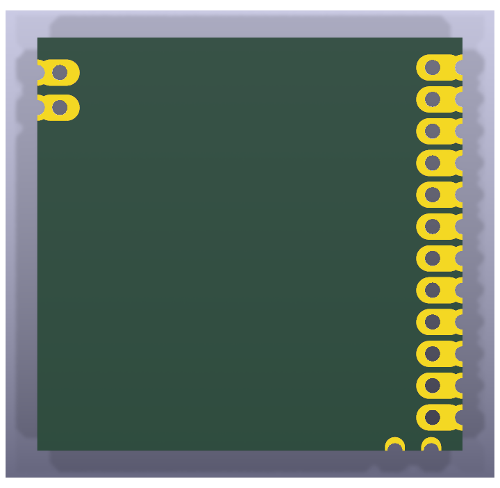
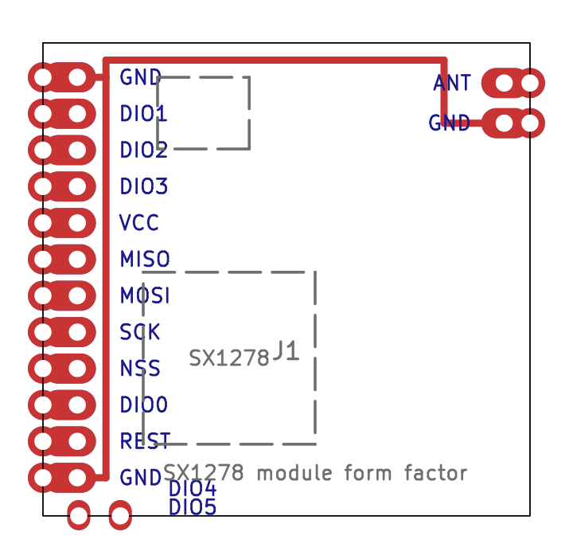
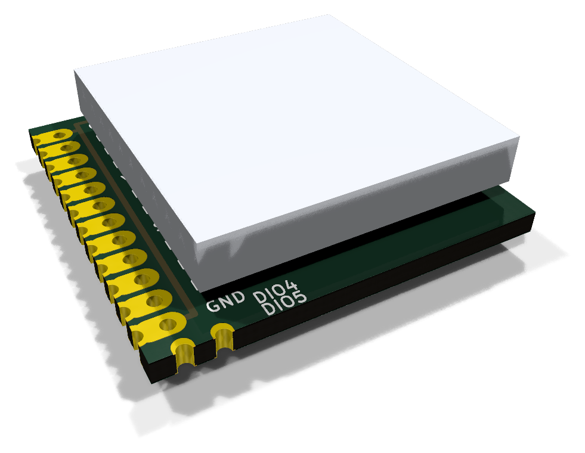

# SX1278 LoRa module (castellated)

The 16-pin castellated 433 MHz SX1278 module sold as "SX1278 LoRa 433MHz
Wireless Module (PXL1276-D01)" with a spring antenna. It is a derivative of
the NiceRF LoRa1276/LoRa1278 layout. A KiCad reproduction of it lives in this
directory; see [the parts index](../README.md) for what these reproductions
are for.

| 3D render, top | 3D render, bottom | Layout (copper, silk, fab, outline) |
| --- | --- | --- |
|  |  |  |

## Buying one

| | |
| --- | --- |
| Buy | [SX1278 LoRa 433MHz wireless module](https://www.aliexpress.com/w/wholesale-sx1278-lora-433mhz-wireless-module.html) |
| How to recognise it | Roughly 17&nbsp;x&nbsp;16.5 mm, no carrier board: 12 castellated pads down one long edge, two notches at one corner and ANT / GND at the other. Sold as "SX1278 LoRa 433MHz Wireless Module (PXL1276-D01)". |
| Antenna | The spring antenna it is sold with solders to the ANT pad. |

Unlike the other three radios this one has no 2.54 mm header, so it does not
fit the socket on the main adapter. It solders flat onto SMD land pads on the
separate [SX1278 module adapter](../../esp32c3-sx1278-adapter), which is
described in [docs/sx1278-module-adapter.md](../../../docs/sx1278-module-adapter.md).

## Dimensions

All values in millimetres, viewed from the component side with the 12-pad
row on the left edge and pin 1 at the top.

| Feature | Value |
| --- | --- |
| Board outline | 17.0 (top/bottom edges) x 16.5 (left/right edges) |
| Left edge | 12 keyhole pads (pins 1-12) at 1.27 pitch, first hole 1.2 from the top corner |
| Bottom edge | 2 castellation-only notches: DIO4 (pin 13) 1.25 and DIO5 (pin 14) 2.7 from the left corner |
| Right edge | 2 keyhole pads: ANT (pin 16) 1.4 and GND (pin 15) 2.8 from the top corner |
| Keyhole pads, left row | 0.60 through-hole 1.2 in from the edge, 0.60 half-hole on the edge, 1.05 wide copper reaching 1.85 in |
| Keyhole pads, right edge | as above but hole 0.9 in from the edge, copper reaching 1.7 in |
| Notches | 0.60 half-hole on the edge, 0.8 wide copper reaching 0.55 in, no inboard hole |
| Board thickness | 1.0 (assumed) |

## Pinout

Pin names (J1), numbered counter-clockwise from the top-left:

| Pin | Name | Pin | Name |
| --- | --- | --- | --- |
| 1 | GND | 9 | NSS |
| 2 | DIO1 | 10 | DIO0 |
| 3 | DIO2 | 11 | REST (reset) |
| 4 | DIO3 | 12 | GND |
| 5 | VCC (3.3 V) | 13 | DIO4 |
| 6 | MISO | 14 | DIO5 |
| 7 | MOSI | 15 | GND |
| 8 | SCK | 16 | ANT |

## The reproduction

The three GND pins are joined by tracks (the original uses a ground plane).
Approximate positions of the SX1278 and its crystal are drawn on `F.Fab`.

Regenerate the project with `uv run scripts/generate_sx1278.py`, and its
images with `uv run scripts/render_boards.py sx1278-lora-module` and
`uv run scripts/render_assemblies.py parts`.

## Sources and accuracy

* Seller PDF for the "SX1278 LoRa 433MHz Wireless Module (PXL1276-D01)":
  module size 17&nbsp;mm&nbsp;x&nbsp;16.5&nbsp;mm.
* Seller pinout photo (top-down with dimension lines) for the pin names in
  physical order: GND DIO1 DIO2 DIO3 VCC MISO MOSI SCK NSS DIO0 REST GND
  along the row, DIO4 and DIO5 at the adjacent corner, ANT and GND at the
  opposite corner. The seller's pin table lists REST twice, which shifts its
  last four entries by one; the photo was followed.
* No manufacturer drawing was found for this variant. Pad positions were
  measured in pixels from the top-down pinout photo and a perspective-
  rectified product photo; both give the 12-pad row a 1.27 mm pitch on the
  16.5 mm edge (the pinout photo's dimension labels appear to have the two
  sides swapped). Positions are accurate to roughly +/-0.15 mm; the pitch,
  pin count and outline are solid.
* Close-up photos show the 12 row pads and the two ANT/GND pads are keyholes
  like the SuperMini's (a plated through-hole plus a half-hole castellation on
  the edge, joined by an oval), while DIO4 and DIO5 are plain castellations
  without an inboard hole. The
  [NiceRF LoRa127X datasheet](https://makerhero.com/img/files/download/LoRa127X-Module-Datasheet.pdf)
  mechanical drawing shows the same construction for this family and
  supplied the 0.6 mm hole size.
