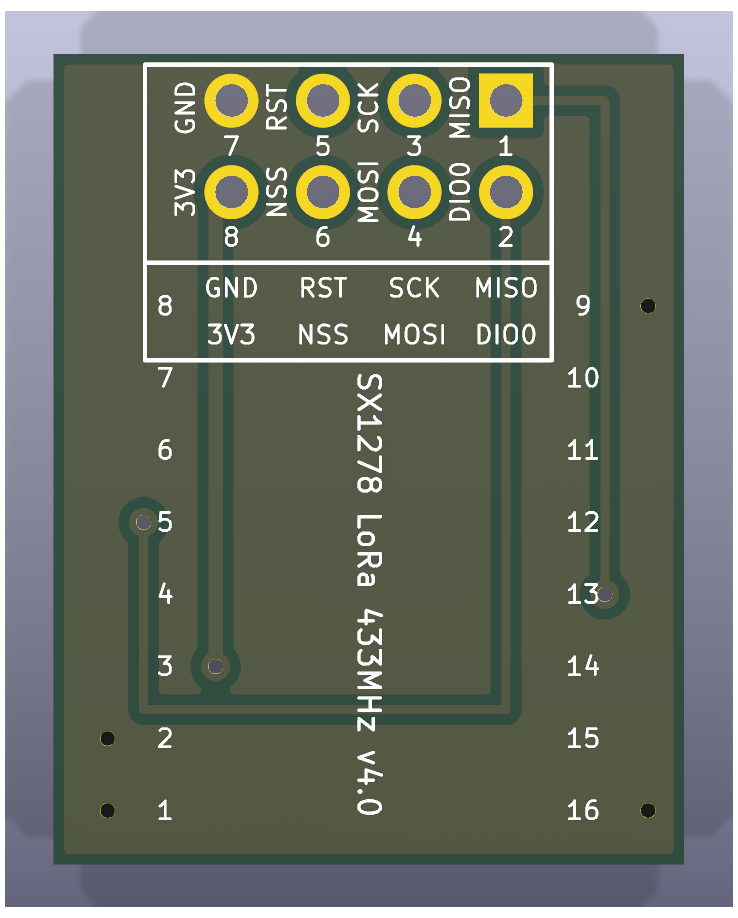
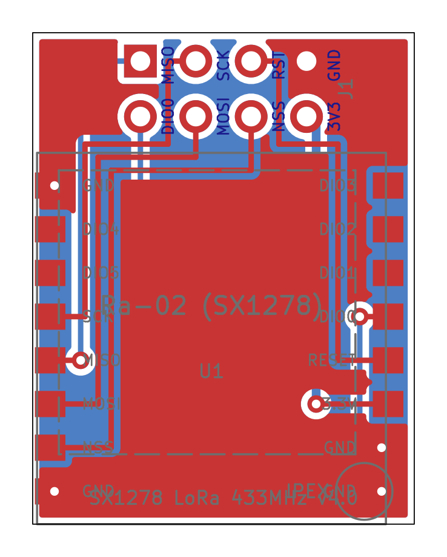
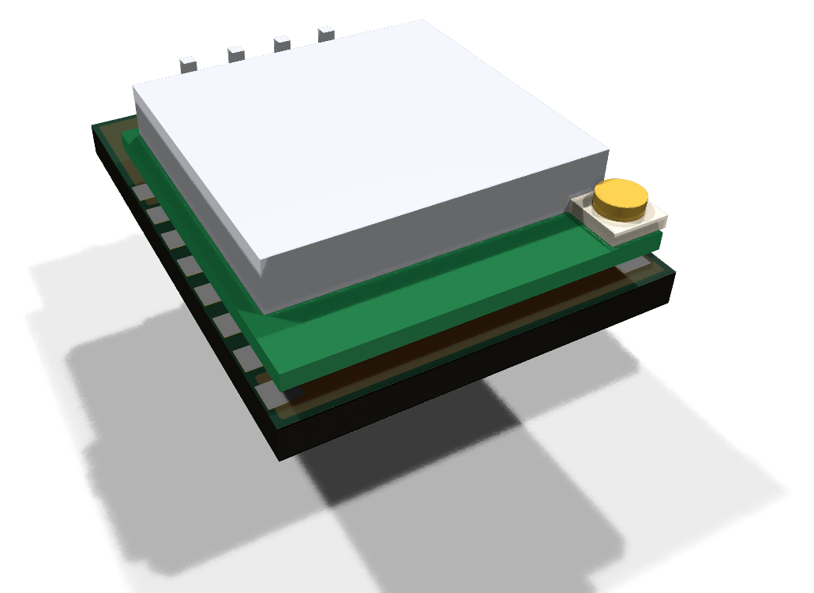

# SX1278 Ra-02 breakout

The blue "SX1278 LoRa 433MHz v4.0" breakout: an Ai-Thinker Ra-02 LoRa module
(IPEX antenna) on a 17.5&nbsp;x&nbsp;22.5 mm carrier with a 2x4 2.54 mm male header on
its back. A KiCad reproduction of it lives in this directory; see
[the parts index](../README.md) for what these reproductions are for.

| 3D render, top | 3D render, bottom | Layout (copper, silk, fab, outline) |
| --- | --- | --- |
|  |  |  |

Drawn as seen from the Ra-02 side with the header edge at the top, the way it
sits on the adapter.

## Buying one

| | |
| --- | --- |
| Buy | [SX1278 LoRa 433MHz Ra-02](https://www.aliexpress.com/w/wholesale-sx1278-lora-433mhz-ra-02.html) |
| Module datasheet | [Ai-Thinker Ra-02](https://docs.ai-thinker.com/en/Ra-02/index.html) |
| How to recognise it | Blue 17.5&nbsp;x&nbsp;22.5 mm carrier with the Ai-Thinker Ra-02 can on top, 2x4 header underneath, silk "SX1278 LoRa 433MHz v4.0" |
| Also needs | A [U.FL (IPEX) to SMA pigtail](https://www.aliexpress.com/w/wholesale-ipex-to-sma-pigtail.html) plus a [433 MHz SMA antenna](https://www.aliexpress.com/w/wholesale-433mhz-sma-antenna.html). It has no SMA jack of its own. |

It plugs into the [radio socket](../../esp32c3-radio-adapter) on the adapter
board, sharing it with the [E07-M1101D](../cc1101-e07-m1101d) and the
[D-Sun CC1101](../cc1101-dsun). For raw OOK its demodulated bitstream is only
on DIO2, which the adapter brings out on a fly-wire header; see the
[design notes](../../../docs/design-notes.md).

## Dimensions and pinout

| Feature | Value | Source |
| --- | --- | --- |
| Outline | 17.5&nbsp;x&nbsp;22.5 mm | photos, scaled by the header pitch (+/- 0.3 mm) |
| Header | 2x4, outer row 1.3 mm from the header edge, columns centred | photos |
| Header pinout | outer row MISO, SCK, RST, GND; inner row DIO0, MOSI, NSS, 3V3 (left to right) | back-side silk in the photos |
| Ra-02 module | 17&nbsp;x&nbsp;16&nbsp;x&nbsp;3.2 mm, 16 castellations at 2.0 mm on the 17 mm edges, first 1.5 mm from the end | Ai-Thinker Ra-02 Specifications V1.0, section 3 |
| Ra-02 pins | 1-8 GND, GND, 3.3V, RESET, DIO0, DIO1, DIO2, DIO3 up the right edge from the IPEX corner; 9-16 GND, DIO4, DIO5, SCK, MISO, MOSI, NSS, GND down the left edge | Ra-02 Specifications V1.0, section 4 |
| IPEX | 1.5 / 1.0 mm from the pin-1 corner (bottom-right here) | Ra-02 Specifications V1.0, section 3 |

The ESP32 GPIO each header pin lands on is in the
[pin map for firmware](../../../README.md#pin-map-for-firmware).

## The reproduction

The header is numbered here like the `Conn_02x04_Odd_Even` symbol (odd pins
in the outer row, pin 1 at the left). Copper reproduces the connections:
four header nets run on the front and three (MISO, DIO0, 3V3) cross on the
back through vias, as the real board does (its back-side trace from the 3V3
header pin ends at a via exactly where module pin 3 sits, which is what
fixed the module's orientation). Both sides carry a GND pour. The back silk
carries the header's pin numbers and name grid and the Ra-02's pin numbers
beside each land; the header names also appear on both sides beside each
column. The breakout's two decoupling capacitors are not modelled, and the
module lands are drawn 1.4&nbsp;x&nbsp;1.2 mm.

Regenerate the project with `uv run scripts/generate_ra02_breakout.py`, and
its images with `uv run scripts/render_boards.py sx1278-ra02-breakout` and
`uv run scripts/render_assemblies.py parts`.
