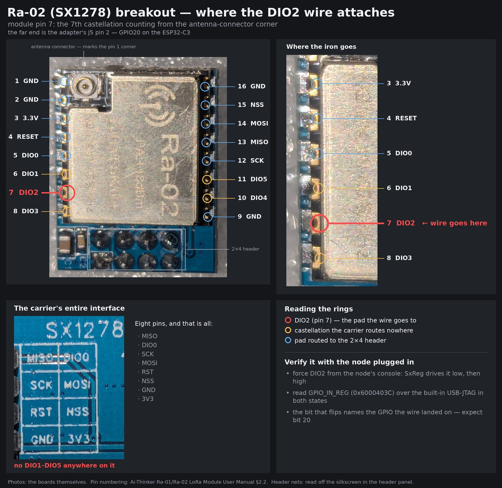

# SX1278 Ra-02 breakout — adding the DIO2 wire

The blue **"SX1278 LoRa 433MHz v4.0"** breakout (an Ai-Thinker Ra-02 on a small
carrier with a 2×4 header) brings out **DIO0 and nothing else** of the SX1278's
six DIO lines. Full FSK *and* OOK needs **DIO2**, so DIO2 has to be soldered
straight to the module. This page says which pad that is, and how to prove by
hand that the wire landed on it.



Only the radio end is covered here. The far end is the adapter's
[J5 fly-wire header](../../../docs/design-notes.md#the-dio2-fly-wire-header) —
pin 2, GPIO20 — which the [board README](../../../README.md#pin-map-for-firmware)
documents.

## Why DIO2 specifically

The SX1278 has exactly two data paths, and the datasheet
([SX1276/77/78/79 rev 7](https://cdn.sparkfun.com/assets/7/7/3/2/2/SX1276_Datasheet.pdf))
allows no third:

> **Continuous mode**: each bit transmitted or received is accessed in real time
> at the DIO2/DATA pin. […] **Packet mode (recommended)**: user only
> provides/retrieves payload bytes to/from the FIFO. *(§2.1.9.2, p.69)*

> As illustrated in Figure 29, in Continuous mode the NRZ data to (from) the
> (de)modulator is directly accessed by the uC on the bidirectional DIO2/DATA
> pin. The FIFO and packet handler are thus inactive. *(§2.1.12.1, p.70)*

Table 29 (*DIO Mapping, Continuous Mode*, p.68) closes the door on any
alternative routing: **all four `Dio2Mapping` values give `Data`**, in both Rx
and Tx, and no other DIO can be mapped to it in Rx.

The consequence for this node:

| Job | Needs DIO2? | Why |
|---|---|---|
| Fine Offset weather RX (FSK) | no | fixed-length packets with a sync word — the packet handler frames them, the FIFO carries them, DIO0 signals `PayloadReady` |
| FSK packet TX | no | FIFO in, DIO0 says `PacketSent` |
| **OOK remotes RX** | **yes** | arbitrary PWM/Manchester bursts, no sync word: the firmware has to see the demodulator's raw edges and time them itself |
| **OOK / Security+ TX** | **yes** | continuous-mode transmit clocks data *into* the same bidirectional pin |
| LoRa | no | its own modem and register bank |

DIO2 is the SX1278's equivalent of the CC1101's GDO2, which this project's
firmware already feeds into ISR edge capture and the OOK-PWM decoders. Without
the wire an SX1278 node is a weather-only receiver.

## Which pad

**Module pin 7 — the 7th castellation counting from the antenna-connector
corner, i.e. the second-to-last on that edge.**

Numbering is from the Ai-Thinker *Ra-01/Ra-02 LoRa Module User Manual* §2.2:
pins 1–8 run down one 17 mm edge and 9–16 back up the other, counter-clockwise
seen from the component side, with the IPEX connector at the pin-1 corner.

| Pin | | Pin | | Pin | | Pin | |
|--:|---|--:|---|--:|---|--:|---|
| 1 | GND | 5 | DIO0 | 9 | GND | 13 | MISO |
| 2 | GND | 6 | DIO1 | 10 | DIO4 | 14 | MOSI |
| 3 | 3.3V | **7** | **DIO2** | 11 | DIO5 | 15 | NSS |
| 4 | RESET | 8 | DIO3 | 12 | SCK | 16 | GND |

The carrier routes pins 3, 4, 5, 12, 13, 14, 15 and a GND to its 2×4 header —
that is the whole of `MISO / DIO0 / SCK / MOSI / RST / NSS / GND / 3V3` you can
read on its back silkscreen. **DIO1, DIO2, DIO3, DIO4 and DIO5 go nowhere.**

Two places take solder, and they are the same net:

- the module's **castellated half-hole** for pin 7, and
- the **carrier land pad** immediately outside it, which protrudes past the
  module edge and is easier to hit with an iron.

Since the carrier routes that pad to nothing, either is DIO2 and only DIO2 — but
prove it rather than assume it, because a land pad that *looks* isolated is
exactly what a solder bridge hides.

> **Orientation.** The diagram is the **component side** — module face up, IPEX
> at the pin-1 corner. The 2×4 header is on the *other* face, so when you flip
> the board to reach the header pins the pad order mirrors.

## Verifying it with the node plugged in

The node is on USB. That one cable carries two independent channels — Espressif's
guide puts it plainly: the chip provides *"two USB channels, one for JTAG and the
other for the USB terminal connection"*. So you can **command the SX1278 down the
console channel** and **watch the ESP32-C3's pins down the JTAG channel**, at the
same time, with no firmware change: the [`SxReg`](../../../firmware/README.md)
command already ships.

The method:

1. force DIO2 to a known level over SPI,
2. read the ESP32-C3's *whole* GPIO input register in one word,
3. force the other level and read it again,
4. **the bit that flips names the GPIO the wire landed on.**

That is better than probing the one pin you expect: `GPIO_IN_REG` shows all 22
GPIOs at once, so a wire that landed on the wrong pad announces itself instead of
reading as a dead wire. The expected answer here is **bit 20** — J5 pin 2.

> ### Use Espressif's OpenOCD, not the distro's
>
> `openocd-esp32` (the build ESP-IDF ships) has a real `esp32c3` target and
> `board/esp32c3-builtin.cfg`. **Do not use mainline OpenOCD on this chip.**
> Debian's 0.12.0+dev has the `esp_usb_jtag` adapter and will happily attach
> with a hand-written RISC-V config — it connects, finds the TAP
> (`0x00005c25`), examines the core, and reads memory correctly. Then it
> destroys the node. Measured on the bench, 2026-09-09: it drives the core
> through the program buffer incorrectly (`Unexpected read of fp via program
> buffer`, `Failed to read s0`, `Examination failed`, `Hart unexpectedly
> reset!`) and its `resume` leaves `dcsr = 0x400090c3` — **`ebreakm` set** — so
> the application takes a Breakpoint exception on every boot:
>
> ```
> Guru Meditation Error: Core 0 panic'ed (Breakpoint). Exception was unhandled.
> Setting breakpoint at 0x42160ffa and returning...
> Panic handler entered multiple times. Abort panic handling. Rebooting ...
> ```
>
> Clearing `dcsr` and disarming all eight triggers did not recover it; each
> `reset run` re-examined into failure, and it ended with the hart halted and
> the chip no longer enumerating on USB at all — a hub power cycle did not
> bring it back. Assume mainline OpenOCD on an ESP32-C3 costs you a trip to the
> bench.

### 0. Park the radio

```
CcMode remotes
```

On an SX1278 node this drops `weather_rx`, puts the chip in standby and stops
the 50 ms weather poll, so your register writes stay put instead of being
overwritten by the receive loop. It is persisted to `/cc1101.cfg` — **set
`CcMode weather` back when you are done.** Both commands are in the
[firmware command reference](../../../firmware/README.md).

Talk to the node over the USB console with any serial terminal that opens the
port **with DTR/RTS deasserted**, so the ESP32-C3 is not reset as you attach, or
over HTTP if the node is on WiFi:

```
curl -sG http://<node-ip>/cm --data-urlencode 'cmnd=CcMode remotes'
```

### 1. Force DIO2 to a level you choose

In **continuous** mode DIO2 *is* the demodulator's data line whatever the DIO
mapping says (Table 29), and in OOK with a **fixed** threshold the demodulator
output is whatever you set the threshold to make it: floor it and the noise is
always "on", ceiling it and nothing ever is.

| Step | Command | Effect |
|---|---|---|
| continuous mode | `SxReg 0x31 0x00` | `RegPacketConfig2` `DataMode` = 0 — FIFO and packet handler out of the way |
| no receive trigger | `SxReg 0x0D 0x08` | `RegRxConfig` `RxTrigger` = 000, AGC auto kept — the weather preset's `0x0E` parks the receiver until a preamble is seen (see the RxReady note below) |
| OOK, receiving | `SxReg 0x01 0x2D` | `RegOpMode`: FSK/OOK bank, `ModulationType` = OOK, low-frequency band, Rx |
| raw demod, fixed threshold | `SxReg 0x14 0x00` | `RegOokPeak`: `BitSyncOn` = 0 (raw output straight to DATA), `OokThreshType` = fixed |
| **DIO2 → low** | `SxReg 0x15 0xFF` | `RegOokFix` = 255 dB: nothing ever crosses it |
| **DIO2 → high** | `SxReg 0x15 0x00` | `RegOokFix` = 0 dB: the noise floor is always above it |

Add a **positive control** on the same pass, so a null result cannot be blamed
on the method. DIO0 *is* wired — GPIO6 on this adapter — so give it a level you
also control:

| Step | Command | Effect |
|---|---|---|
| DIO0 = Rssi | `SxReg 0x40 0x40` | `RegDioMapping1` `Dio0Mapping` = 01 → Rssi in continuous Rx (Table 29) |
| **DIO0 → high** | `SxReg 0x10 0xFF` | `RegRssiThresh` = −127.5 dBm: always exceeded |
| **DIO0 → low** | `SxReg 0x10 0x00` | `RegRssiThresh` = 0 dBm: never exceeded |

`SxReg 0x3E` reads `RegIrqFlags1`, whose bit 3 is that same Rssi flag — the
chip's own view, to check against the pin.

> **Do not use RxReady for this.** It looks perfect on paper (`Dio2Mapping` = 01
> → RxReady in packet-mode Rx, mirrored in `RegIrqFlags1` bit 6) and it does not
> work under the firmware's preset: measured on the bench 2026-09-09, driving
> `RegOpMode` standby → Rx moved `RegIrqFlags1` from `0x80` (ModeReady) to `0x18`
> (PllLock + Rssi), **RxReady never asserted**, and `RegOpMode` itself read back
> `0x0C` (FSRx) instead of the `0x0D` written — the chip parks the receiver in
> frequency-synthesis until the trigger fires. Cause confirmed the same day by
> changing only `RegRxConfig`: `0x0E` (`RxTrigger` = PreambleDetect) → `0x0C` /
> `0x18`; `0x09` (`RxTrigger` = Rssi) → `0x0D` / `0xD8` (ModeReady, RxReady,
> PllLock, Rssi) within 0.5 s; back to `0x0E` → parked again. Auto-restart
> (`RegSyncConfig`) made no difference. That is why step 1 clears the trigger
> first: with it cleared the receiver runs unconditionally, so the OOK threshold
> decides DATA and nothing waits on a packet.

### 2. Read every GPIO in one word

`GPIO_IN_REG` is at **`0x6000403C`** — `DR_REG_GPIO_BASE` `0x60004000`
(`soc/reg_base.h`) plus offset `0x3C` (`soc/gpio_reg.h`) — and bits 0–21 are
GPIO0–GPIO21.

```
openocd -f board/esp32c3-builtin.cfg \
        -c 'adapter serial <the node's MAC>' \
        -c init -c halt -c 'mdw 0x6000403C' -c resume -c 'sleep 300' \
        -c targets -c shutdown
```

`adapter serial` picks the right node when several ESP32-C3s share the VID:PID
`303a:1001` on one host — their USB serial string is their MAC. Attaching
**halts the CPU**, so the node stops decoding for the few seconds you hold it;
always `resume`, and confirm with `targets` that it says `running` *before*
shutting OpenOCD down.

A healthy read looks like this one, taken from the real node on 2026-09-09:

```
0x6000403c: 00337706
```

which decodes as a sanity check on the wiring you already believe in: GPIO5 = 0
(the radio-type strap, tied low on the Ra-02 adapter), GPIO1 (NSS) and GPIO10
(RST) high and idle, GPIO3/4/7 (SCK/MOSI/MISO) low between transactions.

### 3. Diff the two reads

Take a read in the DIO2-low state and another in the DIO2-high state and XOR
them.

| Bits that flip | Verdict |
|---|---|
| bit 6 **and** bit 20 | the wire is good, and it is on the pin the adapter expects |
| bit 6 **and** exactly one other bit | the wire works but landed on the wrong GPIO; that bit names where it actually went |
| bit 6 only | the method works — and there is **no working DIO2 wire** |
| nothing at all | the test itself did not run: the radio is not in the state you think, or you are talking to the wrong node — fix that before believing any verdict |
| bit 6 and several others | you are watching SPI traffic; make sure nothing is driving the bus during the read |

### 4. Put it back

```
SxReg 0x40 0x00
SxReg 0x31 0x40
SxReg 0x0D 0x0E
CcMode weather
SxStatus
```

`CcMode weather` rewrites the whole preset anyway; the three `SxReg` lines
just leave nothing surprising behind if it is skipped. `SxStatus` should show
`"Mode":"weather","WeatherRx":1` again, and the `Rx` counter should start
climbing within a minute or two. A healthy node in weather mode reads
`RegOpMode` `0x0C` and `RegIrqFlags1` `0x18` between packets — that is the
parked-until-preamble state described above, not a fault.

### Status of this procedure

Bench-checked on 2026-09-09, on the real node: `CcMode remotes` parks the radio,
`SxReg` reads and writes registers as documented, the standby → Rx transition is
visible in `RegIrqFlags1`, and `GPIO_IN_REG` reads correctly over the built-in
USB-JTAG. **Steps 1–3 have not been run end-to-end**, because no DIO2 wire
exists yet and the session that would have run them destroyed the node with the
wrong OpenOCD (see the warning above). Treat the OOK-threshold levels as
designed-and-reasoned rather than measured until someone runs them.

## Sources

- Semtech **SX1276/77/78/79** datasheet rev 7, May 2020 — §2.1.9.2 data
  operation modes (p.69), §2.1.12 continuous mode (p.70), Table 29/30 DIO
  mapping (p.68), Table 41 register reset values, RegPacketConfig2 `DataMode`.
- Ai-Thinker **Ra-01/Ra-02 LoRa Module User Manual** §2.2 — the 16-pin table
  and the counter-clockwise numbering from the IPEX corner.
- ESP-IDF **JTAG debugging** guide (v5.4, ESP32-C3) — `board/esp32c3-builtin.cfg`,
  `openocd -f board/esp32c3-builtin.cfg`, and the chip's "two USB channels, one
  for JTAG and the other for the USB terminal connection".
- ESP32-C3 register addresses from ESP-IDF v5.4 `components/soc/esp32c3/register/soc/`:
  `reg_base.h` (`DR_REG_GPIO_BASE` `0x60004000`) and `gpio_reg.h`
  (`GPIO_IN_REG` = base + `0x3C`).
- The header's eight nets: read directly off the breakout's own back silkscreen
  in [`photos/ra02-header.jpg`](photos/ra02-header.jpg), and matching the KiCad
  reproduction of this breakout in
  [`scripts/generate_ra02_breakout.py`](../../../scripts/generate_ra02_breakout.py)
  (`HDR_NETS`).
